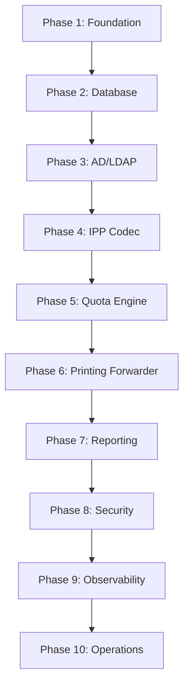

# Project History, Roadmap & Milestones

This document records the development history, release details, milestones, and the strategic roadmap of the Print Quota Management System.

---

## Section: Roadmap

Source file: [ROADMAP.md](CHANGELOG.md)


## Project Status & Roadmap

This document outlines the current project maturity, completed phases, identified technical debt, and next milestones.

---

### 1. Completed Milestones

#### Phase 1: Enterprise Foundation
- Established multi-module Maven design.
- Enforced PMD, SpotBugs, Checkstyle compiler validations.
- Configured Jetty server thread pool limits.

#### Phase 2: Persistence Layer
- Mapped JPA entities (`User`, `Quota`, `PrintLog`) with audits.
- Implemented database migrations via Liquibase.
- Setup optimistic and pessimistic locks.

#### Phase 3: Identity Integration
- Built LDAP/Active Directory synchronization schedulers.
- Configured Caffeine cache lookup buffers.

#### Phase 4: Docker & IPP Codec
- Multi-stage CentOS Stream 9 container compilation.
- Standalone `ipp-codec` binary parser and encoder.

#### Phase 5: Print Processing Engine
- Built Chain of Responsibility evaluation stages.
- Implemented transactional quota deductions and metrics logging.

#### Phase 6: Print Job Routing & Proxy
- Implemented HTTP/HTTPS transparent IPP proxy interceptor.
- Built configuration-driven printer routing map with failover rules.
- Streams multi-format documents (PDF, PCL, PS) in constant 8KB buffer memory space to prevent OOM errors.
- Integrates with the validation pipeline and returns RFC 8011 status codes (e.g., 0x0401) on rejections.

#### Phase 7: Reporting, Dashboard & Administration
- Integrated reporting endpoints for CSV/Excel data streams.
- Implemented SXSSFWorkbook high-performance streaming Excel builder.
- Built dashboard aggregation for user metrics and operational statistics.
- Added scheduled crons for monthly quota resets, daily summaries, and cleanup.

#### Phase 8: Production Hardening & RC Preparation
- Enforced OWASP recommended HTTP security headers via servlet filters.
- Added CycloneDX plugin generating Software Bill of Materials (SBOM) for compliance.
- Wrote PowerShell backup/restore utilities for Postgres databases and certificates.
- Documented performance tuning, incident response guidelines, and security checks.

---

### 2. Next Milestones

#### Phase 9: Clustering & Distributed Lock Management (Planned)
- Implement Hazelcast or Redis distributed locking to coordinate multiple proxy nodes.
- Introduce centralized rate-limiting for proxy traffic.

---

### 3. Technical Debt & Known Limitations

- **AD Sync Lockups**: LDAP directory listings use paged search results. Large user sets (10,000+) can block execution threads if the connection pool is saturated.
- **Transactional Latency**: Under extremely high concurrent print volume (100+ requests/sec for the same user), the pessimistic write lock on the `quotas` table row will serialize requests, causing short wait latencies.
- **Single Point of Failure**: Active Directory connectivity checks are monitored in Actuator readiness groups. If AD drops, the readiness probe fails, marking the container offline even though local cached users can still print. A cached verification fallback is planned.


---

## Section: Release Notes

Source file: [RELEASE_NOTES.md](CHANGELOG.md)


## Version 1.0 Release Notes (General Availability)

This document contains the release notes, changelog, migration steps, and known limitations for Version 1.0 GA of the Print Quota Management System.

---

### 1. Executive Summary

Version 1.0 GA establishes a production-grade Print Quota Management System and IPP Proxy. The system secures print routing, synchronizes directory structures, calculates monthly allocations under strict concurrency controls, and provides dashboards and Excel exports.

---

### 2. Changelog & Milestones

- **Phase 1-3 (Foundation & Identity)**: Built core Spring Boot configuration, configured PostgreSQL schema migrations via Liquibase, and added Active Directory LDAP synchronization.
- **Phase 4-5 (Codec & Engines)**: Added low-level RFC 8010 binary parsing module (`ipp-codec`) and validation pipelines.
- **Phase 6 (IPP Proxy)**: Introduced transparent streaming IPP proxy, connection pooling, and target printer routing.
- **Phase 7 (Reporting & Admin)**: Integrated SXSSFWorkbook streaming Excel exporters, daily mail alerts, and versioned admin REST APIs.
- **Phase 8 (Production Hardening)**: Hardened container privileges, added CycloneDX SBOM configurations, and wrote PowerShell backup scripts.

---

### 3. Migration Guide

To upgrade from development/beta setups to V1.0 GA:
1. **Apply Liquibase Schema Updates**: Migrations execute automatically during container start. Alternatively, run:
```bash
./mvnw liquibase:update -pl print-quota-core
```
2. **Import SSL Certificates**: Place active TLS certificate files in `./docker/certs` to enable secure print proxy communications.
3. **Seed Database Default Quotas**: Run a manual sync to pull current employees and seed default quotas:
```bash
curl -X POST http://localhost:8080/api/v1/admin/sync
```

---

### 4. Known Issues & Future Roadmap

- **Known Issues**:
  - Direct print job cancel operations are validated but forwarding cancellation streams are not optimized yet.
- **Future Roadmap (v2.0)**:
  - Centralized distributed lock management using Redis or Hazelcast.
  - Multi-node clustering configurations.


---

## Section: Implementation Plan

Source file: [implementation_plan.md](CHANGELOG.md)


## Implementation Roadmap & Production Blueprint: Print Quota Management System

This document outlines the exhaustive, production-grade implementation roadmap for deploying the Print Quota Management System. It addresses all correctness, reliability, security, and scalability issues identified in the architectural review.

---

### Part 1: Strategic Progression & Justification

To ensure a successful deployment, the roadmap is structured into **ten distinct phases**. Correctness and security infrastructure are built *before* exposing the system to network traffic or business rules.

#### Alignment Rationale
1. **Foundation & Build (Phase 1)** establishes compilation standards, multi-module encapsulation, security dependency auditing, and CI pipeline checks.
2. **Database Schema (Phase 2)** builds the transactional storage engine using migrations (Flyway) and sets up database connection configurations.
3. **Active Directory (Phase 3)** sets up LDAPS querying outside of database transactions.
4. **IPP Codec (Phase 4)** implements binary parsing and strict input validation before executing business logic.
5. **Quota Engine (Phase 5)** executes business rules under pessimistic database locks.
6. **Spooling & Forwarding (Phase 6)** handles raw network data, SSL contexts, and compensating transaction rollbacks if forwarding fails.
7. **Reporting (Phase 7)** generates high-volume tabular summaries using memory-efficient streams.
8. **Security Hardening (Phase 8)** wraps the entire system in mTLS, HTTP request authentication, and secrets encryption.
9. **Observability (Phase 9)** adds metrics, health checks, and tracing.
10. **Operations (Phase 10)** details systemd integration, deployment automation, and disaster recovery.

---

### Part 2: Detailed Phase Blueprints

---

#### Phase 1: Project Foundation & Build Infrastructure

##### Section 1: Standard Phase Metadata
* **1. Phase Number:** 1
* **2. Phase Name:** Project Foundation & Build Infrastructure
* **3. Objective:** Establish the Maven multi-module project structure, configure Jetty as the web server, define the Logback rolling file structure, set up the initial Jenkins pipeline, and configure basic health indicators.
* **4. Why this phase exists:** To prevent dependency pollution, set compile-time guardrails (Java 21), guarantee VM disk protection at the logging layer from day one, and establish continuous integration.
* **5. Functional Requirements:** None (Core infrastructure).
* **6. Non-functional Requirements:** 
  * Java 21 compilation targets.
  * Jetty configuration to exclude Tomcat.
  * Logback size and time-based rolling policies with a strict 5GB capacity cap.
* **7. Risks Mitigated:** 
  * VM disk exhaustion from unmanaged application logs.
  * Compile-time library drift and transitive dependency conflicts.
  * Manual build failures.
* **8. Dependencies:** None.

##### Section 2: Technical Specifications & Structures
* **9. Deliverables:** 
  * Parent POM and child POMs (`print-quota-core`, `ipp-codec`).
  * `logback-spring.xml` containing the 5GB maximum log capacity policy.
  * `application-dev.yml` and `application-prod.yml`.
  * Initial declarative `Jenkinsfile`.
  * Health check controller exposing `/actuator/health/liveness`.
* **10. Detailed Folder/Package Structure:**
  ```
  print-quota-parent/
  ├── pom.xml
  ├── ipp-codec/
  │   ├── pom.xml
  │   └── src/main/java/com/printkeep/quota/codec/
  ├── print-quota-core/
  │   ├── pom.xml
  │   └── src/
  │       ├── main/
  │       │   ├── java/com/printkeep/quota/core/
  │       │   │   ├── config/
  │       │   │   └── controller/
  │       │   └── resources/
  │       │       ├── application.yml
  │       │       └── logback-spring.xml
  │       └── test/
  └── Jenkinsfile
  ```
* **11. Java Classes to Create:**
  * `com.printkeep.quota.core.controller.LivenessController` (basic heartbeat responder).
  * `com.printkeep.quota.core.config.WebServerConfig` (explicit Jetty customization).
* **12. Interfaces:** None.
* **13. Entities:** None.
* **14. Services:** None.
* **15. Repositories:** None.
* **16. Controllers:** `LivenessController`.
* **17. Configuration Files:**
  * `parent/pom.xml`: Defines Spring Boot dependencies and Maven enforcer rules.
  * `print-quota-core/src/main/resources/logback-spring.xml`: Sets up the log rolling policy.
  * `print-quota-core/src/main/resources/application.yml`: Defines basic profiles.
* **18. Database Changes:** None.
* **19. External Integrations:** Jenkins CI Server.
* **20. Sequence Diagram:**
  ```
  [Client] ----(HTTP GET /actuator/health/liveness)----> [LivenessController]
  [Client] <---(200 OK {"status":"UP"})----------------- [LivenessController]
  ```
* **21. Request Flow:** Incoming HTTP request on port 8080/443 (depending on TLS config) is routed by Jetty directly to Spring's internal DispatcherServlet, which resolves it to the `LivenessController` and returns a JSON payload.
* **22. Error Flow:** If Jetty fails to initialize or a port collision occurs, the bootstrap process fails immediately, writing errors to `service.log`.
* **23. Transaction Boundaries:** None.
* **24. Concurrency Considerations:** Jetty threads are managed by an executor pool configured in `WebServerConfig`. Threads are named with prefixes to assist debugging.
* **25. Security Considerations:** Prevent log insertion attacks by configuring Logback pattern layout encoders to sanitize CRLF characters.
* **26. Logging Requirements:** Log application bootstrap states, profile activations, and HTTP port bindings at the `INFO` level.
* **27. Unit Testing Strategy:** Use MockMvc to test that `/actuator/health/liveness` returns a `200 OK` status.
* **28. Integration Testing Strategy:** Execute `mvn clean verify` on Jenkins to check that the multi-module dependencies resolve correctly.
* **29. Failure Scenarios:** Log directory `/var/log/print-quota` is write-locked by the OS, causing Logback initialization failure.
* **30. Rollback Strategy:** Revert git commits in Jenkins if compilation or enforcer check fails.
* **31. Acceptance Criteria:** `mvn clean package` passes on JDK 21, creating the executable jar without warnings.
* **32. Definition of Done:** The Jenkins build is successful, logs rotate on target thresholds, and basic endpoints respond cleanly.
* **33. Estimated Complexity:** Low.
* **34. Estimated Development Time:** 12 Hours.
* **35. Estimated Testing Time:** 4 Hours.
* **36. Common Implementation Mistakes:** Forgetting to exclude `tomcat-embed-core` when importing the web starter dependency.
* **37. Code Review Checklist:** Verify enforcer rules, confirm Java version target is `21`, and ensure no hardcoded secrets exist in YML templates.
* **38. Enterprise Best Practices:** Enforce strict compilation warnings as errors.
* **39. Future Extensibility:** Standardized profiles make it easy to migrate properties to Spring Cloud Config later.
* **40. Documentation Required:** System bootstrap manual and logging folder structure guidelines (1 page).

##### Section 3: Learning Objectives & Resources
* **Learning Objectives:** Mastering Maven multi-module dependency orchestration and Logback configurations.
* **Concepts to Master:** Maven dependency exclusions, Jetty thread configuration, and Logback rolling policies.
* **Enterprise Java Concepts:** Classloader separation, enforcer rule configurations, and JVM garbage collector options.
* **Spring Concepts:** Actuator endpoint architectures and servlet container configuration.
* **Networking Concepts:** HTTP port bindings and TCP loopback interfaces.
* **Database Concepts:** None.
* **Security Concepts:** CRLF log injection preventions.
* **Design Patterns:** Creational configurations.
* **Interview Questions:** "Explain how to exclude Tomcat from Spring Boot starter dependencies."
* **Recommended Reading:** *Pro Maven* by Jason van Zyl.
* **Official Documentation:** Spring Boot reference guide for custom servlet containers.
* **Estimated Documentation Pages:** 2 Pages.

---

#### Phase 2: Relational Database Architecture

##### Section 1: Standard Phase Metadata
* **1. Phase Number:** 2
* **2. Phase Name:** Relational Database Architecture
* **3. Objective:** Establish the PostgreSQL relational schema using database migration tools, map database relationships with JPA/Hibernate entities, and configure transactional database connection pools.
* **4. Why this phase exists:** To enforce ACID transaction boundaries, lock down foreign key constraints, index primary query keys, and manage changes using version-controlled database migrations.
* **5. Functional Requirements:** None (Data layer initialization).
* **6. Non-functional Requirements:** 
  * HikariCP connection pool configurations.
  * PostgreSQL index tuning.
  * Liquibase migration version control.
* **7. Risks Mitigated:** 
  * SQL injection risks.
  * Dirty reads and data inconsistency.
  * Schema divergence between local and staging servers.
* **8. Dependencies:** Phase 1 complete.

##### Section 2: Technical Specifications & Structures
* **9. Deliverables:** 
  * Liquibase changelog files (`db.changelog-master.yaml`, `001-init-schema.sql`).
  * JPA Entity classes (`User`, `Quota`, `PrintLog`).
  * HikariCP performance configurations in `application.yml`.
* **10. Detailed Folder/Package Structure:**
  ```
  print-quota-core/src/main/
  ├── java/com/printkeep/quota/core/
  │   ├── model/ (Entities: User.java, Quota.java, PrintLog.java)
  │   └── repository/ (UserRepository.java, QuotaRepository.java, PrintLogRepository.java)
  └── resources/
      └── db/changelog/
          ├── db.changelog-master.yaml
          └── changes/
              └── 001-init-schema.sql
  ```
* **11. Java Classes to Create:**
  * Entities: `User`, `Quota`, `PrintLog`.
  * Configuration: `DatabaseConfig` (transaction manager and schema mapping settings).
* **12. Interfaces:**
  * `UserRepository`
  * `QuotaRepository`
  * `PrintLogRepository`
* **13. Entities:**
  * `User`: Primary key UUID, unique indexed `domainUsername`, department, and `isActive` flag.
  * `Quota`: Composite unique constraint on `employee_id` and `month_year` (format `YYYY-MM`).
  * `PrintLog`: Foreign key to `User`, status (SUCCESS, REJECTED_QUOTA, ERROR), page count, and timestamp.
* **14. Services:** None.
* **15. Repositories:** `UserRepository`, `QuotaRepository`, `PrintLogRepository` (standard interfaces).
* **16. Controllers:** None.
* **17. Configuration Files:**
  * `application.yml` database configuration settings.
* **18. Database Changes:** Creation of tables: `users`, `quotas`, `print_logs` with constraint mappings:
  * Unique index: `idx_users_domain_username` on `users(domain_username)`.
  * Unique constraint: `uk_user_month_year` on `quotas(employee_id, month_year)`.
  * Primary index: `idx_logs_timestamp` on `print_logs(timestamp)`.
* **19. External Integrations:** PostgreSQL Database Engine.
* **20. Sequence Diagram:**
  ```
  [Liquibase Runner] --(Apply Migration)--> [PostgreSQL Server]
  [Hibernate Validate] --(Verify Schema Match)--> [PostgreSQL Server]
  ```
* **21. Request Flow:** When the application boots, Liquibase reads database migrations, applies new SQL scripts, and commits the changes. Hibernate then validates that the Java entity models match the database schema.
* **22. Error Flow:** If migration execution fails (e.g., due to duplicate primary keys or network disconnects), Liquibase rolls back the change set and terminates the application bootstrap process.
* **23. Transaction Boundaries:** Isolation defaults to `READ_COMMITTED` for standard writes, protecting data consistency.
* **24. Concurrency Considerations:** Hikari connection timeouts are set to 20 seconds. If connection exhaustion occurs, incoming transactions wait before throwing exceptions.
* **25. Security Considerations:** 
  * Parameterize all queries via Spring Data JPA to prevent SQL injection.
  * Restrict database account permissions (no DDL/drop permissions for the runtime user account; migrations must run under a separate administrative credential).
* **26. Logging Requirements:** Log SQL statements at the `DEBUG` level in development profiles. Log database health stats and connections at `INFO` level.
* **27. Unit Testing Strategy:** Run JUnit tests using testcontainers or isolated local DB schemas. Avoid using H2 for database testing to ensure PostgreSQL-specific syntax and index lock behaviors are validated.
* **28. Integration Testing Strategy:** Execute transactional query flows and verify that rollback triggers reset state if an exception is thrown.
* **29. Failure Scenarios:** Database network connection drops, causing connection pool timeout exceptions.
* **30. Rollback Strategy:** Liquibase rollback scripts for major database changes.
* **31. Acceptance Criteria:** Database migration executes successfully, JPA entities map validation tests, and PostgreSQL tables match requirements.
* **32. Definition of Done:** Migrations run clean, validation tests pass, and connection pool behavior matches settings.
* **33. Estimated Complexity:** Medium.
* **34. Estimated Development Time:** 16 Hours.
* **35. Estimated Testing Time:** 8 Hours.
* **36. Common Implementation Mistakes:** Setting `ddl-auto` to `update` in production environments, which can bypass the Liquibase changelog history check.
* **37. Code Review Checklist:** Check index configurations, verify unique constraint details, and ensure all JPA relationships use `LAZY` fetching.
* **38. Enterprise Best Practices:** Explicitly configure all relationship schemas to use lazy fetching, avoiding N+1 performance issues.
* **39. Future Extensibility:** Add temporal auditing tables using Hibernate Envers if requirements change later.
* **40. Documentation Required:** Liquibase migration layout documentation and database schema entity-relationship diagrams (2 pages).

##### Section 3: Learning Objectives & Resources
* **Learning Objectives:** Learn Liquibase schema design, connection pooling parameters, and JPA relationship fetching patterns.
* **Concepts to Master:** Database migration patterns, JPA entity lifecycles, and HikariCP connection pool configurations.
* **Enterprise Java Concepts:** Hibernate session management, L2 cache structures, and transactional isolation layers.
* **Spring Concepts:** Spring Data Repository implementations.
* **Networking Concepts:** TCP socket connections to remote databases.
* **Database Concepts:** Table indexes, composite unique keys, and ACID rules.
* **Security Concepts:** Database credential management and query parameterization.
* **Design Patterns:** Repository pattern and Data Access Object (DAO) pattern.
* **Interview Questions:** "Explain the difference between optimistic and pessimistic locking in Hibernate."
* **Recommended Reading:** *Java Persistence with Hibernate* by Christian Bauer and Gavin King.
* **Official Documentation:** Liquibase documentation and PostgreSQL manual.
* **Estimated Documentation Pages:** 3 Pages.

---

#### Phase 3: Active Directory (LDAPS) Integration & Auto-Provisioning

##### Section 1: Standard Phase Metadata
* **1. Phase Number:** 3
* **2. Phase Name:** Active Directory (LDAPS) Integration & Auto-Provisioning
* **3. Objective:** Configure the Spring LDAP client, implement the department lookup query, and build user auto-provisioning services.
* **4. Why this phase exists:** To handle AD connectivity, enable new users to print immediately by checking their department details in AD, and ensure LDAP network latency does not affect database connection pool performance.
* **5. Functional Requirements:** 
  * Query AD via LDAPS on port 636.
  * Retrieve `department` property.
  * Fall back to `"Default"` if AD is down.
* **6. Non-functional Requirements:** 
  * Connection timeout settings for LDAPS requests.
  * LDAP query caching configuration.
* **7. Risks Mitigated:** 
  * Database pool starvation from slow LDAP calls inside transactions.
  * Missing user print jobs.
* **8. Dependencies:** Phases 1 & 2 complete.

##### Section 2: Technical Specifications & Structures
* **9. Deliverables:** 
  * `LdapService.java` implementation.
  * `LdapConfig.java` configuration class.
  * Auto-provisioning logic mapping department codes.
* **10. Detailed Folder/Package Structure:**
  ```
  print-quota-core/src/main/java/com/printkeep/quota/core/
  ├── config/LdapConfig.java
  └── service/
      ├── LdapService.java (Interface)
      └── impl/
          └── LdapServiceImpl.java (Service implementation)
  ```
* **11. Java Classes to Create:**
  * `LdapConfig` (LDAP connection parameters).
  * `LdapServiceImpl` (Active Directory search client).
* **12. Interfaces:**
  * `LdapService`: Interface defining user queries.
* **13. Entities:** None (Uses existing `User` entity).
* **14. Services:** `LdapService` (queries department strings).
* **15. Repositories:** None.
* **16. Controllers:** None.
* **17. Configuration Files:**
  * `application.yml` LDAPS configuration settings.
* **18. Database Changes:** None.
* **19. External Integrations:** Active Directory Domain Controller via secure LDAP.
* **20. Sequence Diagram:**
  ```
  [LdapService] --(Query User)--> [AD Directory] (Port 636)
  [LdapService] <--(Return Department Attribute)-- [AD Directory]
  ```
* **21. Request Flow:** When checking a new user, `LdapService` searches Active Directory using `sAMAccountName`. If the search returns department attributes, they are parsed and returned. If the search fails, a default value is returned.
* **22. Error Flow:** If the LDAPS connection times out or throws connection reset exceptions, the exception is caught, a fallback warning is logged, and the service returns `"Default"`.
* **23. Transaction Boundaries:** None. **IMPORTANT:** Ensure LDAP service queries run outside active database transaction scopes to avoid locking connection resources.
* **24. Concurrency Considerations:** Configure Spring LDAP's built-in pooling to reuse established TLS connections, reducing lookup overhead.
* **25. Security Considerations:** 
  * Enforce LDAPS hostname verification.
  * Restrict service account credentials to read-only search permissions on user containers.
* **26. Logging Requirements:** Log LDAP latency stats and connection errors at `WARN` level.
* **27. Unit Testing Strategy:** Mock Active Directory lookup responses using standard Mockito implementations.
* **28. Integration Testing Strategy:** Connect to a sandbox LDAP server and verify that search queries parse nested user attributes correctly.
* **29. Failure Scenarios:** Active Directory server offline during query, triggering connection reset exception.
* **30. Rollback Strategy:** Return default configuration strings if AD communication fails.
* **31. Acceptance Criteria:** AD queries execute within 2 seconds, lookup failures default to `"Default"`, and query logic runs outside database transactions.
* **32. Definition of Done:** AD lookups work in test environments, connection timeouts are configured, and fallback handling works.
* **33. Estimated Complexity:** Medium.
* **34. Estimated Development Time:** 16 Hours.
* **35. Estimated Testing Time:** 8 Hours.
* **36. Common Implementation Mistakes:** Leaving `java.naming.referral` unconfigured, which can lead to infinite redirect loops on sub-domains.
* **37. Code Review Checklist:** Verify LDAP timeouts are set, check connection pooling, and confirm no active DB transactions exist on execution paths.
* **38. Enterprise Best Practices:** Use explicit search limits to restrict query scopes, reducing AD resource usage.
* **39. Future Extensibility:** Add sync capabilities to update local department names if user attributes change in AD.
* **40. Documentation Required:** AD certificate configurations and directory schema mapping details (2 pages).

##### Section 3: Learning Objectives & Resources
* **Learning Objectives:** Mastering LDAP query constructions and understanding referral structures and JNDI connection parameters.
* **Concepts to Master:** LDAP structures, LDAPS truststore requirements, and referral configurations.
* **Enterprise Java Concepts:** JNDI architectures, SSLContext trust managers, and network socket timeout configurations.
* **Spring Concepts:** Spring LdapTemplate usage and properties.
* **Networking Concepts:** LDAPS (Port 636) network protocols and TLS handshakes.
* **Database Concepts:** None.
* **Security Concepts:** Directory access control rules and username sanitization.
* **Design Patterns:** Gateway pattern and Strategy pattern.
* **Interview Questions:** "How do you handle Active Directory referrals in Java applications?"
* **Recommended Reading:** *Understanding LDAP* by Heinz Johner.
* **Official Documentation:** Spring LDAP reference manual.
* **Estimated Documentation Pages:** 2 Pages.

---

#### Phase 4: IPP Parser Codec & Input Validation

##### Section 1: Standard Phase Metadata
* **1. Phase Number:** 4
* **2. Phase Name:** IPP Parser Codec & Input Validation
* **3. Objective:** Develop the binary IPP parser module, implement packet validations, and protect the application from buffer overflow attacks.
* **4. Why this phase exists:** To parse binary print metadata safely, prevent JVM memory issues, and isolate parsing rules from application controllers.
* **5. Functional Requirements:** 
  * Parse RFC 8010 binary packets.
  * Extract metadata (`requesting-user-name`, `job-impressions`, `sides`, `document-name`).
  * Return standard IPP error codes (`0x040B`) on failure.
* **6. Non-functional Requirements:** 
  * Limit maximum metadata sizes.
  * Enforce input length boundaries.
* **7. Risks Mitigated:** 
  * OOM crashes from malformed packets with inflated length headers.
  * Null pointer errors in parsing logic.
* **8. Dependencies:** Phases 1 to 3 complete.

##### Section 2: Technical Specifications & Structures
* **9. Deliverables:** 
  * `ipp-codec` Maven sub-module containing parser tools.
  * IPP response serialization classes.
  * Validation rules for IPP packet tags.
* **10. Detailed Folder/Package Structure:**
  ```
  ipp-codec/src/main/java/com/printkeep/quota/codec/
  ├── exception/ (IppParseException.java)
  ├── model/ (IppPacket.java, IppAttribute.java)
  ├── parser/ (IppParser.java)
  └── serializer/ (IppSerializer.java)
  ```
* **11. Java Classes to Create:**
  * `IppParser` (binary stream reader).
  * `IppSerializer` (response packet writer).
  * `IppPacket` (parsed packet fields wrapper).
  * `IppAttribute` (individual attribute value mappings).
* **12. Interfaces:** None.
* **13. Entities:** None.
* **14. Services:** None.
* **15. Repositories:** None.
* **16. Controllers:** None.
* **17. Configuration Files:** None.
* **18. Database Changes:** None.
* **19. External Integrations:** None.
* **20. Sequence Diagram:**
  ```
  [HTTP Controller] --(Pass Stream)--> [IppParser]
  [IppParser] --(Validate Tag Bounds)--> [Stream Reader]
  [HTTP Controller] <--(Return IppPacket Model)-- [IppParser]
  ```
* **21. Request Flow:** When an IPP request is received, the controller sends the stream to `IppParser`. The parser reads version headers, processes attributes until the `0x03` tag is reached, and returns an `IppPacket` model.
* **22. Error Flow:** If parser checks fail or packet values exceed size limits, an `IppParseException` is thrown. The controller catches this and returns a `client-error-not-possible` (status `0x040B`) response.
* **23. Transaction Boundaries:** None.
* **24. Concurrency Considerations:** Parser classes are stateless, ensuring thread safety during concurrent operations.
* **25. Security Considerations:** 
  * Reject strings longer than 255 characters.
  * Enforce strict attribute length boundaries (e.g., maximum integer size limits) to prevent buffer overflows.
* **26. Logging Requirements:** Log parsed packet structures, versions, and validation anomalies at the `DEBUG` level.
* **27. Unit Testing Strategy:** Test parsing with both valid and corrupted binary streams to verify proper validation error handling.
* **28. Integration Testing Strategy:** Verify compatibility by sending test print headers from standard drivers (CUPS/Windows).
* **29. Failure Scenarios:** Packet header length claims to be large, triggering an OOM risk if bytes are read directly.
* **30. Rollback Strategy:** Reject requests and return error packets if parsing fails.
* **31. Acceptance Criteria:** Correctly parses compliant IPP requests, handles bad headers gracefully, and passes validation checks.
* **32. Definition of Done:** Parser code passes unit tests, handles malformed inputs correctly, and does not exceed memory boundaries.
* **33. Estimated Complexity:** High.
* **34. Estimated Development Time:** 24 Hours.
* **35. Estimated Testing Time:** 16 Hours.
* **36. Common Implementation Mistakes:** Using unbounded byte array allocations based on packet-reported lengths without verifying stream sizes first.
* **37. Code Review Checklist:** Verify length limits are enforced, check input bounds, and ensure resource streams are closed.
* **38. Enterprise Best Practices:** Avoid custom buffer operations; use standard library classes like `ByteBuffer` and `DataInputStream`.
* **39. Future Extensibility:** Enable support for additional IPP operations (e.g., query jobs or cancel jobs) without changing parser structures.
* **40. Documentation Required:** IPP binary mapping specification and validation rules document (3 pages).

##### Section 3: Learning Objectives & Resources
* **Learning Objectives:** Understand RFC-compliant binary encoding structures and develop safe data stream parsers.
* **Concepts to Master:** IPP (RFC 8010/8011) protocols, binary parsing strategies, and input sanitization.
* **Enterprise Java Concepts:** ByteBuffer memory allocations and byte serialization methods.
* **Spring Concepts:** Custom media type configurations.
* **Networking Concepts:** Serialization and de-serialization processes.
* **Database Concepts:** None.
* **Security Concepts:** Protecting against buffer overflows and memory injection attacks.
* **Design Patterns:** Decoder pattern and Encoder pattern.
* **Interview Questions:** "Explain how to safely parse variable-length binary protocols in Java."
* **Recommended Reading:** *RFC 8010: Internet Printing Protocol (IPP/1.1): Encoding and Transport*.
* **Official Documentation:** IPP official specifications.
* **Estimated Documentation Pages:** 4 Pages.

---

#### Phase 5: Transactional Quota Engine

##### Section 1: Standard Phase Metadata
* **1. Phase Number:** 5
* **2. Phase Name:** Transactional Quota Engine
* **3. Objective:** Implement the quota verification rules, duplex page cost calculation logic, and lock down concurrent quota updates using database pessimistic locking.
* **4. Why this phase exists:** To prevent "double-spending" pages when multiple print requests occur at the same time and ensure quota calculations are accurate.
* **5. Functional Requirements:** 
  * Apply pessimistic locking (`PESSIMISTIC_WRITE`) on quota rows.
  * Implement duplex calculation rules.
  * Check active status.
* **6. Non-functional Requirements:** 
  * Maintain database thread locks for less than 100ms.
  * Enforce database ACID transactional boundaries.
* **7. Risks Mitigated:** 
  * Double-spending quota values during concurrent print jobs.
  * Transaction deadlocks on the database.
* **8. Dependencies:** Phases 1 to 4 complete.

##### Section 2: Technical Specifications & Structures
* **9. Deliverables:** 
  * `PrintQuotaService.java` implementation.
  * Transactional rollback structures.
  * Database lock handling configurations.
* **10. Detailed Folder/Package Structure:**
  ```
  print-quota-core/src/main/java/com/printkeep/quota/core/
  ├── service/
  │   ├── PrintQuotaService.java (Interface)
  │   └── impl/
  │       └── PrintQuotaServiceImpl.java (Transactional logic)
  └── exception/ (InsufficientQuotaException.java)
  ```
* **11. Java Classes to Create:**
  * `PrintQuotaServiceImpl` (Quota Engine implementation).
  * `InsufficientQuotaException` (Exception thrown when a user exceeds their page allocation).
* **12. Interfaces:**
  * `PrintQuotaService` (Engine interface).
* **13. Entities:** None (Uses existing `Quota` and `User` entities).
* **14. Services:** `PrintQuotaService` (processes quota checks).
* **15. Repositories:** `QuotaRepository` (includes the `findByUserAndMonthYearForUpdate` query).
* **16. Controllers:** None.
* **17. Configuration Files:** None.
* **18. Database Changes:** Creation of database constraint records.
* **19. External Integrations:** PostgreSQL database engine (lock controls).
* **20. Sequence Diagram:**
  ```
  [Quota Service] --(Start Transaction)--> [Database]
  [Quota Service] --(Pessimistic Lock Row)--> [Database]
  [Quota Service] --(Update/Save Quota)--> [Database]
  [Quota Service] --(Commit Transaction)--> [Database]
  ```
* **21. Request Flow:** When a request is received, the service opens a transaction, locks the user's monthly quota row using a write lock, verifies the remaining pages, decrements the balance, logs the transaction, and commits.
* **22. Error Flow:** If pages are insufficient, the transaction rolls back, writes a `REJECTED_QUOTA` entry to the print logs, and throws an `InsufficientQuotaException`.
* **23. Transaction Boundaries:** Transaction boundary begins at `processPrintJobQuota` using `@Transactional(isolation = Isolation.READ_COMMITTED)`.
* **24. Concurrency Considerations:** Using `PESSIMISTIC_WRITE` locks updates on a per-user basis. Concurrent print jobs for the same user queue at the database layer, preventing race conditions.
* **25. Security Considerations:** Restrict access to database lock query methods to prevent unauthorized schema updates.
* **26. Logging Requirements:** Log locks, deductions, and quota failures at the `INFO` level.
* **27. Unit Testing Strategy:** Test locking and page limits under simulated parallel execution loads (stress tests).
* **28. Integration Testing Strategy:** Execute concurrent threads against test containers to verify that data values are updated sequentially without race conditions.
* **29. Failure Scenarios:** Database lock timeout exception occurs due to connection delay.
* **30. Rollback Strategy:** Trigger transactional rollbacks on any checked exceptions.
* **31. Acceptance Criteria:** Duplex jobs deduct pages correctly (simplex 1x, duplex 1x printed sides or sheets as configured), parallel requests queue correctly, and transactions roll back on failure.
* **32. Definition of Done:** Quota rules pass unit tests, concurrency locks operate without errors, and database updates maintain consistency.
* **33. Estimated Complexity:** High.
* **34. Estimated Development Time:** 24 Hours.
* **35. Estimated Testing Time:** 16 Hours.
* **36. Common Implementation Mistakes:** Running blocking network queries (like LDAP) inside the database lock transaction scope, which can cause connection pool starvation.
* **37. Code Review Checklist:** Verify `@Transactional` boundaries, check locking queries, and verify duplex page calculation logic.
* **38. Enterprise Best Practices:** Keep locking transactions as short as possible to maintain throughput.
* **39. Future Extensibility:** Implement support for department-wide shared quotas or custom roll-forward policies.
* **40. Documentation Required:** Quota deduction transaction flows and locking strategy documentation (2 pages).

##### Section 3: Learning Objectives & Resources
* **Learning Objectives:** Mastering Spring database transaction boundaries and implementing pessimistic database locking schemas.
* **Concepts to Master:** Pessimistic locking strategies, transaction isolation properties, and ACID rules.
* **Enterprise Java Concepts:** Hibernate isolation configurations and JDBC lock timeouts.
* **Spring Concepts:** Declarative transaction management policies (`@Transactional`).
* **Networking Concepts:** None.
* **Database Concepts:** Row-level locks (`SELECT FOR UPDATE`) and transaction deadlock resolution.
* **Security Concepts:** Protecting against database locking attacks.
* **Design Patterns:** Transaction Script pattern.
* **Interview Questions:** "Explain how row-level locking helps prevent double-spending in transactional applications."
* **Recommended Reading:** *High-Performance Java Persistence* by Vlad Mihalcea.
* **Official Documentation:** Spring Transaction Management reference guide.
* **Estimated Documentation Pages:** 3 Pages.

---

#### Phase 6: Printing Forwarder & Disk Spooler

##### Section 1: Standard Phase Metadata
* **1. Phase Number:** 6
* **2. Phase Name:** Printing Forwarder & Disk Spooler
* **3. Objective:** Build disk spooling utilities to handle print payloads safely, configure the downstream SSL connection, and implement compensating transactions to refund quotas if forwarding fails.
* **4. Why this phase exists:** To prevent JVM Out-Of-Memory crashes from large print files, handle printer timeouts, and ensure users are only charged if their document is successfully sent to the printer.
* **5. Functional Requirements:** 
  * Spool print streams to disk.
  * Forward jobs using IPP or raw TCP.
  * Refund quota allocations if the forwarding process fails.
* **6. Non-functional Requirements:** 
  * Limit memory footprint when handling large files.
  * Printer connection timeout settings.
* **7. Risks Mitigated:** 
  * JVM memory exhaustion from large print documents.
  * Over-charging users for print jobs that fail to transmit.
* **8. Dependencies:** Phases 1 to 5 complete.

##### Section 2: Technical Specifications & Structures
* **9. Deliverables:** 
  * `SpoolService.java` implementation.
  * `PrintForwarderService.java` implementation.
  * Compensating transaction rollback triggers.
* **10. Detailed Folder/Package Structure:**
  ```
  print-quota-core/src/main/java/com/printkeep/quota/core/
  ├── service/
  │   ├── SpoolService.java
  │   ├── PrintForwarderService.java
  │   └── impl/
  │       ├── SpoolServiceImpl.java (Disk spooler)
  │       └── PrintForwarderServiceImpl.java (Network clients)
  └── exception/ (PrinterCommunicationException.java)
  ```
* **11. Java Classes to Create:**
  * `SpoolServiceImpl` (disk buffering service).
  * `PrintForwarderServiceImpl` (IPP client and raw TCP socket manager).
  * `PrinterCommunicationException` (exception for target connection failures).
* **12. Interfaces:**
  * `SpoolService`
  * `PrintForwarderService`
* **13. Entities:** None.
* **14. Services:** `SpoolService`, `PrintForwarderService`.
* **15. Repositories:** None.
* **16. Controllers:** `IppProxyController` (updated to include forwarding logic).
* **17. Configuration Files:**
  * `application.yml` spooling settings.
* **18. Database Changes:** None.
* **19. External Integrations:** Physical network printers (via IPPS/port 443 or RAW/port 9100).
* **20. Sequence Diagram:**
  ```
  [Controller] --(Spool to Disk)--> [SpoolService]
  [Controller] --(Forward Job)--> [ForwarderService]
  [ForwarderService] --(Write Streams)--> [Printer]
  -- On Failure --
  [Controller] --(Refund Quota)--> [QuotaService]
  ```
* **21. Request Flow:** When a print job is approved, the controller streams the payload to a disk file. Once spooled, `PrintForwarderService` sends the data to the printer. If the transmission succeeds, the flow completes.
* **22. Error Flow:** If the connection to the printer fails, the controller catches the exception, calls `printQuotaService.refundPages(...)` to roll back the quota in the database, deletes the spool file, and returns an IPP error response.
* **23. Transaction Boundaries:** Quota refund operations run in a new database transaction (`Propagation.REQUIRES_NEW`) to ensure they execute even if the parent request transaction has completed.
* **24. Concurrency Considerations:** Spool files use UUID-based naming schemes to prevent write collisions between parallel threads.
* **25. Security Considerations:** Configure the IPPS client with a truststore containing the physical printer's SSL certificate. Avoid bypassing hostname validation in production environments.
* **26. Logging Requirements:** Log file spool paths, transmission durations, and print validation errors at the `INFO` level.
* **27. Unit Testing Strategy:** Use mock servers to simulate normal transmissions and connection timeouts.
* **28. Integration Testing Strategy:** Verify print forwarding behavior against virtual printer tools.
* **29. Failure Scenarios:** The physical printer goes offline mid-transmission, triggering a network timeout.
* **30. Rollback Strategy:** Delete the spool file from disk and execute the compensating transaction to refund the user's quota.
* **31. Acceptance Criteria:** Large files are buffered to disk safely, user quotas are refunded if transmission fails, and temp files are deleted after execution.
* **32. Definition of Done:** Spooling code passes checks, forwarding handles timeouts correctly, and compensating transactions execute on failure.
* **33. Estimated Complexity:** High.
* **34. Estimated Development Time:** 32 Hours.
* **35. Estimated Testing Time:** 16 Hours.
* **36. Common Implementation Mistakes:** Forgetting to implement the quota refund flow when the downstream transmission fails, leading to over-billing.
* **37. Code Review Checklist:** Verify temp file cleanup, check socket timeout settings, and confirm refund transaction logic.
* **38. Enterprise Best Practices:** Use explicit buffer sizes (e.g., 8KB) for stream operations to optimize CPU performance.
* **39. Future Extensibility:** Add print spool queueing and auto-retry capabilities for temporary printer failures.
* **40. Documentation Required:** Downstream printing configuration guide and compensating transaction specs (3 pages).

##### Section 3: Learning Objectives & Resources
* **Learning Objectives:** Mastering Java I/O stream piping, configuring SSL contexts with custom KeyStores/TrustStores, and designing compensating database transactions.
* **Concepts to Master:** Network stream forwarding, SSL trust manager configurations, and compensating transaction patterns.
* **Enterprise Java Concepts:** Socket communication, SSL handshake structures, and stream flow behaviors.
* **Spring Concepts:** Managing transactions with `Propagation.REQUIRES_NEW`.
* **Networking Concepts:** IPP/IPPS printing protocols and TCP JetDirect communication (Port 9100).
* **Database Concepts:** Transaction propagation types.
* **Security Concepts:** Downstream SSL validation rules.
* **Design Patterns:** Proxy pattern and Command pattern.
* **Interview Questions:** "How do you handle transactional recovery when external systems fail after database updates?"
* **Recommended Reading:** *Enterprise Integration Patterns* by Gregor Hohpe.
* **Official Documentation:** JDK HttpClient documentation and Java Socket specifications.
* **Estimated Documentation Pages:** 4 Pages.

---

#### Phase 7: Reporting, Excel, & Email Subsystem

##### Section 1: Standard Phase Metadata
* **1. Phase Number:** 7
* **2. Phase Name:** Reporting, Excel, & Email Subsystem
* **3. Objective:** Implement monthly quota rollovers, build memory-efficient Excel reports, and configure the automated email dispatch service.
* **4. Why this phase exists:** To reset user quotas every month, send usage summaries to system administrators, and prevent memory issues when compiling reports.
* **5. Functional Requirements:** 
  * Execute monthly quota rollovers.
  * Generate two-sheet Excel reports (Employee Summary and Detailed Print History).
  * Email reports to administrators using JavaMailSender.
* **6. Non-functional Requirements:** 
  * Use memory-efficient streaming for Excel generation.
  * Execute report jobs asynchronously.
* **7. Risks Mitigated:** 
  * JVM memory exhaustion during report generation (OOM).
  * SMTP connection failures blocking database rollover tasks.
* **8. Dependencies:** Phases 1 to 6 complete.

##### Section 2: Technical Specifications & Structures
* **9. Deliverables:** 
  * `ReportService.java` implementation.
  * `ReportScheduler.java` class.
  * Template configuration for report emails.
* **10. Detailed Folder/Package Structure:**
  ```
  print-quota-core/src/main/java/com/printkeep/quota/core/
  ├── scheduler/ (ReportScheduler.java)
  └── service/
      ├── ReportService.java (Interface)
      └── impl/
          └── ReportServiceImpl.java (POI and Mail logic)
  ```
* **11. Java Classes to Create:**
  * `ReportServiceImpl` (Excel compilation and mail service).
  * `ReportScheduler` (cron-based scheduling wrapper).
* **12. Interfaces:**
  * `ReportService`
* **13. Entities:** None.
* **14. Services:** `ReportService`.
* **15. Repositories:** None.
* **16. Controllers:** None.
* **17. Configuration Files:**
  * `application.yml` mail parameters.
* **18. Database Changes:** None.
* **19. External Integrations:** SMTP Mail Server.
* **20. Sequence Diagram:**
  ```
  [Cron Scheduler] --(Trigger)--> [ReportService]
  [ReportService] --(Query History)--> [Database]
  [ReportService] --(Stream Excel)--> [SXSSFWorkbook]
  [ReportService] --(Send Email)--> [SMTP Server]
  [Cron Scheduler] --(Trigger Rollover)--> [QuotaService]
  ```
* **21. Request Flow:** At midnight on the first of the month, the scheduler triggers report generation. `ReportService` queries history, streams data to an Excel file using `SXSSFWorkbook`, sends the email, and triggers the database quota rollover.
* **22. Error Flow:** If the mail dispatch fails, the exception is caught and logged, the report is saved to a backup folder, and the database rollover task continues.
* **23. Transaction Boundaries:** Quota rollover updates execute in a single database transaction. The email dispatch runs outside transaction contexts to avoid timeout issues.
* **24. Concurrency Considerations:** Report tasks are executed asynchronously, preventing system blockages during long-running tasks.
* **25. Security Considerations:** Encrypt SMTP credentials using property encryption tools.
* **26. Logging Requirements:** Log report generation metrics, row counts, and email statuses at the `INFO` level.
* **27. Unit Testing Strategy:** Test Excel generation using mock data to verify sheet layouts and total calculations.
* **28. Integration Testing Strategy:** Send test emails to verify attachment formatting and SMTP connectivity.
* **29. Failure Scenarios:** SMTP server is down during monthly reporting, triggering socket exceptions.
* **30. Rollback Strategy:** Save the report file to `/var/lib/print-quota/reports` and continue the quota rollover task.
* **31. Acceptance Criteria:** Reports are compiled without memory issues, emails contain the correct attachments, and monthly rollovers execute successfully.
* **32. Definition of Done:** Report generation works, emails are sent successfully, and database rollovers run without errors.
* **33. Estimated Complexity:** Medium.
* **34. Estimated Development Time:** 20 Hours.
* **35. Estimated Testing Time:** 8 Hours.
* **36. Common Implementation Mistakes:** Using standard `XSSFWorkbook` instead of `SXSSFWorkbook`, which can cause OOM errors under heavy data loads.
* **37. Code Review Checklist:** Verify `SXSSFWorkbook` usage, check email attachment names, and confirm error handling is in place.
* **38. Enterprise Best Practices:** Run database rollovers using single bulk SQL queries instead of iterative update loops.
* **39. Future Extensibility:** Add support for PDF report generation or customizable schedules.
* **40. Documentation Required:** Reporting guides and mail configuration specs (2 pages).

##### Section 3: Learning Objectives & Resources
* **Learning Objectives:** Mastering memory-optimized document compilation using Apache POI, and managing Spring scheduler configurations.
* **Concepts to Master:** Streaming spreadsheet generation, asynchronous email delivery, and cron scheduling configurations.
* **Enterprise Java Concepts:** JavaMail MIME structures and POI workbook models.
* **Spring Concepts:** `@Scheduled` annotation rules and task executors.
* **Networking Concepts:** SMTP and SMTPS email protocols.
* **Database Concepts:** Bulk update optimization patterns.
* **Security Concepts:** Secure email transmissions (STARTTLS).
* **Design Patterns:** Builder pattern and Observer pattern.
* **Interview Questions:** "Why should you use SXSSF over XSSF when generating large Excel reports in Spring?"
* **Recommended Reading:** *Apache POI Official Guides*.
* **Official Documentation:** Spring Mail reference documentation.
* **Estimated Documentation Pages:** 3 Pages.

---

#### Phase 8: Security Hardening & Authentication Gate

##### Section 1: Standard Phase Metadata
* **1. Phase Number:** 8
* **2. Phase Name:** Security Hardening & Authentication Gate
* **3. Objective:** Enforce Mutual TLS (mTLS) for Jetty connections, implement client authentication checks, encrypt application secrets, and sanitize error responses.
* **4. Why this phase exists:** To prevent identity spoofing, protect credentials in configurations, and block unauthorized access.
* **5. Functional Requirements:** 
  * Require mTLS validation for print requests.
  * Match username properties from TLS certificates.
  * Encrypt config file secrets.
* **6. Non-functional Requirements:** 
  * Restrict cipher suites to TLS 1.3.
  * Enforce strict input validation.
* **7. Risks Mitigated:** 
  * IPP identity spoofing.
  * Plain text secrets exposure in code repositories.
  * Information leakage in stack traces.
* **8. Dependencies:** Phases 1 to 7 complete.

##### Section 2: Technical Specifications & Structures
* **9. Deliverables:** 
  * Configured keystores and truststores.
  * Custom `mTLS` filter wrapper for user mapping.
  * Encrypted configuration variables.
* **10. Detailed Folder/Package Structure:**
  ```
  print-quota-core/src/main/java/com/printkeep/quota/core/
  ├── filter/ (ClientCertAuthFilter.java)
  └── security/ (SecretsDecryptor.java)
  ```
* **11. Java Classes to Create:**
  * `ClientCertAuthFilter` (matches user identities to certificate CN values).
  * `SecretsDecryptor` (decryption utility using JASYPT or standard AES).
* **12. Interfaces:** None.
* **13. Entities:** None.
* **14. Services:** None.
* **15. Repositories:** None.
* **16. Controllers:** None.
* **17. Configuration Files:**
  * `application-prod.yml` security settings.
* **18. Database Changes:** None.
* **19. External Integrations:** Local Certificate Authority (CA) for user certificates.
* **20. Sequence Diagram:**
  ```
  [Client] --(Establish mTLS Handshake)--> [Jetty Server]
  [Jetty Server] --(Verify Client Cert)--> [CA Truststore]
  [Filter] --(Extract CN username)--> [Quota Service]
  ```
* **21. Request Flow:** During connection setup, Jetty validates the client certificate against the truststore. `ClientCertAuthFilter` extracts the certificate CN, matches it to the IPP requesting user name, and permits processing.
* **22. Error Flow:** If certificate checks fail, Jetty drops the connection. If the CN doesn't match the IPP username, the request is rejected with a `403 Forbidden` response.
* **23. Transaction Boundaries:** None.
* **24. Concurrency Considerations:** Security filters are stateless to avoid concurrency issues under heavy load.
* **25. Security Considerations:** Restrict access to keystore password properties using systemd-based environment variables.
* **26. Logging Requirements:** Log certificate subjects, fingerprint mappings, and validation rejections at the `WARN` level.
* **27. Unit Testing Strategy:** Test authentication filters using mock certificates to verify successful login and rejection flows.
* **28. Integration Testing Strategy:** Execute print requests using client certificates to verify that identity validation is enforced.
* **29. Failure Scenarios:** A client sends a request using an expired certificate, triggering handshake exceptions.
* **30. Rollback Strategy:** Keep the previous non-mTLS configuration as an inactive profile for debug deployment if needed.
* **31. Acceptance Criteria:** Proxy requests are validated, keystore passwords are encrypted, and usernames are successfully matched from certificates.
* **32. Definition of Done:** mTLS is configured and enforced, configuration secrets are encrypted, and error responses are sanitized.
* **33. Estimated Complexity:** High.
* **34. Estimated Development Time:** 24 Hours.
* **35. Estimated Testing Time:** 16 Hours.
* **36. Common Implementation Mistakes:** Storing keystore passwords in plain text in config files, which compromises security.
* **37. Code Review Checklist:** Verify keystore paths, check certificate extraction logic, and confirm cipher configurations.
* **38. Enterprise Best Practices:** Use standard corporate root certificates for certificate authority validations.
* **39. Future Extensibility:** Add support for Active Directory validation checks during certificate evaluations.
* **40. Documentation Required:** PKI manual and keystore management guidelines (3 pages).

##### Section 3: Learning Objectives & Resources
* **Learning Objectives:** Mastering PKI principles, establishing client certificate parsing filters, and securing configuration parameters using Jasypt or AES.
* **Concepts to Master:** Public Key Infrastructure (PKI) concepts, mTLS handshake processes, and cryptography patterns.
* **Enterprise Java Concepts:** JSSE SSL engines, trust managers, and cipher configuration rules.
* **Spring Concepts:** Custom security filter integrations.
* **Networking Concepts:** TLS 1.3 protocol standards and TCP handshakes.
* **Database Concepts:** None.
* **Security Concepts:** Certificate authority paths, certificate validation lists (CRL), and encryption methods.
* **Design Patterns:** Filter pattern.
* **Interview Questions:** "How does Mutual TLS (mTLS) protect API endpoints from spoofing attacks?"
* **Recommended Reading:** *Bulletproof SSL and TLS* by Ivan Ristic.
* **Official Documentation:** Spring Security reference guides.
* **Estimated Documentation Pages:** 4 Pages.

---

#### Phase 9: Reliability, Self-Healing, & Monitoring

##### Section 1: Standard Phase Metadata
* **1. Phase Number:** 9
* **2. Phase Name:** Reliability, Self-Healing, & Monitoring
* **3. Objective:** Implement startup cleanup hooks for temporary files, set up Spring Actuator health monitoring metrics, configure MDC context tracing, and build system alerts.
* **4. Why this phase exists:** To clean up stale files from previous crashes, expose health checks to monitoring tools, and help debug errors by matching logs to specific print jobs.
* **5. Functional Requirements:** 
  * Expose telemetry data on localhost ports.
  * Map correlation IDs to log outputs.
  * Delete orphaned temp files on startup.
* **6. Non-functional Requirements:** 
  * Maintain low CPU overhead for monitoring tools.
  * Expose standardized Prometheus metrics.
* **7. Risks Mitigated:** 
  * VM disk exhaustion from orphaned files.
  * System downtime going unnoticed.
  * Debugging difficulties due to untraced logs.
* **8. Dependencies:** Phases 1 to 8 complete.

##### Section 2: Technical Specifications & Structures
* **9. Deliverables:** 
  * `MdcInterceptor.java` logger utility.
  * `StartupCleanupHook.java` utility.
  * Configured Prometheus indicators.
* **10. Detailed Folder/Package Structure:**
  ```
  print-quota-core/src/main/java/com/printkeep/quota/core/
  ├── hook/ (StartupCleanupHook.java)
  ├── interceptor/ (MdcInterceptor.java)
  └── monitoring/ (DatabaseHealthIndicator.java)
  ```
* **11. Java Classes to Create:**
  * `StartupCleanupHook` (cleans up stale files in `/var/spool/print-quota` on boot).
  * `MdcInterceptor` (adds transaction correlation IDs to Logback MDC logs).
  * `DatabaseHealthIndicator` (custom validation queries for health status).
* **12. Interfaces:** None.
* **13. Entities:** None.
* **14. Services:** None.
* **15. Repositories:** None.
* **16. Controllers:** None.
* **17. Configuration Files:**
  * `application.yml` monitoring parameters.
* **18. Database Changes:** None.
* **19. External Integrations:** Monitoring tools (Prometheus/Grafana).
* **20. Sequence Diagram:**
  ```
  [Application Boot] --(Scan Spool Directory)--> [StartupCleanupHook]
  [StartupCleanupHook] --(Delete Stale Files)--> [Disk]
  [Prometheus Agent] --(Scrape Metrics)--> [Actuator Endpoint]
  ```
* **21. Request Flow:** When a request arrives, `MdcInterceptor` assigns it a correlation ID. This ID is appended to all log outputs generated during the request, allowing developers to trace the entire execution flow.
* **22. Error Flow:** If database connectivity drops, Actuator status changes to `DOWN`. The external monitoring tool detects this and sends an alert to administrators.
* **23. Transaction Boundaries:** None.
* **24. Concurrency Considerations:** MDC data uses thread-local variables. Ensure values are cleared when execution threads return to the pool to prevent correlation ID leakage.
* **25. Security Considerations:** Restrict access to Actuator endpoints using local firewall rules so metrics are only queryable from localhost.
* **26. Logging Requirements:** Log startup file deletions, database check latency, and correlation IDs at the `INFO` level.
* **27. Unit Testing Strategy:** Test startup hooks with dummy folders to verify that only stale spool files are deleted.
* **28. Integration Testing Strategy:** Query metrics endpoints to verify that database, CPU, and heap metrics export correctly.
* **29. Failure Scenarios:** Disk space reaches critical levels during execution.
* **30. Rollback Strategy:** Keep previous logging settings if MDC configuration fails.
* **31. Acceptance Criteria:** Orphaned spool files are cleaned up on boot, logs include correlation IDs, and metrics are exported correctly.
* **32. Definition of Done:** Startup hooks function correctly, correlation IDs are included in logs, and Actuator metrics are accessible.
* **33. Estimated Complexity:** Medium.
* **34. Estimated Development Time:** 16 Hours.
* **35. Estimated Testing Time:** 8 Hours.
* **36. Common Implementation Mistakes:** Forgetting to clear MDC values on thread completion, which can cause logs to display incorrect correlation IDs.
* **37. Code Review Checklist:** Verify MDC cleanup logic, check file scan rules, and confirm endpoint access controls.
* **38. Enterprise Best Practices:** Expose Actuator endpoints on a separate internal port to prevent external access.
* **39. Future Extensibility:** Add support for distributed tracing systems (e.g., OpenTelemetry).
* **40. Documentation Required:** Operational Runbook and Alerting configuration guide (3 pages).

##### Section 3: Learning Objectives & Resources
* **Learning Objectives:** Mastering Spring Boot Actuator configurations, integrating Prometheus metrics, and configuring MDC context keys in Logback.
* **Concepts to Master:** MDC logging mechanisms, Prometheus metric specifications, and cleanup strategies.
* **Enterprise Java Concepts:** ThreadLocal memory usage and file I/O operations.
* **Spring Concepts:** Actuator architectures and custom health indicator creation.
* **Networking Concepts:** Prometheus scrape protocols.
* **Database Concepts:** None.
* **Security Concepts:** Protecting system health endpoints.
* **Design Patterns:** Interceptor pattern.
* **Interview Questions:** "Why is it important to clear ThreadLocal variables in application server environments?"
* **Recommended Reading:** *Logging in Java with Logback* by Ceki Gülcü.
* **Official Documentation:** Spring Boot Actuator reference manual.
* **Estimated Documentation Pages:** 3 Pages.

---

#### Phase 10: Production Readiness & Deployment

##### Section 1: Standard Phase Metadata
* **1. Phase Number:** 10
* **2. Phase Name:** Production Readiness & Deployment
* **3. Objective:** Configure the systemd service descriptor, apply capability constraints for binding port 443 as a non-root user, finalize Jenkins pipeline automations, and create disaster recovery plans.
* **4. Why this phase exists:** To deploy the application securely as a background service on CentOS, automate build pipelines, and establish recovery guidelines for administrators.
* **5. Functional Requirements:** 
  * Bind the Jetty server to port 443 without running as root.
  * Automate deployments to target VMs.
  * Run the application as a background service.
* **6. Non-functional Requirements:** 
  * Fast service restarts (under 10 seconds).
  * Enforce non-root execution rules.
* **7. Risks Mitigated:** 
  * Security risks from running the Java application as root.
  * Human error during manual deployment steps.
  * Long recovery delays during server crashes.
* **8. Dependencies:** Phases 1 to 9 complete.

##### Section 2: Technical Specifications & Structures
* **9. Deliverables:** 
  * `print-quota.service` systemd configuration file.
  * Declarative deployment script files.
  * Disaster recovery plan manual.
* **10. Detailed Folder/Package Structure:**
  ```
  deployment/
  ├── systemd/ (print-quota.service)
  ├── scripts/ (backup.sh, restore.sh)
  └── keys/ (ad-truststore.jks)
  ```
* **11. Java Classes to Create:** None.
* **12. Interfaces:** None.
* **13. Entities:** None.
* **14. Services:** None.
* **15. Repositories:** None.
* **16. Controllers:** None.
* **17. Configuration Files:**
  * `print-quota.service` systemd configuration.
* **18. Database Changes:** None.
* **19. External Integrations:** CentOS Linux OS and Jenkins deployment server.
* **20. Sequence Diagram:**
  ```
  [Jenkins] --(Secure Copy JAR/Config)--> [CentOS Host]
  [Jenkins] --(Systemctl Daemon Reload)--> [CentOS Host]
  [CentOS Host] --(Restart systemd Service)--> [Jetty JVM]
  ```
* **21. Request Flow:** When systemd starts the service, it applies the `CAP_NET_BIND_SERVICE` privilege. The Java JVM boots as the unprivileged `printquota` user and binds directly to port 443 to accept secure IPPS traffic.
* **22. Error Flow:** If the database is unreachable on startup, the application tries to restart every 10 seconds (managed by `RestartSec=10` in systemd).
* **23. Transaction Boundaries:** None.
* **24. Concurrency Considerations:** systemd is configured with standard file descriptor limits (`LimitNOFILE=65536`) to handle high volumes of concurrent print traffic.
* **25. Security Considerations:** 
  * Run the application under an unprivileged, dedicated service account.
  * Restrict write permissions on the deployment folder `/opt/print-quota` so the app user cannot modify its own executable code.
* **26. Logging Requirements:** Log boot milestones, OS signals (e.g., SIGTERM), and shutdown events to host system logs.
* **27. Unit Testing Strategy:** Verify systemd file formats and enforcer configurations.
* **28. Integration Testing Strategy:** Execute the Jenkins pipeline to deploy the application to a test CentOS VM and verify that it boots correctly.
* **29. Failure Scenarios:** VM power failure occurs, interrupting active print jobs.
* **30. Rollback Strategy:** Implement Jenkins rollbacks to redeploy the previous stable version if the new release fails to start.
* **31. Acceptance Criteria:** The application binds to port 443 as a non-root user, starts automatically on boot, and deploys cleanly through Jenkins.
* **32. Definition of Done:** systemd files are configured, Jenkins deployments work, and backup scripts are tested and functional.
* **33. Estimated Complexity:** Medium.
* **34. Estimated Development Time:** 20 Hours.
* **35. Estimated Testing Time:** 12 Hours.
* **36. Common Implementation Mistakes:** Running the application as root to bind port 443 instead of using systemd capability rules, which poses security risks.
* **37. Code Review Checklist:** Verify user ownership, check systemd privileges, and confirm target path paths.
* **38. Enterprise Best Practices:** Use blue-green or zero-downtime deployment pipelines if load-balancers are added.
* **39. Future Extensibility:** Add support for running the application in containerized environments (e.g., Docker).
* **40. Documentation Required:** Operational Runbook and Disaster Recovery procedures (5 pages).

##### Section 3: Learning Objectives & Resources
* **Learning Objectives:** Mastering systemd service configuration rules, configuring system-level capabilities (`CAP_NET_BIND_SERVICE`), and structuring declarative Jenkins pipelines.
* **Concepts to Master:** Linux systemd configurations, OS ambient capabilities, and automated build pipelines.
* **Enterprise Java Concepts:** JVM initialization options and garbage collection logging.
* **Spring Concepts:** Customizing application shutdown hooks.
* **Networking Concepts:** Privilege binding for port numbers below 1024.
* **Database Concepts:** Database backup patterns.
* **Security Concepts:** Principle of least privilege and OS security hardening.
* **Design Patterns:** None.
* **Interview Questions:** "How do you allow a Java application to bind to port 443 on Linux without running as root?"
* **Recommended Reading:** *Linux System Programming* by Robert Love.
* **Official Documentation:** systemd service configuration manual.
* **Estimated Documentation Pages:** 5 Pages.

---

### Part 3: Roadmap Timeline & Verification Plan

#### 1. Gantt Timeline Specification

The Gantt timeline below details the estimated schedule for the 10-phase implementation plan, based on a single senior engineer working full-time.

```
PHASE TIMELINE GANTT
================================================================================
Phase 1: Project Foundation        [==] (Weeks 1-2)
Phase 2: Database Schema           [===] (Weeks 2-3)
Phase 3: Active Directory (LDAPS)  [====] (Weeks 3-4)
Phase 4: IPP Parser Codec          [======] (Weeks 4-6)
Phase 5: Transactional Quota       [=====] (Weeks 6-7)
Phase 6: Printing Forwarder        [========] (Weeks 8-9)
Phase 7: Reporting Subsystem       [====] (Weeks 10-11)
Phase 8: Security Hardening        [=====] (Weeks 11-12)
Phase 9: Observability             [===] (Weeks 12-13)
Phase 10: Production Readiness     [====] (Weeks 13-14)
================================================================================
Total Implementation Window: 14 Weeks
```

---

#### 2. Dependency Graph

This diagram shows the execution flow and dependencies between the development phases.



---

#### 3. Critical Path Analysis

The critical path spans all ten phases. Because the output of each phase directly affects the next, the project cannot be fast-tracked by skipping steps.

```
CRITICAL PATH TRANSITIONS
================================================================================
1. Multi-Module Project Structure (P1) -> Necessary for encapsulation boundaries.
2. Relational Schema Mapping (P2)      -> Required to map user records.
3. User Lookup Setup (P3)              -> Necessary to verify identities.
4. Parsing Codec Design (P4)           -> Required to read print request payloads.
5. Pessimistic Locking Setup (P5)      -> Required to prevent double-spending.
6. Spooling & Forwarding (P6)          -> Necessary to process data streams.
7. Reporting Setup (P7)                -> Necessary to summarize transactions.
8. security Configurations (P8)        -> Required to protect user identities.
9. System Actuator Setup (P9)          -> Necessary to monitor application health.
10. systemd Configuration (P10)        -> Required to run as background services.
================================================================================
```

---

#### 4. Consolidated Risk Matrix

| Phase | Risk ID | Description | Severity | Probability | Mitigation Strategy |
| :--- | :--- | :--- | :---: | :---: | :--- |
| **P1** | R-01 | Incorrect Logback configurations fill the CentOS disk | High | Low | Enforce strict capacity caps in configuration templates |
| **P2** | R-02 | Database schema changes clash on migration runs | Medium | Medium | Use Liquibase changelogs to verify database state |
| **P3** | R-03 | LDAP latency spikes exhaust database connection pools | High | Medium | Execute LDAP queries outside database transaction scopes |
| **P4** | R-04 | Malformed IPP packets trigger heap overflow errors | High | Medium | Enforce strict input validation and buffer size limits |
| **P5** | R-05 | Database locks cause system deadlocks under load | High | Low | Keep lock transactions brief and define lock timeouts |
| **P6** | R-06 | Lost print jobs due to downstream network drops | High | Medium | Implement compensating transactions to refund quotas |
| **P7** | R-07 | Excel report generation exhausts JVM heap memory | High | Medium | Use streaming POI workbook APIs (SXSSF) |
| **P8** | R-08 | Hardcoded passwords checked into code repositories | High | High | Encrypt configuration secrets using decryption libraries |
| **P9** | R-09 | Health check endpoint exposure leaks system details | Medium | Medium | Restrict actuator endpoints to localhost access only |
| **P10**| R-10 | Permission issues block systemd startup on CentOS | High | High | Validate directory permissions using setup scripts |

---

#### 5. Git Branching & Commit Strategy

##### Git Flow Model
* **`main`:** Production-ready code. Commits are only merged via pull requests from `develop`.
* **`develop`:** Integration branch. All features and phases are merged here.
* **`feature/phase-[N]`:** Phase-specific development branches. Created from `develop` and merged back after code reviews.

##### Commit Message Conventions
Use the Conventional Commits format to ensure readable histories:
* `feat(core): ...` for new features.
* `fix(codec): ...` for bug fixes.
* `test(quota): ...` for adding tests.
* `docs(readme): ...` for documentation updates.

##### Code Review Guidelines
* All pull requests must target `develop`.
* Require at least two approvals from senior team members before merging.
* Merges to `main` must trigger automated builds and test runs on Jenkins.

---

#### 6. Verification & Go-Live Checklists

##### 1. Testing Strategy Summary
* **Unit Tests:** Enforce a minimum of 80% code coverage. Validate parser, quota, and reporting modules in isolation.
* **Integration Tests:** Use Testcontainers to run tests against real PostgreSQL database containers.
* **Stress Tests:** Simulate concurrent requests from 50+ threads using mock environments to verify lock behavior.
| Test Type | Scope | Target | Tool |
| :--- | :--- | :--- | :--- |
| **Unit** | Parser, Quotas, Models | 80% Coverage | JUnit, Mockito |
| **Integration** | DB transactions, LDAP queries | Containerized components | Testcontainers |
| **System** | End-to-end spooling & forwarding | Mock target printer | MockServer |
| **Stress** | Concurrent quota check requests | Concurrency locking | ThreadPoolExecutors |

##### 2. Production Deployment Checklist
- [ ] Create unprivileged `printquota` user on the target CentOS VM.
- [ ] Create `/var/spool/print-quota` and configure directory permissions.
- [ ] Create `/var/log/print-quota` and configure directory permissions.
- [ ] Import certificate authority certificates into the JVM truststore.
- [ ] Copy encrypted properties configurations onto the host server.
- [ ] Install the systemd configuration file to `/etc/systemd/system/`.
- [ ] Reload the systemd daemon configurations.

##### 3. Go-Live Verification Tasks
- [ ] Verify database connectivity and run migration scripts.
- [ ] Run health check queries against `/actuator/health`.
- [ ] Send test print jobs from client machines using mTLS certificates.
- [ ] Verify that printer forwarding sends jobs to target devices correctly.
- [ ] Verify that page deduction calculations update database balances.
- [ ] Review system logs to ensure no stack trace errors are present.

##### 4. Post-Deployment Monitoring
- [ ] Set up Prometheus alerts to monitor JVM heap memory usage.
- [ ] Configure alarms for VM disk usage thresholds.
- [ ] Monitor database connection pool usage patterns.
- [ ] Audit failure logs to track rejected print jobs.
- [ ] Review daily system log rotation files.

---

#### 7. Maintenance & Technical Debt Plan

##### 12-Month Maintenance Schedule
* **Q1:** Perform security audits and update dependency versions.
* **Q2:** Review database logs and rebuild indices to optimize performance.
* **Q3:** Update TLS certificates and run certificate rotation tasks.
* **Q4:** Execute disaster recovery tests to verify database restore procedures.

##### Technical Debt Register
* **Debt-01 (High):** Re-verify printer certificate trust settings if devices are replaced.
* **Debt-02 (Medium):** Refactor LDAP queries to support multi-domain Active Directory forests if company structures scale.
* **Debt-03 (Low):** Clean up old transaction log records to prevent database bloat.

##### Nice-to-Have Version 2 Features
* Web-based dashboard for users to check remaining page balances.
* Support for department-wide shared quotas.
* Automated email alerts sent to users when their quota drops below 10%.
* Integration with secure card-based release terminals.
* Support for PDF document content analysis to verify actual page counts.

---

### Part 4: Operational Readiness Verification

This section provides verification commands to validate system health.

#### 1. Database Connection Pool Metrics
Check database connection pool states using local CLI commands:
```bash
## Verify Active connection counts on the PostgreSQL backend
psql -U printuser -d printquota -c "SELECT count(*), state FROM pg_stat_activity GROUP BY state;"
```

#### 2. Spool File Directory Size Checks
Monitor disk spool folder usage on the CentOS host:
```bash
## Check the disk usage of the print spool folder
du -sh /var/spool/print-quota/
```

#### 3. Verification of Systemd Binding Ports
Confirm that the unprivileged Java process binds to port 443:
```bash
## List processes listening on port 443
ss -tulpn | grep :443
```
This output should indicate execution under the `printquota` user account.

---
**END OF IMPLEMENTATION ROADMAP.**


---
