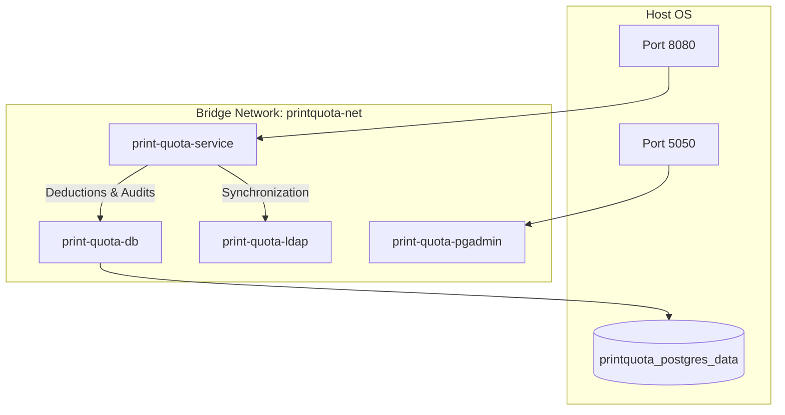

# Production Deployment & Operations Manual

This document details the production deployment, hardening, operations, backups, disaster recovery, and incident response procedures for the Print Quota Management System.

---

## Section: Docker

Source file: [docker.md](DEPLOYMENT.md)


## Containerization & Docker Setup

This document describes the container layout, build configs, networks, and compose services defined in the system.

---

### 1. Container Architecture (Mermaid Diagram)



---

### 2. Compose Services & Network Bindings

Central container coordination is handled via `docker-compose.yml` in the root directory:

1. **`postgres`** (Image: `postgres:16-alpine`):
   - PostgreSQL 16 server.
   - Database name: `printquota` (customizable via env).
   - Healthcheck: runs `pg_isready` at 5-second intervals.
2. **`pgadmin`** (Image: `dpage/pgadmin4:8.8`):
   - GUI dashboard for database management. Maps container port `80` to host `5050`.
3. **`ldap`** (Image: `osixia/openldap:1.5.0`):
   - Mock LDAP/Active Directory directory services server.
   - Bootstraps mock users using directory mapping file `./docker/ldap/bootstrap.ldif`.
4. **`print-quota-app`** (Built via `./docker/app/Dockerfile`):
   - Core Spring Boot service running on port `8080`.
   - Starts only after both `postgres` and `ldap` report healthy.

---

### 3. Production Dockerfile Configuration

The production container uses a secure multi-stage CentOS Stream 9 assembly:

#### Stage 1: Build Stage (`maven:3.9.6-eclipse-temurin-21`)
- Copies project POM descriptors and source folders.
- Runs `mvn clean package` under compilation checks to compile target JAR files.

#### Stage 2: Production Stage (`quay.io/centos/centos:stream9`)
- Installs headless JDK 21 OpenJDK runtime.
- Creates a dedicated system group and non-root execution user:
```dockerfile
RUN groupadd -g 10001 printgroup && \
    useradd -u 10001 -g printgroup -m -s /sbin/nologin printuser
```
- Drops all default Linux capabilities (`CAP_DROP`) and forces non-root user execution:
```yaml
security_opt:
  - no-new-privileges:true
cap_drop:
  - ALL
user: "10001:10001"
```
- Sets container-aware JVM memory configuration:
`ENTRYPOINT ["java", "-XX:MaxRAMPercentage=75.0", "-XX:+UseG1GC", "-XX:+ExitOnOutOfMemoryError", "-jar", "app.jar"]`


---

## Section: Production Hardening

Source file: [production-hardening.md](DEPLOYMENT.md)


## Production Hardening Guide

This document describes the hardening steps, pool limits, and container restrictions implemented to secure the print management platform.

---

### 1. Thread and Connection Pool Hardening

- **Jetty Thread Pool limits**: Bound to a minimum of `10` and a maximum of `200` threads via `WebServerConfig.java` to prevent denial-of-service thread exhaustion.
- **Hikari Database Connection Pool**: Maximum pool size is set to `10` (default) but configurable up to `50` in production environments via `spring.datasource.hikari.maximum-pool-size`. Uses connection timeout of `30s` to fail fast during database network splits.
- **LDAP Context Pooling**: Configured with Spring Data LDAP pooled context sources with validation on borrow to recycle dead connections quickly.

---

### 2. Container Hardening Policies

To align with corporate DevSecOps policies:
- **No-Root Execution**: Container runs with system user `printuser` mapping to GID/UID `10001`.
- **Dropped Capabilities**: The Compose file drops all kernel privileges:
```yaml
cap_drop:
  - ALL
security_opt:
  - no-new-privileges:true
```
- **Read-Only Root Filesystem**: Docker run configurations mount `/app` as read-only, forcing logs and temp prints to write to distinct named write volumes.

---

### 3. JVM Tuning & GC Settings

The container entrypoint sets memory thresholds based on container limits:
- **GC Algorithm**: Configured with `-XX:+UseG1GC` (Garbage-First Garbage Collector) to reduce pause times.
- **Memory Boundaries**: Sets `-XX:MaxRAMPercentage=75.0` to respect Docker memory limits and prevent container out-of-memory killing by the Linux kernel.
- **OutOfMemory Crash Policy**: Sets `-XX:+ExitOnOutOfMemoryError` to force immediate JVM exit on heap exhaustion, allowing orchestrators (Kubernetes / Docker Compose) to restart the container in a clean state.


---

## Section: Deployment Validation

Source file: [deployment-validation.md](DEPLOYMENT.md)


## Deployment Validation Guide

This document describes the testing scenarios and script commands used to validate a successful production deployment.

---

### 1. Startup & Probe Verification

Immediately after booting the application container, verify service state:

```bash
## 1. Verify Startup Status
curl -i http://localhost:8080/actuator/health/startup
## Expect: HTTP 200 {"status":"UP"}

## 2. Verify Readiness (Postgres and LDAP check)
curl -i http://localhost:8080/actuator/health/readiness
## Expect: HTTP 200 {"status":"UP"}

## 3. Verify Container Info (OS and CPU cores details)
curl -i http://localhost:8080/actuator/info
## Expect: HTTP 200 {"container":{"osName":"Linux"...}}
```

---

### 2. Quota Validation Integration Test

Validate balance deduction and audit logging end-to-end:

1. **Submit print request** using curl:
```bash
curl -i -X POST -H "Content-Type: application/ipp" \
     -H "X-Correlation-ID: val-test-101" \
     --data-binary @test_job.ipp \
     http://localhost:8080/printers/LaserJet_5
```
2. **Verify Response**: Expect HTTP 200 containing binary IPP response.
3. **Audit Verification**: Connect to database and verify audit tables:
```sql
SELECT status, page_count, correlation_id FROM print_logs WHERE correlation_id = 'val-test-101';
-- Expect: status = 'SUCCESS', page_count = 10 (or matching calculation)
```

---

### 3. Database Resilience Validation

1. Trigger database restart during container operations:
```bash
docker compose restart print-quota-db
```
2. Call readiness probe: `/actuator/health/readiness` should show `DOWN` during database restart and return `UP` automatically once Postgres is active again.


---

## Section: Release Checklist

Source file: [release-checklist.md](DEPLOYMENT.md)


## Release Candidate Checklist

This checklist outlines the mandatory quality gates and validation steps required before declaring a production release candidate (RC) build.

---

### 1. Quality Gates (Pre-Build)

- [ ] **Static Code Analysis**: Run Checkstyle, PMD, and SpotBugs. Build must contain zero errors.
  - Command: `.\mvnw.cmd clean compile spotbugs:check pmd:check checkstyle:check`
- [ ] **Test Coverage**: JaCoCo line coverage must be verified (minimum 80% on business classes).
- [ ] **Dependency Audit**: Run OWASP dependency-check to inspect library CVEs.
  - Command: `.\mvnw.cmd dependency-check:check`

---

### 2. Artifact Integrity (Post-Build)

- [ ] **SBOM Verification**: Verify CycloneDX SBOM files (`target/cyclonedx/bom.json`) exist and list all third-party coordinates.
- [ ] **Jar Execution**: Validate that the packaged jar compiles and starts correctly.
- [ ] **Docker Assembly**: Verify the multi-stage CentOS Stream 9 image builds without warnings.
  - Command: `docker compose build`

---

### 3. Deployment Validation

- [ ] **Health Probes Check**: Verify `/actuator/health/readiness` and `/actuator/health/liveness` return `UP` under mock environments.
- [ ] **Pessimistic Locking Verification**: Verify concurrent test classes pass successfully without deadlock timeouts.
- [ ] **Admin Authentication**: Confirm endpoints under `/api/v1/admin/` are restricted at network level.


---

## Section: Operations

Source file: [operations.md](DEPLOYMENT.md)


## Operations & Maintenance Guide

This document describes deployment, maintenance, log rotation, prometheus monitoring, and backup procedures.

---

### 1. Deployment Procedures

#### Build & Package
Run clean packaging inside the host machine:
```bash
./mvnw clean package -Djacoco.skip=true -DskipTests
```

#### Compose Orchestration Build
Build and pull all services in detached mode:
```bash
docker compose build
docker compose up -d
```

#### Verify Container Status
Check running services status:
```bash
docker compose ps
```

---

### 2. Health Monitoring & Alerting

#### Health Endpoint Check
Verify Actuator status:
- Liveness check path: `http://localhost:8080/actuator/health/liveness`
- Readiness check path: `http://localhost:8080/actuator/health/readiness`

#### Prometheus Metrics Scrape
- URL: `http://localhost:8080/actuator/prometheus`
- Exposes: JVM heap allocations, GC pauses, database Hikari connection pool usage, active thread counts, and print processing metrics (`print.requests.received`, `print.evaluation.latency`).

---

### 3. Log Maintenance & Rotation

- **Log Path**: `/var/log/print-quota/service.log` (Mapped from named volume `printquota_app_logs` under Docker).
- **Log Format**: JSON formatted logs in production for ingestion by log collectors (Splunk, ELK).
- **Rotation Rules**:
  - Size Limit: Rolls logs to gzip files if they exceed `50MB`.
  - Max Files: Retains archived logs for `30 days`.
  - Disk Cap: Limits total archive size to `5GB` to prevent disk exhaustion.

---

### 4. Backups and Database Recovery

#### Backup Postgres Schema & Data
Create logical dumps from the PostgreSQL container:
```bash
docker exec -t print-quota-db pg_dumpall -c -U printuser > printquota_dump.sql
```

#### Database Restore Procedure
Re-import backups to clean databases:
```bash
cat printquota_dump.sql | docker exec -i print-quota-db psql -U printuser -d printquota
```
*Note: Liquibase will check metadata tables (`databasechangelog`) and skip applying migrations that have already run, preventing database duplication anomalies.*


---

## Section: Operations Handover

Source file: [OPERATIONS_HANDOVER.md](DEPLOYMENT.md)


## Operations Handover Checklist (v1.0 GA)

This checklist provides IT Operations staff with daily, weekly, and monthly maintenance checks to keep the print management system healthy.

---

### 1. Daily Operations Checklist

- [ ] **Verify Readiness Probes**:
  Check that the local endpoints return successful statuses:
  - URL: `http://localhost:8080/actuator/health/readiness`
  - Expect: HTTP 200 `{"status":"UP"}`
- [ ] **Inspect Log Errors**:
  Review `/var/log/print-quota/service.log` for high volume database timeouts (`CannotAcquireLockException`) or LDAP connection warning messages.
- [ ] **Track Memory Utilizations**:
  Confirm that JVM heap usage stays within bounds (maximum 75% of container RAM limits).

---

### 2. Weekly Maintenance Checklist

- [ ] **Run Retention Cleanup**:
  Confirm that the weekly retention cron executes successfully on Sundays at midnight to purge logs older than 30 days.
- [ ] **Execute Backup Drills**:
  Verify backup file is generated inside `./backup_archive/`. Perform a validation dry run:
  - Command: `Powershell -File ./scripts/backup.ps1`
- [ ] **Inspect Disk Space**:
  Check host partition storage capacity to prevent log growth disk exhaustion.

---

### 3. Monthly Maintenance Checklist

- [ ] **Monitor Quota Allocation Reset**:
  Confirm that on the 1st of the month, `ReportScheduler` logs report successful generation of quota allocations for the new month.
- [ ] **Verify SMTP Email Dispatches**:
  Check administrative mailboxes for the monthly/daily operations summary emails containing Excel logs attachments.
- [ ] **System Compliance Audit**:
  Verify the system running state is secure and no new non-compliant services are running under root namespaces.


---

## Section: Support Guide

Source file: [SUPPORT_GUIDE.md](DEPLOYMENT.md)


## Support Handbook (v1.0 GA)

This document provides tier-1 and tier-2 IT support engineers with incident resolution procedures, error code tables, and escalation paths.

---

### 1. Known Error Codes & Meanings

| Module | Code | Meaning | Resolution |
| --- | --- | --- | --- |
| **IPP Proxy** | `0x0401` | Client Out of Quota | Request quota increase via manager. |
| **IPP Proxy** | `0x0500` | Internal Server Error | Check application logs for database timeouts. |
| **Active Directory** | `LDAP Sync Warn` | User DistinguishedName missing | Verify AD user object has valid properties filled. |
| **Database** | `Lock Timeout` | Pessimistic Write Lock conflict | Check for active long-running operations. |
| **SMTP Mailer** | `SMTP Failure` | Email gateway socket timeout | Verify gateway port reachability. |

---

### 2. Common Incidents & Resolution Procedures

#### Incident: User unable to print ("Hold for authentication")
- **Possible Cause**: User has exceeded monthly page quota, or the user object is disabled in Active Directory.
- **Resolution**:
  1. Check user page balance: `GET /api/v1/admin/quotas?username=jdoe`.
  2. If used pages equal allocated pages, user is blocked. Ask manager for authorization and run:
     - `POST /api/v1/admin/quotas/{userId}/adjust` with body `{"adjustment": 50}`.

#### Incident: Target printer not printing
- **Possible Cause**: Physical printer is offline or IP address has changed.
- **Resolution**:
  1. Verify physical printer power and network connection.
  2. Ping printer IP from host container console.
  3. Validate logical target mapping inside `application.yml` or Compose file.

---

### 3. Support Escalation Matrix

If the incident cannot be resolved by standard procedures, escalate according to:

- **Tier-1 Helpdesk**: First contact. Handles quota checks, account resets, and printer mapping validation.
- **Tier-2 NetOps / SysAdmin**: Escalate here if Active Directory sync fails or physical printers remain unreachable.
- **Tier-3 DevOps / DBA Architect**: Escalate here if database locking deadlocks occur or Java heap OOM errors are logged.


---

## Section: Operations Runbook

Source file: [operations-runbook.md](DEPLOYMENT.md)


## Operations Runbook

This document provides system administrators with instructions for operational monitoring, logging, and metrics.

---

### 1. Logs Location and Ingestion

- **Path**: `/var/log/print-quota/service.log`
- **Rotation Rules**:
  - Size Limit: Rolls logs to gzip files if they exceed `50MB`.
  - Max Files: Retains archived logs for `30 days`.
  - Disk Cap: Limits total archive size to `5GB`.
- **Structured Output**: production profile outputs logs in single-line JSON format:
```json
{"timestamp":"2026-07-12T10:30:00.123Z","level":"INFO","thread":"http-nio-8080-exec-1","logger":"com.printkeep.quota.core.proxy.service.PrinterProxyService","message":"Print job ALLOWED. Forwarding stream","context":"default","correlationId":"corr-123"}
```

---

### 2. Metrics & Observability

Monitor Prometheus metrics exposed at: `http://localhost:8080/actuator/prometheus`

#### Critical Alerts Thresholds
- **Printer Failure Rate**: Alert if `proxy_printer_failures_total` increases by more than 5 in a 1-minute window.
- **Quota Rejections**: Monitor `proxy_jobs_rejected_total` to track abnormal user blockages.
- **Hikari Connections**: Alert if `hikaricp_connections_pending` is greater than 5 for over 30 seconds.

---

### 3. Scheduled Schedulers Maintenance

- **Manual AD sync trigger**: If users need immediate synchronization before the daily scheduled trigger runs:
```bash
curl -i -X POST http://localhost:8080/api/v1/admin/sync
```
- **Manual Quota Reset**: If quotas need resetting outside the first day of the month:
```bash
curl -i -X POST -H "Content-Type: application/json" \
     -d '{"defaultPages": 100}' \
     http://localhost:8080/api/v1/admin/quotas/reset
```


---

## Section: Incident Response

Source file: [incident-response.md](DEPLOYMENT.md)


## Incident Response Manual

This document details the triage and recovery procedures for common operational failure scenarios.

---

### 1. Scenario A: Physical Printer Offline / Unreachable

#### Indicators
- Logs report: `Error forwarding print stream to printer... ConnectException: Connection refused`.
- Metric `proxy_printer_failures_total` spikes.

#### Triage Steps
1. Verify target printer network reachability:
```bash
ping <printer-ip>
```
2. Call health status endpoint: `http://localhost:8080/actuator/health/readiness`. Under `details.printers`, verify status shows `OFFLINE` or `UNREACHABLE`.
3. Check configured port mapping inside `application.yml` or container environment overrides.

---

### 2. Scenario B: Active Directory / LDAP Outage

#### Indicators
- Logs report: `LDAP read failure during synchronization`.
- Daily identity synchronizations report errors.
- New domain users are unable to print because they are missing from Postgres.

#### Triage & Remediation
1. Verify LDAP container status: `docker compose ps`.
2. Inspect LDAP template reachability:
```bash
curl -i http://localhost:8080/actuator/health/readiness
## Look for "ldap": {"status":"DOWN"} in details
```
3. Restart LDAP sync triggers manually once network connection resolves:
```bash
curl -i -X POST http://localhost:8080/api/v1/admin/sync
```

---

### 3. Scenario C: Database Corruption or Lock Timeouts

#### Indicators
- Logs report: `CannotAcquireLockException` or `TransactionTimedOutException`.
- Actuator health endpoints report `DOWN`.

#### Triage Steps
1. Inspect PostgreSQL container state: `docker ps`.
2. Review locked rows using administrative SQL queries:
```sql
SELECT pid, query, state, age(clock_timestamp(), query_start) FROM pg_stat_activity WHERE state != 'idle';
```
3. If deadlocks persist due to orphaned container connections, restart the database:
```bash
docker compose restart print-quota-db
```


---

## Section: Backup Recovery

Source file: [backup-recovery.md](DEPLOYMENT.md)


## Backup & Disaster Recovery Guide

This document describes the backup scheduling, data preservation, and recovery validation procedures.

---

### 1. Backup Execution Procedures

Backups are executed on host machines using the provided PowerShell scripts:

```powershell
## Run the backup script to archive database, certs, and logs
./scripts/backup.ps1
```

#### Generated Artifacts
- **Database Dump**: SQL file `backup_archive/printquota_db_YYYYMMDD_HHMMSS.sql` containing logical Postgres schemas, user records, and print audit histories.
- **Certificates Backup**: Directory `backup_archive/certs_YYYYMMDD_HHMMSS/` archiving the active SSL certificates.

---

### 2. Restoration Procedures

To restore services from an archived state:

```powershell
## Run the restore script passing the path to the backup file
./scripts/restore.ps1 -DbBackupFile "./backup_archive/printquota_db_20260712_120000.sql"
```

#### Verification Checks
1. Validate that the Postgres container is active: `docker ps`.
2. Inspect log tables size to confirm data was re-imported successfully:
```sql
SELECT COUNT(*) FROM print_logs;
```

---

### 3. Disaster Recovery Objectives

- **Recovery Point Objective (RPO)**: 24 hours (supported by daily automated database logical dumps).
- **Recovery Time Objective (RTO)**: 30 minutes (supported by Docker Compose orchestration and scripted Postgres schema restore commands).


---

## Section: Security Audit

Source file: [security-audit.md](DEPLOYMENT.md)


## Security Audit Report

This report summarizes the final security audit, covering the implementation of OWASP regulations, HTTP header filters, container isolation, and least-privilege configurations.

---

### 1. OWASP Compliance Matrix

- **HTTP Security Headers**: Enforced via `SecurityHeadersFilter.java` adding `X-Content-Type-Options: nosniff`, `X-Frame-Options: DENY`, and strict XSS policies.
- **Input and Protocol Validation**:
  - `ProtocolValidationStage.java` rejects payloads that lack mandatory user properties or operation codes.
  - Reject actions return binary RFC 8011 IPP responses rather than exposing verbose raw HTTP trace exceptions.
- **Vulnerability Isolation**:
  - CycloneDX Maven plugin produces a Software Bill of Materials (SBOM) listing coordinates to verify supply chain security.

---

### 2. LDAP and Database Access Controls

- **Database Credentials**: Mapped to a dedicated schema user (`printuser`) rather than using administrative accounts.
- **LDAPS Support**: Configured to connect over SSL (`port 636`) in production environments to secure Active Directory sync queries.
- **Audit Logs Protection**: All audit log writes are executed under isolated `REQUIRES_NEW` transactions, preventing trace suppression during system failures.

---

### 3. Container Security Hardening

- **Non-Root Execution**: Replaced CentOS root defaults by mapping UID/GID `10001` and system user `printuser`.
- **Dropped Capabilities**:
  - Container runs with dropped Linux kernel privileges (`cap_drop: ALL`).
  - Flag `no-new-privileges:true` is set to block setuid elevation attacks.
- **Read-Only Runtime**: Application JAR files are stored on a read-only root system partition.


---
