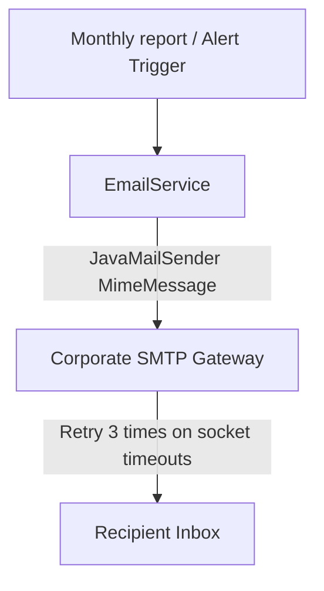
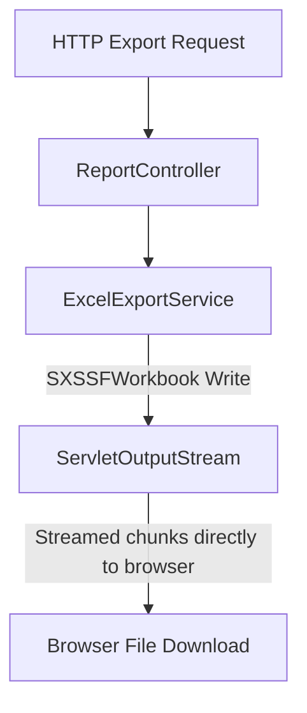

# Local Development & Environment Setup Guide

This document provides the details required to get the development environment running locally, execute tests, run local simulations, and perform local administration.

---

## Section: Testing

Source file: [testing.md](SETUP.md)


## Testing Blueprint & Matrix

This document outlines the testing levels, mock architectures, database testcontainers, and build validation commands.

---

### 1. Testing Framework Levels

1. **Unit Tests**:
   - Standalone logic testing with JUnit 5 and AssertJ.
   - Core parser/encoder check (`IppCodecTests.java`) testing bit conversions.
   - Metadata extraction (`IppMetadataExtractorTests.java`) checking rounding and multipliers.
   - MDC logging trace validation (`MdcCorrelationFilterTests.java`).
2. **Integration Tests**:
   - Spring Boot Test context checks.
   - Sliced controller layer tests (`LivenessControllerTests.java`).
3. **Database Concurrency Integration Tests**:
   - `QuotaConcurrencyTests.java` verifying pessimistic locks.
   - Spin up a real PostgreSQL 16 container via **Testcontainers** dynamically.
4. **Embedded LDAP Testing**:
   - Configures an in-memory **UnboundID Directory Server** mapping custom schema properties to mock Active Directory.

---

### 2. Test execution Command Guide

```bash
## Execute the complete testing suite (Runs Unit + Integration tests)
./mvnw clean test "-Dnet.bytebuddy.experimental=true"

## Run tests for a specific module
./mvnw test -pl print-quota-core "-Dnet.bytebuddy.experimental=true"

## Disable JaCoCo coverage rules checking
./mvnw clean test "-Djacoco.skip=true" "-Dnet.bytebuddy.experimental=true"
```
*Note: Java 26 inline mocking via ByteBuddy requires setting JVM property `"-Dnet.bytebuddy.experimental=true"` to prevent JVM compilation warnings.*

---

### 3. Mock Environments

#### A. Testcontainers Integration Setup
`AbstractIntegrationTest` starts a static database instance:
- Image: `postgres:16-alpine`
- Startup: Instantiated before class loading, sharing a single container across all repository tests to minimize context startup time.
- Fallback: Uses `DockerCondition` extension to skip executing test classes if no Docker daemon is running on the host system.

#### B. In-Memory LDAP Integration Setup
`LdapTestConfiguration` initializes:
- Embedded server: `InMemoryDirectoryServer`
- Port: Randomly assigned available system port.
- User schema: Prefills mock users matching domain accounts (`jdoe`, `asmith`, and disabled users).


---

## Section: User Guide

Source file: [USER_GUIDE.md](SETUP.md)


## PrintKeep End-User Guide (v1.0 GA)

This document describes how the print quota enforcement system works, what happens during quota rejections, and how to verify balances.

---

### 1. How Printing Works

When you submit a document to an office printer:
1. **Request Interception**: Your print job stream is analyzed by PrintKeep before reaching the printer.
2. **Identity Resolution**: The system extracts your Windows domain username from your workspace credentials.
3. **Quota Check**: The system calculates the page count (including page/duplex multipliers) and checks your remaining monthly quota.
4. **Delivery**: If you have sufficient pages, the job starts printing immediately.

---

### 2. Quotas Allocation & Monthly Reset

- **Allocation**: Every employee is allocated a monthly default quota (usually `100 pages` unless adjusted by your department head).
- **Reset Day**: On the first day of every month at midnight, your used page count resets to zero, and your page balance refreshes. Unused pages do not roll over to the next month.
- **Double-sided printing (Duplex)**: Standard prints count as 1 page per sheet face. Double-sided printing is recommended to conserve paper, but each printed side counts toward your quota limit.

---

### 3. Rejected Print Jobs

If your job is rejected:
- **Reason**: You have exceeded your allocated monthly page limit, or your account is marked inactive in Active Directory.
- **Notification**: Your workstation print queue will show an error message like "Hold for Authentication" or "Out of Quota" (status code `0x0401` returned in IPP format).
- **Remediation**: Contact your department manager to request a temporary quota adjustment.

---

### 4. Frequently Asked Questions (FAQ)

##### Q: How can I check my remaining page quota?
A: You can check your balance by logging into your intranet dashboard or contacting the IT Helpdesk.

##### Q: My print job failed but my quota was still deducted. What should I do?
A: If a physical paper jam occurs after the print job has been authorized by the proxy, the pages have already been recorded. Open a support ticket to have your balance adjusted.

##### Q: Are large PDF documents supported?
A: Yes. Large documents are streamed in small chunks to prevent network print dropouts.


---

## Section: Admin Guide

Source file: [ADMIN_GUIDE.md](SETUP.md)


## PrintKeep Administrator Handbook (v1.0 GA)

This document provides system administrators with setup, management, troubleshooting, and restoration guidelines.

---

### 1. System Overview

PrintKeep is an enterprise-grade print quota enforcement system and IPP proxy. It acts as a transparent filter between office client workstations and network printers:

- **Identity Sync**: Automated nightly synchronizations fetch user metadata and departments from Active Directory.
- **Quota Validation**: Compares print job page requests against the current month's remaining balance using pessimistic database write locking.
- **Proxy Routing**: Forwards allowed print streams to destination printers in low-memory, chunked streams.

---

### 2. Global Configurations

All properties are configured inside `application.yml` or overridden via environment variables:

| Environment Variable | Description | Default Value |
| --- | --- | --- |
| `SPRING_DATASOURCE_URL` | PostgreSQL connection URL | `jdbc:postgresql://localhost:5432/printquota` |
| `SPRING_LDAP_URLS` | Active Directory LDAP URLs | `ldap://localhost:10389` |
| `APP_QUOTA_DEFAULT_LIMIT` | Monthly default user page allocation | `100` |
| `APP_PRINTERS_ROUTING_MAP` | Logical name to target printer URI mapping | `LaserJet_5=http://printer.local/ipp` |
| `APP_ADMIN_EMAILS` | Target comma-separated admin emails | `admin@company.local` |

---

### 3. Printer Registration and Routing

To register new logical network printers, update the routing map key-values in `application.yml` or container variables:
```yaml
app:
  printers:
    routing-map:
      LaserJet_5: "http://printer1.company.local:631/ipp/print"
      Finance_Printer: "http://printer2.company.local:631/ipp/print"
```
During operations, client print queries targeting `http://proxy:8080/printers/LaserJet_5` will automatically route to the corresponding destination URI.

---

### 4. Quota Adjustments & Resets

Admin operations are exposed via administrative REST endpoints.

#### Adjust User Quota
- **POST** `/api/v1/admin/quotas/{userId}/adjust`
- Request: `{"adjustment": 50}` (increases quota limit by 50 pages; negative values decrease limit).

#### Manual Quota Reset
- **POST** `/api/v1/admin/quotas/reset`
- Request: `{"defaultPages": 150}` (resets all monthly balances to 150 pages).

---

### 5. Active Directory / LDAP Synchronization

Active Directory sync matches sAMAccountName records to PostgreSQL. The scheduler triggers daily.
To trigger an immediate manual synchronization:
- **POST** `/api/v1/admin/sync`
- Returns: `{"status":"SUCCESS","message":"Active Directory sync completed"}`

---

### 6. Logs Interpretation

Logs are formatted in single-line JSON structure for simple search integration (Splunk, Elasticsearch):
- **Core fields**: `timestamp`, `level`, `logger`, `message`, `correlationId`.
- **Example Log**:
```json
{"timestamp":"2026-07-12T10:45:00.102Z","level":"INFO","message":"Print job ALLOWED. Consumed pages: 5","correlationId":"uuid-999"}
```

---

### 7. Backup, Recovery & Disaster Recovery

Run backup/restore operations on host machines:
- **Execute Backup**: `Powershell -File ./scripts/backup.ps1`
- **Execute Restoration**: `Powershell -File ./scripts/restore.ps1 -DbBackupFile ./backup_archive/printquota_db_20260712_120000.sql`
- **RTO**: 30 minutes.
- **RPO**: 24 hours.


---

## Section: Administration

Source file: [administration.md](SETUP.md)


## Administrative Operations Portal

This document outlines the administrative APIs, user management queries, email workflows, and manual synchronization tools.

---

### 1. Administrative Workflows

#### A. Email Alert & Report Workflow (Mermaid Diagram)



#### B. Export / Download Workflow (Mermaid Diagram)



---

### 2. Admin API Catalog Reference

All administrative endpoints are versioned under `/api/v1/admin/`:

#### Search Users
- **Endpoint**: `GET /api/v1/admin/users`
- **Parameters**: `username` (optional), `department` (optional), `page`, `size`, `sort`
- **Response**: Paginated JSON user records.

#### Search Monthly Quotas
- **Endpoint**: `GET /api/v1/admin/quotas`
- **Parameters**: `username` (optional), `month` (optional), `page`, `size`
- **Response**: Paginated JSON quota balances.

#### Adjust User Quota
- **Endpoint**: `POST /api/v1/admin/quotas/{userId}/adjust`
- **Request Body**: `{"adjustment": 50}` (increases/decreases quota limit)
- **Response**: Updated quota entity.

#### Reset Quotas
- **Endpoint**: `POST /api/v1/admin/quotas/reset`
- **Request Body**: `{"defaultPages": 100}` (optional)
- **Response**: Success status message.

#### Trigger LDAP Sync
- **Endpoint**: `POST /api/v1/admin/sync`
- **Response**: Status of the synchronization process.

---

### 3. Email Alerting Configuration

To send daily summaries and offline alerts, configure the SMTP settings via environment variables:
- **`SPRING_MAIL_HOST`**: SMTP target address (e.g. `smtp.company.local`).
- **`SPRING_MAIL_PORT`**: SMTP communication port (e.g. `587` or `25`).
- **`APP_ADMIN_EMAILS`**: Target comma-separated administrator emails.


---

## Section: Readme

Source file: [project/README.md](SETUP.md)


## Carzonrent Spring Boot QA Environment

Production-style local QA gateway for Carzonrent, built with CentOS Stream 9, OpenJDK 21, Spring Boot 3.3.x, Maven, Apache HTTP Server, and Docker. The public endpoint is [http://localhost:8081](http://localhost:8081).

Apache is the only externally reachable web server. It never serves the dashboard from its document root; every request is reverse-proxied to Spring Boot on `127.0.0.1:8085` inside the container.

### Architecture

```text
Browser
        |
        v
localhost:8081
        |
        v
Docker Port Mapping
8081 -> 80
        |
        v
Apache HTTP Server
        |
Reverse Proxy
        |
        v
Spring Boot
127.0.0.1:8085
        |
Business Logic
        |
        v
HTTP Response
```

### Folder structure

```text
project/
|-- .dockerignore
|-- Dockerfile
|-- docker-entrypoint.sh
|-- verify.ps1
|-- README.md
|-- apache/
|   `-- qa.carzonrent.conf
`-- app/
    |-- pom.xml
    `-- src/main/
        |-- java/com/carzonrent/platform/qadashboard/
        |-- resources/application.yml
        |-- resources/templates/dashboard.html
        `-- resources/static/css/dashboard.css
```

### Build and run

Run from the `project` directory in PowerShell:

```powershell
docker build --pull --build-arg BUILD_VERSION=2.0.0 -t carzonrent-qa:2.0.0 -t carzonrent-qa:latest .

docker run -d `
  --name qa.carzonrent `
  --hostname qa.carzonrent `
  --restart unless-stopped `
  -p 8081:80 `
  carzonrent-qa:2.0.0
```

To rebuild an existing local deployment:

```powershell
docker rm -f qa.carzonrent
docker build --pull --build-arg BUILD_VERSION=2.0.1 -t carzonrent-qa:2.0.1 -t carzonrent-qa:latest .
docker run -d --name qa.carzonrent --hostname qa.carzonrent --restart unless-stopped -p 8081:80 carzonrent-qa:2.0.1
```

### Spring Boot application

The application name is `qa-dashboard`. Maven builds the executable JAR during image creation, and the entrypoint starts it before Apache.

Exposed routes:

- `GET /` renders the enterprise QA dashboard using Spring MVC and Thymeleaf.
- `GET /health` returns `{"status":"UP"}`.
- `GET /info` returns hostname, Java version, Spring Boot version, current time, operating system, and `environment=QA`.

`application.yml` binds Tomcat to `127.0.0.1:8085`, not `0.0.0.0`. Docker does not publish port 8085, so the backend is reachable only from inside the container.

### Apache reverse proxy

The Apache virtual host applies the requested enterprise proxy settings:

```apache
SSLProxyEngine On
Timeout 2400
ProxyTimeout 2400
ProxyBadHeader Ignore
ProxyPass / http://127.0.0.1:8085/
ProxyPassReverse / http://127.0.0.1:8085/
```

Additional choices:

- `ProxyRequests Off` prevents open-forward-proxy behavior.
- `ProxyPreserveHost On` keeps the QA host header visible to Spring Boot.
- `mod_ssl`, `mod_proxy`, `mod_proxy_http`, `mod_proxy_connect`, and `mod_headers` are loaded by the CentOS Apache module configuration.
- Packaged inbound `ssl.conf` is removed because this local QA gateway exposes HTTP port 80 only; `SSLProxyEngine` remains available for upstream proxy behavior.
- Apache access and error logs go to stdout/stderr for `docker logs`.

### Container startup

`docker-entrypoint.sh` starts Spring Boot from `/opt/carzonrent/runtime/qa-dashboard.jar`, waits for `http://127.0.0.1:8085/health`, and then executes:

```text
/usr/sbin/httpd -DFOREGROUND
```

Apache remains the foreground process. If Spring Boot fails during startup, the container exits instead of accepting broken traffic.

### Healthcheck

Docker health only becomes healthy when both layers work:

- Apache-proxied health: `http://127.0.0.1/health`
- Direct loopback Spring Boot health: `http://127.0.0.1:8085/health`

### Verification

Run:

```powershell
.\verify.ps1
```

The script checks container running state, health status, hostname, `8081 -> 80` mapping, that 8085 is not published, `httpd -t`, Apache modules, Spring Boot loopback binding, internal backend connectivity, proxied `/`, `/health`, `/info`, CSS delivery, 404 handling, Java 21, Spring Boot process state, Docker logs, and application logs.

Useful manual commands:

```powershell
docker ps --filter "name=qa.carzonrent"
docker logs --tail 50 qa.carzonrent
docker inspect -f '{{.State.Health.Status}}' qa.carzonrent
docker port qa.carzonrent
docker exec qa.carzonrent httpd -t
docker exec qa.carzonrent httpd -M
docker exec qa.carzonrent ss -lntp
docker exec qa.carzonrent curl -i http://127.0.0.1:8085/health
curl.exe -i http://localhost:8081/
curl.exe -i http://localhost:8081/health
curl.exe -i http://localhost:8081/info
```

Expected results are container health `healthy`, Apache `Syntax OK`, HTTP `200` for `/`, `/health`, and `/info`, HTTP `404` for `/not-found`, Apache on published port `8081`, and Spring Boot only on `127.0.0.1:8085` inside the container.

### Windows domain simulation

The hosts file is not modified automatically. To add the QA name:

1. Start Notepad as Administrator.
2. Open `C:\Windows\System32\drivers\etc\hosts` using the **All Files** file type.
3. Add:

   ```text
   127.0.0.1 qa.carzonrent.com
   ```

4. Save the file and optionally run `ipconfig /flushdns`.
5. Open [http://qa.carzonrent.com:8081](http://qa.carzonrent.com:8081).

The `:8081` suffix is required because hosts-file entries map names to IP addresses, not ports.

### Troubleshooting

- Build fails on `curl-minimal`: the Dockerfile uses `dnf --allowerasing` so full `curl` can replace the minimal package.
- Apache complains about missing TLS certificates: the Dockerfile removes the packaged inbound `ssl.conf` while keeping `mod_ssl` installed for `SSLProxyEngine`.
- Container stays unhealthy: inspect `docker logs qa.carzonrent`, then run `docker exec qa.carzonrent curl -i http://127.0.0.1:8085/health` and `docker exec qa.carzonrent curl -i http://127.0.0.1/health`.
- Backend appears externally reachable: confirm `docker port qa.carzonrent` only lists `80/tcp`; port 8085 must not appear.


---
