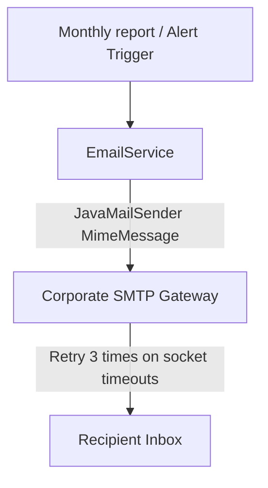
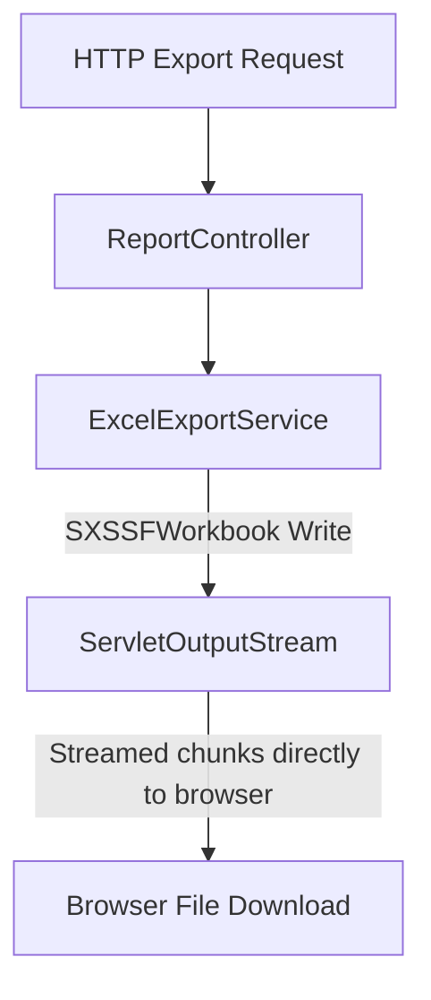

# Administrative Operations Portal

This document outlines the administrative APIs, user management queries, email workflows, and manual synchronization tools.

---

## 1. Administrative Workflows

### A. Email Alert & Report Workflow (Mermaid Diagram)

### B. Export / Download Workflow (Mermaid Diagram)

---

## 2. Admin API Catalog Reference

All administrative endpoints are versioned under `/api/v1/admin/`:

### Search Users
- **Endpoint**: `GET /api/v1/admin/users`
- **Parameters**: `username` (optional), `department` (optional), `page`, `size`, `sort`
- **Response**: Paginated JSON user records.

### Search Monthly Quotas
- **Endpoint**: `GET /api/v1/admin/quotas`
- **Parameters**: `username` (optional), `month` (optional), `page`, `size`
- **Response**: Paginated JSON quota balances.

### Adjust User Quota
- **Endpoint**: `POST /api/v1/admin/quotas/{userId}/adjust`
- **Request Body**: `{"adjustment": 50}` (increases/decreases quota limit)
- **Response**: Updated quota entity.

### Reset Quotas
- **Endpoint**: `POST /api/v1/admin/quotas/reset`
- **Request Body**: `{"defaultPages": 100}` (optional)
- **Response**: Success status message.

### Trigger LDAP Sync
- **Endpoint**: `POST /api/v1/admin/sync`
- **Response**: Status of the synchronization process.

---

## 3. Email Alerting Configuration

To send daily summaries and offline alerts, configure the SMTP settings via environment variables:
- **`SPRING_MAIL_HOST`**: SMTP target address (e.g. `smtp.company.local`).
- **`SPRING_MAIL_PORT`**: SMTP communication port (e.g. `587` or `25`).
- **`APP_ADMIN_EMAILS`**: Target comma-separated administrator emails.
