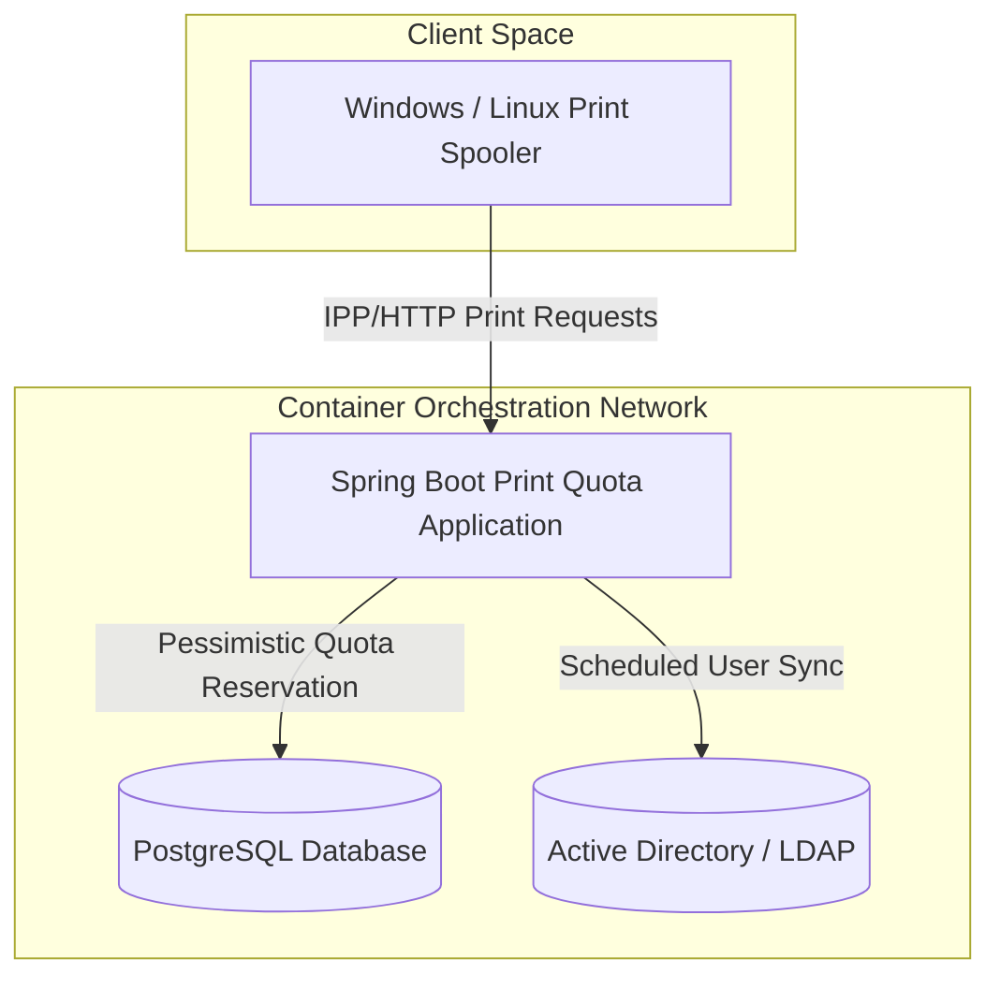
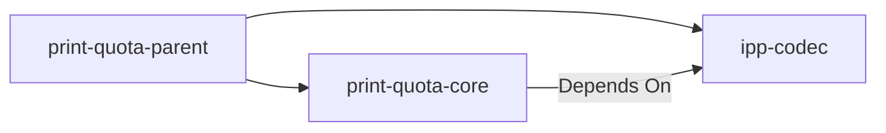
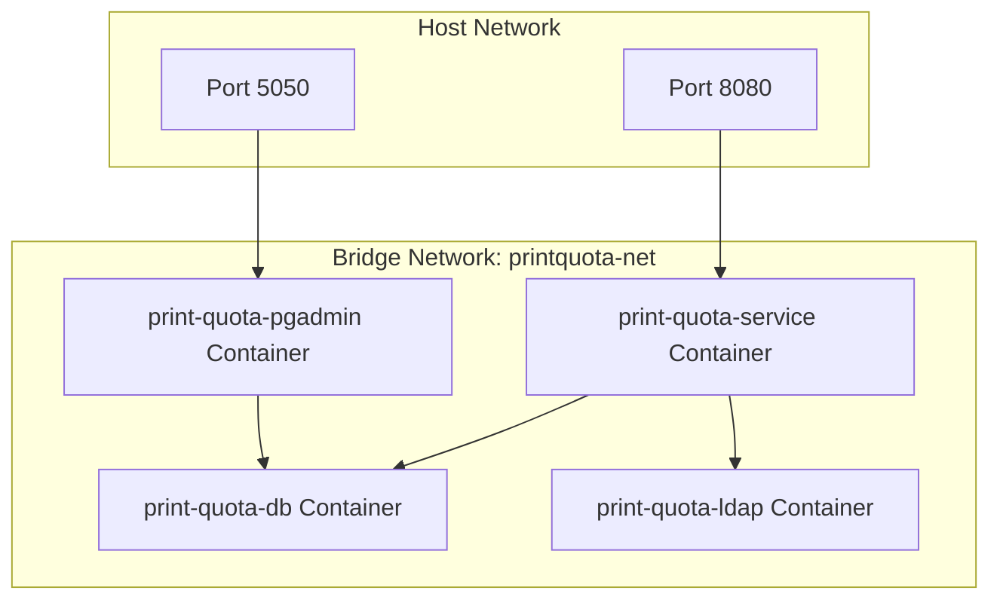

# Architecture Blueprint

This document details the architectural layout, modules separation, package layers, and execution flows for the Print Quota Management System.

---

## 1. Overall Architectural Architecture (Mermaid Diagram)

---

## 2. Module Responsibilities

The system is split into two modules to isolate decoding capabilities from the core execution platform:

1. **`print-quota-parent` (Root)**:
   - Centralizes dependency management BOMs (Spring Boot, Caffeine, Liquibase).
   - Standardizes build rules, compilers (`-Werror` Java 21), and quality enforcement rules (Checkstyle, SpotBugs, PMD).

2. **`ipp-codec`**:
   - Encapsulates binary parser/encoder implementations for RFC 8010/8011 IPP payloads.
   - Provides immutable records (`IppPacket`, `IppAttributeGroup`, `IppAttribute`) and enums (`IppOperation`, `IppTag`) to model IPP operations.
   - Zero framework dependencies (standalone Java library).

3. **`print-quota-core`**:
   - Hosts the Spring Boot application configuration, filters, endpoints, and scheduled task executors.
   - Orchestrates persistence (JPA entities and PostgreSQL repositories), identity (LDAP synchronization), and processing (Chain of Responsibility pipeline stages).

---

## 3. Package & Layered Architecture

Within `print-quota-core`, packages enforce clean boundaries:

- **`config/`**: Sets up Jetty threads, Actuator groups, Prometheus registry, and Caffeine caches.
- **`controller/`**: Handles Actuator endpoints and global exception filters.
- **`filter/`**: Handles MDC trace token mapping for requests.
- **`identity/`**: Houses LDAP query repository, mapping templates, and schedulers syncing AD users into Postgres.
- **`model/`**: Houses JPA entities (`User`, `Quota`, `PrintLog`).
- **`processing/`**: Implements processing engines (`PrintProcessingPipeline`), extraction utilities (`IppMetadataExtractor`), transaction boundaries (`PrintTransactionService`), and verification stages (`ProtocolValidationStage`, etc.).
- **`repository/`**: Inherits Spring Data JPA interfaces for data mutations, including pessimistic write lock declarations.

---

## 4. Deployment Architecture

The service is packaged using multi-stage Docker builds and orchestrated inside a private virtual bridge network:

- **App Base Image**: `quay.io/centos/centos:stream9` (CentOS Stream 9 Minimal).
- **Run Credentials**: Runs as a non-privileged user (`printuser`, GID/UID `10001`) with dropped kernel capabilities (`cap_drop: ALL`).
- **DB Persistent Volumes**: Host-bound volume mounts preserve PostgreSQL data and container log directories.
