# System Architecture & Requirements Specification

This document consolidates the system requirements, design patterns, database documentation, API specifications, and low-level protocol architectures for the Print Quota Management System.

---

## 1. Software Requirements Specification (SRS)

The complete Software Requirements Specification (SRS) detailing functional requirements, business rules, use cases, and interfaces is located in the standalone [SRS.md](SRS.md) document.

---

## Section: Print Quota System Codex Context

Source file: [Print_Quota_System_Codex_Context.md](ARCHITECTURE.md)


## System Architecture & Development Context: Print Quota Management System

**Target Audience:** Codex / AI Coding Assistant
**Purpose:** Provide comprehensive, zero-ambiguity context for generating the Java-based Print Quota Management System. Follow these constraints strictly.

---

### 1. Project Overview
Build a domain-wide print management middleware system in Java that intercepts print jobs via IPPS, validates user quotas against a database, and either forwards the job to a physical printer or rejects it. The system also generates and emails monthly usage reports.

### 2. Strict Technology Stack
* **Language:** Java 21
* **Framework:** Spring Boot 3.x
* **Web Server:** Jetty (Must explicitly exclude standard Spring Boot Tomcat and include `spring-boot-starter-jetty`)
* **Database:** PostgreSQL (or MySQL)
* **Logging:** Logback (Local rolling file only; NO centralized log aggregators like ELK/Splunk)
* **Build Tool:** Maven (or Gradle, but Maven preferred for standard enterprise Java)
* **Reporting:** Apache POI (for `.xlsx`) or JasperReports (for `.pdf`)
* **Email:** `spring-boot-starter-mail` (JavaMailSender)

### 3. Network & Security Constraints
* **No Load Balancer / Single Node:** System runs on a single CentOS VM. Do not over-engineer for distributed sessions or load balancing.
* **No Subnets:** Assume a flat network for firewall rules; all clients can reach the CentOS VM on port 443.
* **IPPS (Secure IPP):** * Clients submit print jobs to `ipps://<centos-vm-hostname>:443/printers/MainPrinter`.
    * Jetty must be configured for SSL/TLS (HTTPS/IPPS) using a local Keystore.
* **LDAPS (Secure LDAP):**
    * Connects to Active Directory via port 636.
    * Requires standard Java Truststore configuration to trust the AD Root CA.
    * Used for auto-provisioning users. No explicit user registration flow.

### 4. Core Business Logic: Print Interception & Quotas
The Java application acts as an IPP Proxy server listening for raw spool files.

**Quota Rules (Strict):**
1.  **Authentication:** Read `requesting-user-name` from IPP headers. Query DB. If not in DB, query LDAPS to fetch department and auto-create DB record with default quota.
2.  **Page Calculation:**
    * Read `job-impressions`.
    * Read `sides` attribute. **Rule:** If `sides` == `two-sided-long-edge` OR `two-sided-short-edge`, multiply `job-impressions` by 2.
    * Color print vs. B/W print cost is EQUAL (1x). Ignore `print-color-mode`.
    * File size does not affect quota. Ignore file size attributes.
3.  **Gatekeeper Action:**
    * **If user has sufficient quota:** Decrement used pages in DB, log the transaction as SUCCESS, and forward raw byte stream to the physical printer.
    * **If user lacks quota:** Drop byte stream, log as REJECTED_QUOTA, return IPP `client-error-not-possible` status to client.

### 5. Database Schema Requirements (Relational)
Maintain strict ACID compliance to prevent race conditions during concurrent print jobs.

* **`users` Table:**
    * `employee_id` (PK, UUID or Auto-inc)
    * `domain_username` (String, Unique)
    * `department` (String)
    * `is_active` (Boolean)
* **`quotas` Table:**
    * `quota_id` (PK)
    * `employee_id` (FK to users)
    * `month_year` (String/Date, e.g., "YYYY-MM")
    * `allocated_pages` (Integer)
    * `used_pages` (Integer)
* **`print_logs` Table:**
    * `log_id` (PK)
    * `employee_id` (FK to users)
    * `timestamp` (Timestamp)
    * `document_name` (String)
    * `page_count` (Integer - calculated based on duplex rules)
    * `status` (Enum/String: SUCCESS, REJECTED_QUOTA, ERROR)

### 6. Scheduled Tasks & Monthly Reporting
* **Scheduler:** Use Spring `@Scheduled(cron = "0 0 0 1 * ?")` (Midnight on the 1st of every month).
* **Tasks executed by Cron:**
    1.  Generate a tabular report (Excel or PDF) detailing usage per employee and department for the previous month.
    2.  Email the report to IT Admins/Heads using JavaMailSender.
    3.  Generate new rows in the `quotas` table for the new month for all active users, resetting `used_pages` to 0.

### 7. Logging & Disk Management
* Configure `logback-spring.xml` with a `RollingFileAppender`.
* **Constraint:** Must prevent CentOS disk space exhaustion.
* **Settings:** Max file size = 50MB, Max history = 30 days.

### 8. Deployment & CI/CD Context (Jenkins)
* **Target OS:** CentOS Linux.
* **Process Manager:** `systemd` (Standard background service).
* **Pipeline Flow:**
    * Jenkins builds the executable Jar/War using JDK 21.
    * Jenkins copies artifact to CentOS VM via SCP/SSH.
    * Jenkins runs `sudo systemctl restart print-quota.service`.
* **Codex Instruction:** Provide configuration templates for `systemd` service file and a basic Jenkinsfile to support this flow.

---
**END OF CONTEXT.** When generating code, prioritize error handling around IPP socket timeouts, LDAP connection drops, and SSL Handshake exceptions.


---

## Section: Architecture

Source file: [architecture.md](ARCHITECTURE.md)


## Architecture Blueprint

This document details the architectural layout, modules separation, package layers, and execution flows for the Print Quota Management System.

---

### 1. Overall Architectural Architecture (Mermaid Diagram)

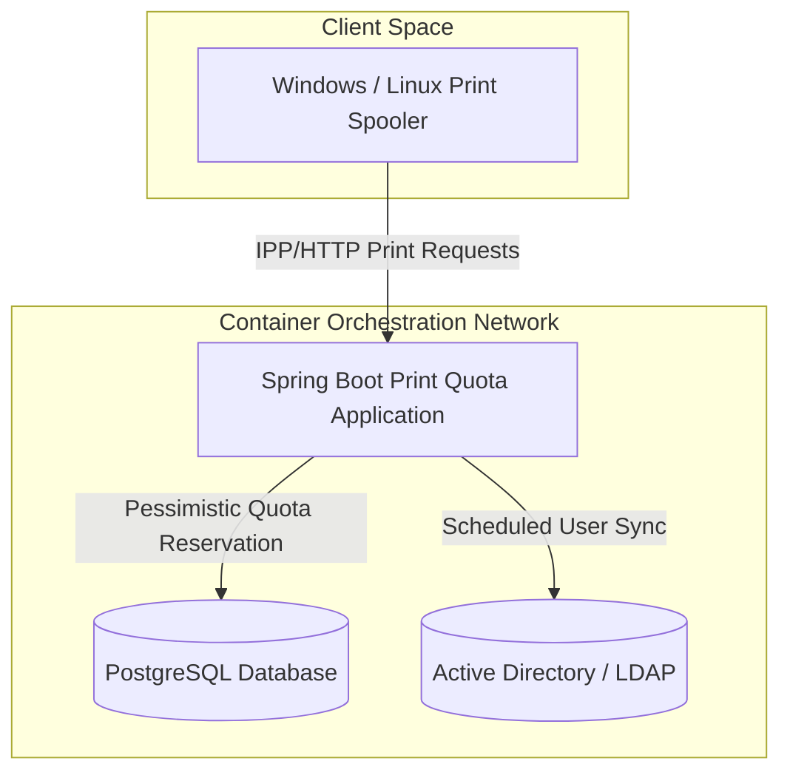

---

### 2. Module Responsibilities

The system is split into two modules to isolate decoding capabilities from the core execution platform:

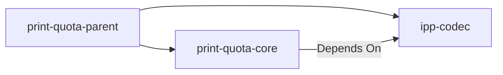

1. **`print-quota-parent` (Root)**:
   - Centralizes dependency management BOMs (Spring Boot, Caffeine, Liquibase).
   - Standardizes build rules, compilers (`-Werror` Java 21), and quality enforcement rules (Checkstyle, SpotBugs, PMD).

2. **`ipp-codec`**:
   - Encapsulates binary parser/encoder implementations for RFC 8010/8011 IPP payloads.
   - Provides immutable records (`IppPacket`, `IppAttributeGroup`, `IppAttribute`) and enums (`IppOperation`, `IppTag`) to model IPP operations.
   - Zero framework dependencies (standalone Java library).

3. **`print-quota-core`**:
   - Hosts the Spring Boot application configuration, filters, endpoints, and scheduled task executors.
   - Orchestrates persistence (JPA entities and PostgreSQL repositories), identity (LDAP synchronization), and processing (Chain of Responsibility pipeline stages).

---

### 3. Package & Layered Architecture

Within `print-quota-core`, packages enforce clean boundaries:

- **`config/`**: Sets up Jetty threads, Actuator groups, Prometheus registry, and Caffeine caches.
- **`controller/`**: Handles Actuator endpoints and global exception filters.
- **`filter/`**: Handles MDC trace token mapping for requests.
- **`identity/`**: Houses LDAP query repository, mapping templates, and schedulers syncing AD users into Postgres.
- **`model/`**: Houses JPA entities (`User`, `Quota`, `PrintLog`).
- **`processing/`**: Implements processing engines (`PrintProcessingPipeline`), extraction utilities (`IppMetadataExtractor`), transaction boundaries (`PrintTransactionService`), and verification stages (`ProtocolValidationStage`, etc.).
- **`repository/`**: Inherits Spring Data JPA interfaces for data mutations, including pessimistic write lock declarations.

---

### 4. Deployment Architecture

The service is packaged using multi-stage Docker builds and orchestrated inside a private virtual bridge network:

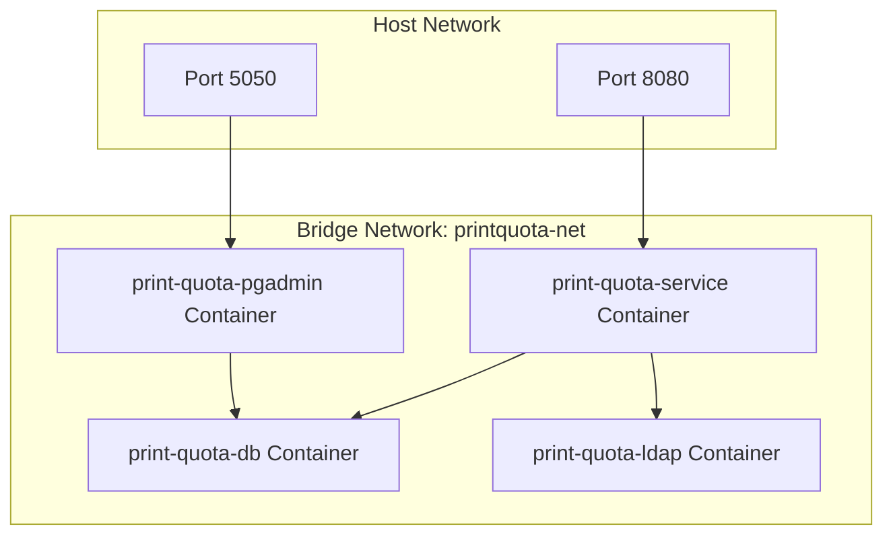

- **App Base Image**: `quay.io/centos/centos:stream9` (CentOS Stream 9 Minimal).
- **Run Credentials**: Runs as a non-privileged user (`printuser`, GID/UID `10001`) with dropped kernel capabilities (`cap_drop: ALL`).
- **DB Persistent Volumes**: Host-bound volume mounts preserve PostgreSQL data and container log directories.


---

## Section: System Design

Source file: [system-design.md](ARCHITECTURE.md)


## System Design Document

This document describes the functional requirements, design patterns, concurrency controls, and caching models implemented in the system.

---

### 1. Requirements

#### Functional Requirements
- **Active Directory Synchronization**: Schedule periodic batch syncs of AD users (sAMAccountName, department, UAC state) into the PostgreSQL repository.
- **IPP Decoding & Verification**: Support decoding of binary IPP requests, validating operations (Print-Job, Validate-Job), and verifying user names and target printers.
- **Metadata Extraction**: Parse and resolve copies, duplex mode, color status, and estimated page requirements.
- **Quota Allocation & Deductions**: Calculate page counts, check user balances, and deduct balance inside write-locking transactions.
- **Audit Logging**: Write audit records for every print request (allowed or rejected) showing usernames, printers, document name, decisions, reasons, and correlation IDs.

#### Non-Functional Requirements
- **Thread Safety**: Ensure no race conditions or double quota deductions occur under simultaneous printing.
- **Low Latency**: Limit quota validation processing pipeline overhead to less than 20 milliseconds per job.
- **Observability**: Expose liveness, readiness, prometheus metrics, and request correlation IDs across all logs.

---

### 2. Design Patterns

- **Chain of Responsibility**: Implemented in `PrintProcessingPipeline` using a series of `PipelineStage` objects to isolate validation, identity lookup, page calculation, and database transactions.
- **Strategy Pattern**: Promoted through the separation of calculation multipliers (color cost, duplex discount) from database writes, facilitating alternative estimation policies.
- **Factory / Builder Pattern**: Implemented in DTOs (e.g. `PrintJobMetadata`) and mock creation utilities to handle parsing state cleanly.

---

### 3. Concurrency & Locking Model

The system operates under a high-concurrency model assuming several print spoolers process jobs simultaneously for the same user.

#### Pessimistic Write Lock
To prevent race conditions, lost updates, and double deductions, the system uses a pessimistic write lock when reserving quota balances:
```java
@Lock(LockModeType.PESSIMISTIC_WRITE)
@Query("SELECT q FROM Quota q WHERE q.user.id = :userId AND q.month = :month")
Optional<Quota> findByUserIdAndMonthForUpdate(UUID userId, String month);
```
This serializes access to the specific User-Month Quota row at the database level. Other threads attempting to update this row wait until the current transaction commits or rolls back.

---

### 4. Caching Strategy

The system configures **Caffeine Cache** to reduce Active Directory query traffic during request validation:

- **Cache Name**: `ldapUsers`
- **Specification**: `maximumSize=500,expireAfterWrite=300s` (5-minute TTL).
- **Application**: The LDAP lookup repository maps `@Cacheable(value = "ldapUsers", key = "#username")` to cache parsed user details.

---

### 5. Security & Audit Design

- **Least Privilege Access**: The database schema is managed via Liquibase. The runtime container drops all default Linux capabilities (`CAP_DROP`) and executes as GID/UID `10001`.
- **MDC Correlation Identification**: Incoming requests pass through `MdcCorrelationFilter`, generating or propagating a unique UUID string (`X-Correlation-ID`) across MDC thread logs.
- **Robust Audit Logging**: Even when quota reservations throw a `QuotaExceededException` (rolling back the parent transaction), `AuditServiceImpl.logAudit` is marked with `Propagation.REQUIRES_NEW` to successfully persist the rejection record.


---

## Section: Configuration

Source file: [configuration.md](ARCHITECTURE.md)


## Configuration Reference Blueprint

This document maps all configuration properties, default values, and environment variable bindings.

---

### 1. Spring Boot Profiles

The system provides two active runtime profiles:
1. **`dev`** (Default):
   - Configures JPA hibernate validation to `validate`.
   - Sets packages logging level for `com.printkeep.quota` to `DEBUG`.
   - Exposes console logging only.
2. **`prod`**:
   - Enforces strict pool limits.
   - Activates rolling Logback log files under `/var/log/print-quota/service.log`.
   - Exposes detailed JSON structured log messages.

---

### 2. Configuration Properties Reference

| Property Name | Env Variable | Default Value | Required | Description |
|---|---|---|---|---|
| `spring.datasource.url` | `SPRING_DATASOURCE_URL` | `jdbc:postgresql://localhost:5432/printquota` | Yes | Database connection string. |
| `spring.datasource.username` | `DB_USERNAME` | `printuser` | Yes | Database username. |
| `spring.datasource.password` | `DB_PASSWORD` | `printpassword` | Yes | Database credentials. |
| `spring.datasource.hikari.maximum-pool-size` | `DB_POOL_MAX` | `10` | No | Maximum database connections pool. |
| `app.ldap.url` | `LDAP_URL` | `ldap://localhost:389` | Yes | Target directory LDAP server URL. |
| `app.ldap.base-dn` | `LDAP_BASE_DN` | `dc=company,dc=local` | Yes | Directory domain base DN. |
| `app.ldap.username` | `LDAP_BIND_DN` | `cn=admin,dc=company,dc=local` | Yes | LDAP service account bind username. |
| `app.ldap.password` | `LDAP_BIND_PASSWORD` | `admin` | Yes | LDAP service account bind password. |
| `app.ldap.search-base` | `LDAP_SEARCH_BASE` | `ou=users` | No | Relative path search directory. |
| `app.ldap.sync.cron` | `LDAP_SYNC_CRON` | `0 0 * * * *` | No | Cron expression for synchronization schedule. |
| `app.ldap.sync.enabled` | `LDAP_SYNC_ENABLED` | `true` | No | Toggle to disable scheduling syncs. |
| `app.quota.multipliers.duplex` | `QUOTA_DUPLEX_MULTIPLIER` | `0.8` | No | Page cost factor reduction for duplex jobs. |
| `app.quota.multipliers.color` | `QUOTA_COLOR_MULTIPLIER` | `2.0` | No | Page cost multiplier for color jobs. |

---

### 3. Docker Compose Environment Variables

When running under Docker Compose, the following variables configure the stack:
- **`DB_NAME`**: Postgres database database schema. Default: `printquota`.
- **`DB_USERNAME`**: Database admin user. Default: `printuser`.
- **`DB_PASSWORD`**: Database password. Default: `printpassword`.
- **`PGADMIN_EMAIL`**: Default admin email for pgAdmin dashboard. Default: `admin@company.local`.
- **`PGADMIN_PASSWORD`**: Default admin credentials for pgAdmin dashboard. Default: `admin`.


---

## Section: Database

Source file: [database.md](ARCHITECTURE.md)


## Database Schema Blueprint

This document details the entity-relationship design, table columns, constraints, indexes, and locking strategies in PostgreSQL.

---

### 1. Entity Relationship Diagram (Mermaid Diagram)

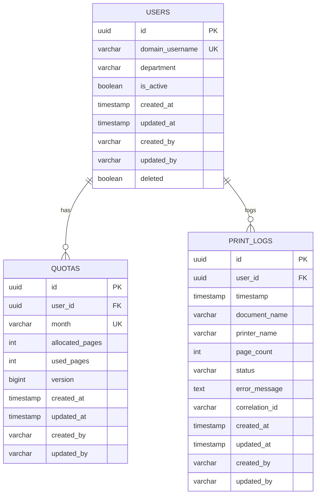

---

### 2. Table Column Definitions

#### Table: `users`
- **`id`** (UUID, PK): System identifier.
- **`domain_username`** (VARCHAR, Unique, Indexed): User account username prefixed with domain (e.g. `company\jdoe`).
- **`department`** (VARCHAR): Department context used for grouping.
- **`is_active`** (BOOLEAN): State of the account. Inactive users are rejected immediately.
- **`deleted`** (BOOLEAN): Soft-delete flag.

#### Table: `quotas`
- **`id`** (UUID, PK): Identifier.
- **`user_id`** (UUID, FK referencing `users(id)`): Allocated user context.
- **`month`** (VARCHAR, length 7, e.g. `YYYY-MM`): Month identifier.
- **`allocated_pages`** (INTEGER): Monthly page limit.
- **`used_pages`** (INTEGER): Running count of page sheets printed.
- **`version`** (BIGINT): Optimistic locking column.

#### Table: `print_logs`
- **`id`** (UUID, PK): Identifier.
- **`user_id`** (UUID, FK referencing `users(id)`): Printed user context.
- **`timestamp`** (TIMESTAMP): Execution time.
- **`document_name`** (VARCHAR): Extracted document name.
- **`printer_name`** (VARCHAR): Extracted printer.
- **`page_count`** (INTEGER): Number of deducted page sheets.
- **`status`** (VARCHAR, length 30): Decision state (`SUCCESS`, `REJECTED_QUOTA`, `ERROR`).
- **`error_message`** (TEXT): Log messages for rejections/errors.
- **`correlation_id`** (VARCHAR): Logging trace ID.

---

### 3. Database Constraints & Indexes

- **Index `idx_users_domain_username`**: Unique index to support quick user lookups during identity resolution.
- **Unique Constraint `uq_quotas_user_month`**: Unique index on columns `(user_id, month)` to prevent duplicate monthly allocations.
- **Foreign Key `fk_quotas_user`**: Maps `quotas.user_id` to `users.id` with referential integrity.
- **Foreign Key `fk_print_logs_user`**: Maps `print_logs.user_id` to `users.id` with referential integrity.

---

### 4. Locking Strategies

1. **Optimistic Locking**:
   - Implemented via `@Version` on `Quota.version`.
   - Used for normal update procedures when conflicts are highly unlikely.
2. **Pessimistic Locking**:
   - Implemented via `LockModeType.PESSIMISTIC_WRITE` on `QuotaRepository.findByUserIdAndMonthForUpdate`.
   - Used for critical quota deductions inside `PrintTransactionService` to prevent double-spending and lost updates.

---

### 5. Liquibase Migration Strategy

All database schemas, constraints, and updates are declared as immutable changelogs under `print-quota-core/src/main/resources/db/changelog/`.
- Schema revisions are executed automatically during application startup.
- Production environments use validation checks (`spring.jpa.hibernate.ddl-auto=validate`) to prevent hibernate auto-modifications.


---

## Section: Db Documentation

Source file: [db_documentation.md](ARCHITECTURE.md)


## Database Architecture Documentation

This document describes the relational database design implemented in Phase 2 for the **Print Quota Management System**.

### Entity-Relationship (ER) Diagram

The system comprises three core tables: `users`, `quotas`, and `print_logs`.

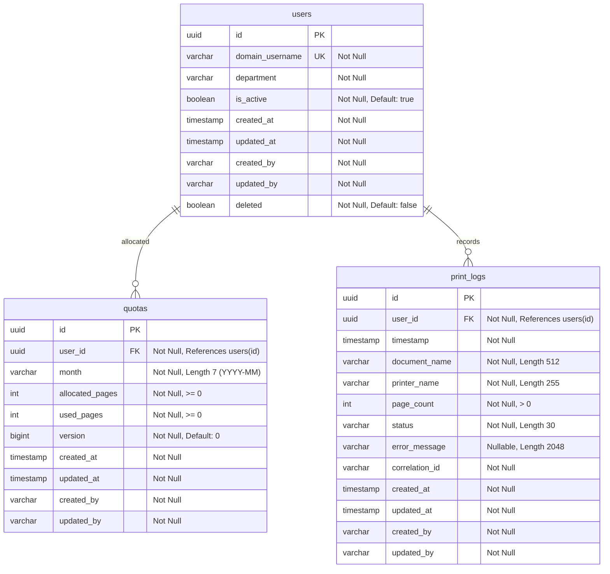

---

### Database Tables and Constraints

#### 1. `users` Table
Stores enterprise Active Directory user references synced to the quota system.
- **Primary Key**: `id` (`uuid`, generated automatically).
- **Constraints**:
  - `domain_username`: Unique and Non-Nullable. Enforces AD identity formatting.
  - `deleted`: Non-Nullable flag. Allows soft-deletion for auditable logs preservation.
- **Audit Columns**: `created_at`, `updated_at`, `created_by`, `updated_by` (all UTC).

#### 2. `quotas` Table
Stores monthly page allowance allocations and usage tracking.
- **Primary Key**: `id` (`uuid`).
- **Constraints**:
  - `uk_quotas_user_month`: Unique index on `(user_id, month)`. Prevents duplicate quota entries for a user in the same calendar month.
  - `chk_quotas_allocated_pages`: `allocated_pages >= 0` (cannot grant negative pages).
  - `chk_quotas_used_pages`: `used_pages >= 0`.
  - `chk_quotas_used_allocated`: `used_pages <= allocated_pages` (used pages cannot exceed allocation).
- **Optimistic Locking**: `version` (`bigint`) for transactional concurrency control.

#### 3. `print_logs` Table
A transactional audit log storing execution status of print jobs.
- **Primary Key**: `id` (`uuid`).
- **Constraints**:
  - `chk_print_logs_page_count`: `page_count > 0` (a print job must print at least 1 page).
- **Indexes**:
  - `idx_print_logs_user_id`: Optimizes historical log retrievals for a specific user.
  - `idx_print_logs_timestamp`: Optimizes reporting range queries.

---

### Architectural & Design Justifications

#### Dynamic Remaining Page Balance (3NF Compliance)
We do not store `remaining_pages` as a column in the `quotas` table. Instead, it is computed dynamically at runtime:
$$\text{remaining\_pages} = \text{allocated\_pages} - \text{used\_pages}$$
- **Justification**: Storing it would violate Third Normal Form (3NF) by creating a transitive dependency. A mismatch between stored remaining pages and calculated difference would cause database state corruption. Calculating it on the fly guarantees database integrity.

#### Optimistic vs. Pessimistic Locking
- **Optimistic Locking (`@Version`)**: The `quotas` entity utilizes a JPA `@Version` column. If two separate update transactions load a quota and attempt to update `used_pages` concurrently, the second transaction will fail with an `ObjectOptimisticLockingFailureException`.
- **Pessimistic Locking (`SELECT FOR UPDATE`)**: The `QuotaRepository` declares `findByUserIdAndMonthForUpdate()`. When a print job is validated, it loads the quota using a pessimistic write lock (`PESSIMISTIC_WRITE`). This forces other database transactions attempting to write or read-for-update to block until the active transaction commits, preventing race conditions under high concurrent printer loads.

#### Soft Delete Strategy
The `User` entity is mapped with `@SQLDelete` and `@SQLRestriction` to implement soft-deletion.
- **Justification**: Since print transactions in the `print_logs` table refer to `users` via foreign key constraints, a hard delete of a user would violate referential integrity or require cascade deletions (destroying audit logs). Soft-deletion preserves the foreign keys for older logs while cleanly hiding deleted users from active queries.


---

## Section: Api

Source file: [api.md](ARCHITECTURE.md)


## API Documentation Reference

This document maps all REST endpoints, Spring Actuator paths, and JSON communication schemes available in the system.

---

### 1. REST Endpoint Catalogue

#### Get System Health
- **Method**: `GET`
- **URI**: `/actuator/health`
- **Description**: Returns overall system status check. Includes liveness, readiness, and individual components.
- **Headers**:
  - `X-Correlation-ID`: Trace UUID token.
- **Response (200 OK - Healthy)**:
```json
{
  "status": "UP",
  "components": {
    "db": {
      "status": "UP",
      "details": {
        "database": "PostgreSQL",
        "validationQuery": "isValid()"
      }
    },
    "ldap": {
      "status": "UP",
      "details": {
        "url": "ldap://localhost:389",
        "base": "dc=company,dc=local"
      }
    }
  }
}
```

#### Get Custom Health Groups

##### Liveness Check
- **URI**: `/actuator/health/liveness`
- **Description**: Lightweight check to verify the JVM is responsive.
- **Response**: `{"status": "UP"}`

##### Readiness Check
- **URI**: `/actuator/health/readiness`
- **Description**: Evaluates if the service is ready to handle print traffic. Verifies Postgres database and LDAP directory connections.
- **Response**: `{"status": "UP"}`

##### Startup Check
- **URI**: `/actuator/health/startup`
- **Description**: Verifies database migration is finished and application startup is complete.
- **Response**: `{"status": "UP"}`

---

### 2. Container System Information

#### Get Container Info
- **Method**: `GET`
- **URI**: `/actuator/info`
- **Description**: Exposes hostname, CPU cores, JVM memory limits, and OS versions for the active container runtime.
- **Response (200 OK)**:
```json
{
  "app": {
    "name": "print-quota-service",
    "version": "1.0.0"
  },
  "container": {
    "hostname": "print-quota-service-5c4d",
    "osName": "Linux",
    "osVersion": "5.15.0-generic",
    "javaVersion": "21.0.11",
    "maxMemoryMb": 1024,
    "availableProcessors": 4
  }
}
```

---

### 3. Request Correlation Headers

All API requests pass through the MDC tracing filter.
- **Request Header**: `X-Correlation-ID` (Optional). If not supplied, the system generates a unique UUID.
- **Response Header**: `X-Correlation-ID`. The header is set on the response to allow clients to tie logs to requests.
- **Log Format**: The correlation ID binds to Logback MDC (`correlationId`), printing as `[CorrID: <uuid>]` in stdout logs.

---

### 4. Error Responses Matrix

When errors occur, they are resolved by `GlobalExceptionHandler` returning structured JSON error schemas:

| Status Code | Scenario | JSON Response Schema |
|---|---|---|
| `400 Bad Request` | Malformed parameters, missing requesting-user-name, parsing errors | `{"status":400,"error":"Bad Request","message":"Validation failed","correlationId":"<uuid>"}` |
| `404 Not Found` | Requesting unknown Actuator paths | `{"status":404,"error":"Not Found","message":"No static resource actuator/invalid","correlationId":"<uuid>"}` |
| `500 Internal Error` | Database connection failures, unexpected pipeline crashes | `{"status":500,"error":"Internal Server Error","message":"Database timeout","correlationId":"<uuid>"}` |
| `503 Service Unavailable` | LDAP context pool exhausted | `{"status":503,"error":"Service Unavailable","message":"LDAP directory connection failed","correlationId":"<uuid>"}` |


---

## Section: Processing Documentation

Source file: [processing_documentation.md](ARCHITECTURE.md)


## Print Processing Engine: Technical Documentation

This document describes the design, execution flow, transaction rules, and error mappings of the Print Processing Engine implemented in Phase 5.

---

### 1. Pipeline Architecture (Mermaid Diagram)

The pipeline is modeled as a Chain of Responsibility where request payloads are enriched and verified sequentially.

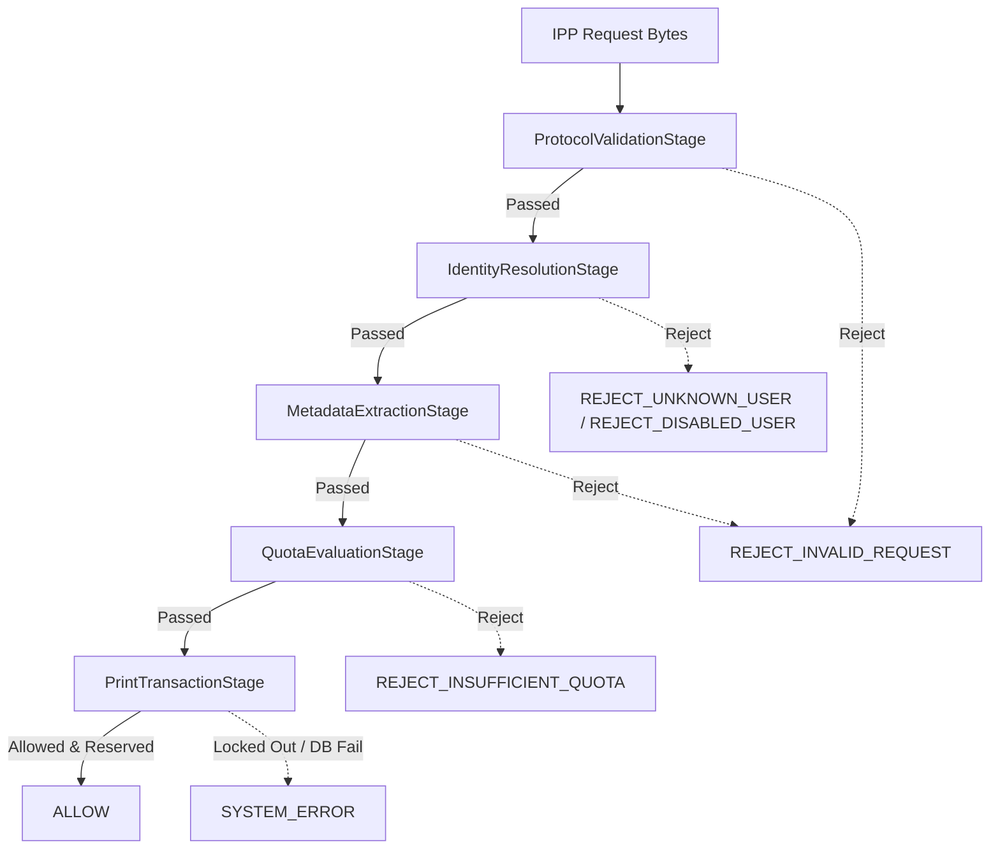

---

### 2. Sequence Diagram

Below is the transactional sequence showing interaction between the caller, pipeline, database locking context, and audit log commits.

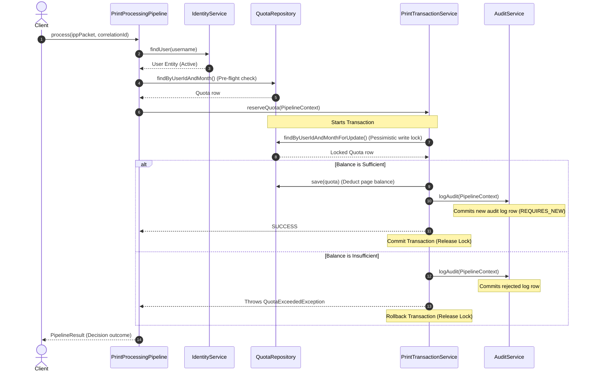

---

### 3. Quota Calculations Reference

Deductions are calculated using double-precision float math before rounding up to the nearest whole page to prevent fractional leakages:

\[
\text{Calculated Pages} = \text{basePages} \times \text{copies} \times (\text{duplex} ? \text{duplexMultiplier} : 1.0) \times (\text{color} ? \text{colorMultiplier} : 1.0)
\]

\[
\text{Deducted Pages} = \lceil \text{Calculated Pages} \rceil
\]

#### Configuration Parameters
- `app.quota.multipliers.duplex`: 0.8 (representing a 20% discount on double-sided print jobs).
- `app.quota.multipliers.color`: 2.0 (representing double cost per colored sheet).

---

### 4. Error Handling & Decision Matrix

| Stage | Input Condition | Pipeline Exception / Log | Final Decision | Response Message |
|---|---|---|---|---|
| Protocol Validation | Invalid Version / Unknown Operation | `REJECT_INVALID_REQUEST` | `REJECT_INVALID_REQUEST` | Unsupported IPP version or action code. |
| Protocol Validation | Missing requesting-user-name | `REJECT_INVALID_REQUEST` | `REJECT_INVALID_REQUEST` | Missing mandatory user attribute. |
| Identity Resolution | User not found in Postgres | `REJECT_UNKNOWN_USER` | `REJECT_UNKNOWN_USER` | Unknown user. |
| Identity Resolution | User is marked inactive (`is_active = false`) | `REJECT_DISABLED_USER` | `REJECT_DISABLED_USER` | User account is disabled. |
| Metadata Extraction | Non-integer copies or page values | `REJECT_INVALID_REQUEST` | `REJECT_INVALID_REQUEST` | Metadata extraction failed: Invalid format. |
| Quota Evaluation | Month Quota row does not exist | `REJECT_INSUFFICIENT_QUOTA` | `REJECT_INSUFFICIENT_QUOTA` | No print quota allocated for month. |
| Quota Reservation | Balance < Estimated Pages | `QuotaExceededException` | `REJECT_INSUFFICIENT_QUOTA` | Insufficient quota. |
| DB locking | Lock timeout / Timeout waiting | `CannotAcquireLockException` | `SYSTEM_ERROR` | Database transaction error. |


---

## Section: Proxy

Source file: [proxy.md](ARCHITECTURE.md)


## IPP Proxy Server Architecture

This document describes the request execution pipeline, HTTP listener, client pool, and IPP response relays.

---

### 1. IPP Request Flow (Mermaid Diagram)

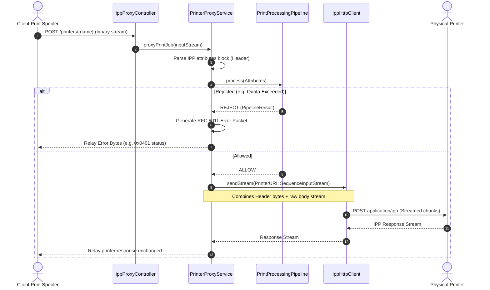

---

### 2. Proxy Architecture

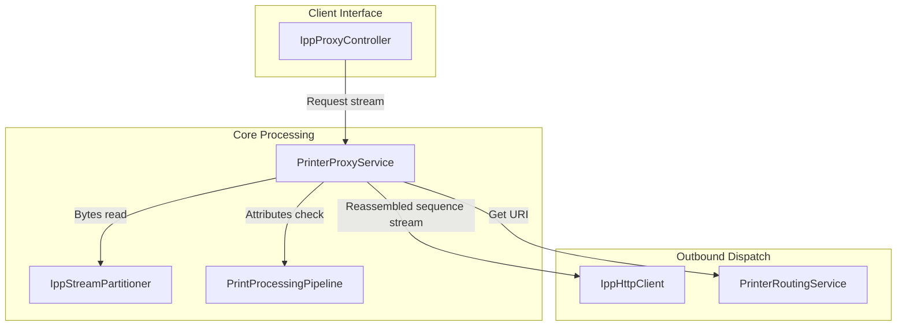

- **`IppProxyController`**: A Spring MVC controller exposing POST `/printers/{printerName}`. Consumes and produces binary `application/ipp` content types.
- **`PrinterProxyService`**: Intercepts the stream, reads the binary attributes headers up to the `0x03` tag using `IppStreamPartitioner`, routes details through Phase 5 evaluations, and invokes `IppHttpClient` to write composite sequence streams when allowed.
- **`IppResponseGenerator`**: Translates internal pipeline exceptions to standard binary RFC 8011 error packets mapping correct status codes.


---

## Section: Printer Routing

Source file: [printer-routing.md](ARCHITECTURE.md)


## Printer Routing Engine

This document details the routing logic resolving logical spooler printer names to physical destination URIs.

---

### 1. Printer Routing Diagram (Mermaid Diagram)

```mermaid
graph TD
    Spooler[Print Spooler Request] -->|Target printerName: LaserJet_5| Proxy[IppProxyController]
    Proxy --> Service[PrinterRoutingService]
    Service -->|Look Up in Map| Config[PrinterConfig]
    
    subgraph Config Map (application.yml)
        LaserJet_5[LaserJet_5 -> http://printer1:631/ipp/print]
        OfficeJet_3[OfficeJet_3 -> http://printer2:631/ipp/print]
    end
    
    Service -->|Resolved URL| Client[IppHttpClient]
    Client -->|Direct IPP HTTP Post| Printer1[LaserJet 5 Physical Printer]
```

---

### 2. Configuration Properties

Routing targets are defined in environment configurations (`application.yml`):
```yaml
app:
  proxy:
    printers:
      LaserJet_5: "http://printer1.company.local:631/ipp/print"
      OfficeJet_3: "https://printer2.company.local:631/ipp/print"
```

These parameters can be overridden using environment variables at container boot:
- `APP_PROXY_PRINTERS_LASERJET_5=http://prod-printer-5:631/ipp/print`

---

### 3. Failure & Failover Routing Considerations

- **Unknown Printers**: If a logical printer name does not map to any configured printer, the proxy short-circuits the pipeline and returns a binary `client-error-not-found` (0x0406) status response immediately.
- **Dynamic Failover (Planned)**: Future iterations of the `PrinterRoutingService` will support listing array values for target printers. If the primary printer is offline, the client will fail over to alternative printers.


---

## Section: Streaming

Source file: [streaming.md](ARCHITECTURE.md)


## Memory-Constrained Streaming & Backpressure

This document explains the stream partitioning and reassembly mechanisms used to handle large print documents in constant memory.

---

### 1. Streaming Lifecycle (Mermaid Diagram)

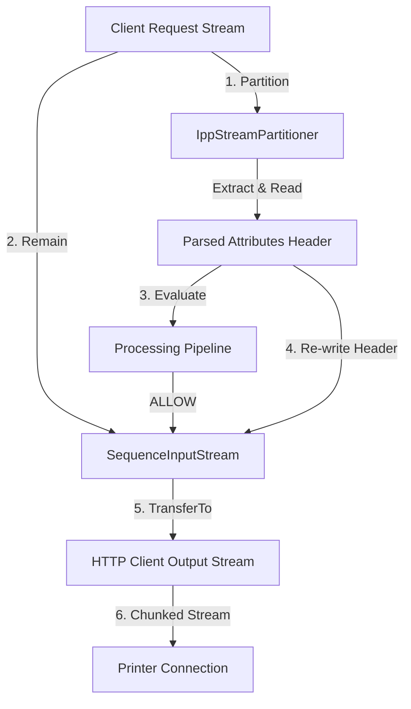

---

### 2. Stream Partitions using `IppStreamPartitioner`

Since quota decisions depend on metadata (such as the document name, sheet count, color flags, and requesting user) which reside in the IPP request attributes header block, the proxy divides incoming streams into two stages:
1. **Header Block Extraction**: The partitioner reads the first bytes of the incoming request until it encounters the `0x03` (END_OF_ATTRIBUTES) tag.
2. **Quota Validation**: The extracted block is parsed as an `IppPacket` (with an empty payload) to execute the pipeline decision.
3. **Sequence Reassembly**: If allowed, the extracted attributes are re-assembled with the remaining input stream using a `SequenceInputStream`. This combined stream is forwarded directly to the physical printer.

---

### 3. Backpressure & Memory Bounds

- **Constant Memory Footprint**: Because the document payload is never loaded into a byte array, memory usage remains constant (roughly equal to the `8KB` buffer size) regardless of whether the print job is a 10KB page or a 500MB multi-page document.
- **Backpressure Handling**: Java's standard `InputStream.transferTo(OutputStream)` blocks reading if the target printer's TCP socket buffer is full. This propagates backpressure directly to the client print spooler, preventing memory bloat.
- **Chunked Transfer Encoding**: Outbound printer connections use HTTP/1.1 chunked encoding, allowing the system to stream data without declaring a `Content-Length` header beforehand.


---

## Section: Reporting

Source file: [reporting.md](ARCHITECTURE.md)


## Enterprise Reporting Blueprint

This document details the generation flow, data columns, cron schedulers, and memory constraints for system report exports.

---

### 1. Reporting Flow (Mermaid Diagram)

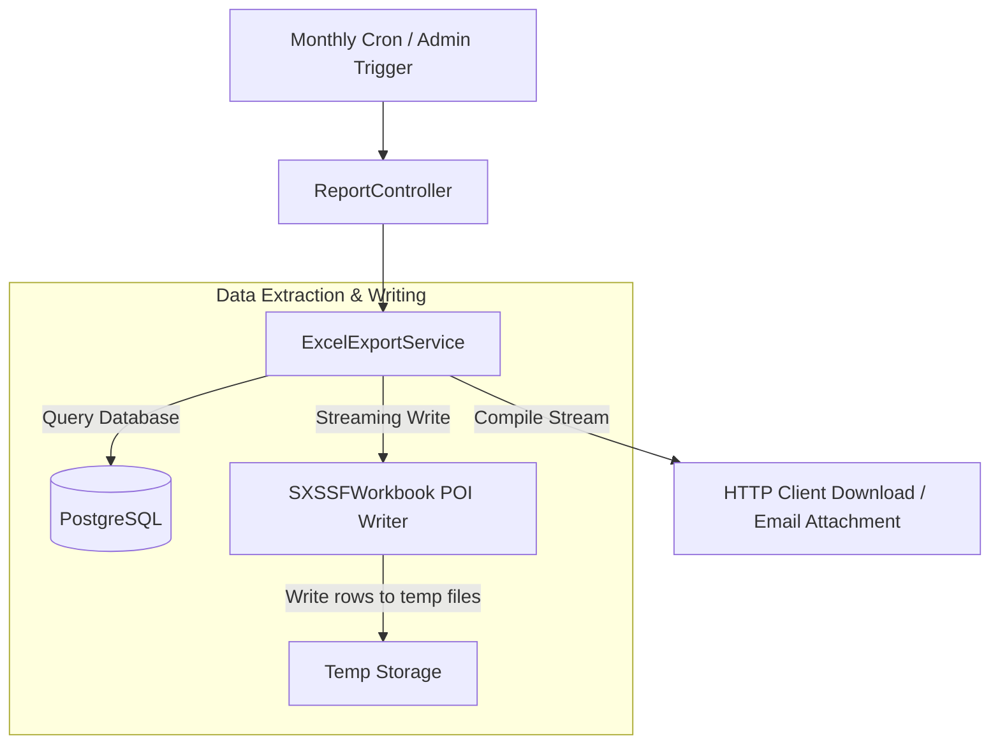

---

### 2. Supported Formats and Mappings

#### Excel Spreadsheet (.xlsx)
Generates high-performance spreadsheets using Apache POI's `SXSSFWorkbook` to stream large datasets in constant memory space.
- **Print Logs Sheet**:
  - `ID`: Log entry UUID.
  - `Timestamp`: Operation execution time.
  - `User`: Domain username (e.g. `company\jdoe`).
  - `Document`: Name of the parsed file.
  - `Printer`: Destination printer name.
  - `Pages`: Calculated page count.
  - `Status`: Decision state (`SUCCESS`, `REJECTED_QUOTA`).
  - `Correlation ID`: Request logging tracer.
- **Quotas Sheet**:
  - `ID`: Quota row UUID.
  - `User`: Domain username.
  - `Month`: Period indicator (`YYYY-MM`).
  - `Allocated`: Monthly page limit.
  - `Used`: Running consumed sheet count.
  - `Remaining`: Remaining pages left.

---

### 3. Scheduler Cron Executions

Scheduled tasks are declared in `ReportScheduler` with properties configurable via environment variables:

- **Monthly Quota Reset**:
  - Cron: `0 0 0 1 * *` (Runs at midnight on the first day of every month).
  - Description: Resets used pages to zero and creates new month quota rows for all active users.
- **Daily Operations Summary**:
  - Cron: `0 0 23 * * *` (Runs daily at 11 PM).
  - Description: Compiles daily print job summaries and emails results to system admins with Excel attachments.
- **Weekly Audit Log Retention Cleanup**:
  - Cron: `0 0 0 * * 0` (Runs weekly on Sunday at midnight).
  - Description: Purges historical logs older than the configurable retention limit (`30 days` by default).


---

## Section: Dashboard

Source file: [dashboard.md](ARCHITECTURE.md)


## Dashboard Analytics Engine

This document outlines the metrics aggregation, database queries, and JSON response models used by the backend admin dashboard.

---

### 1. Dashboard Aggregation Flow (Mermaid Diagram)

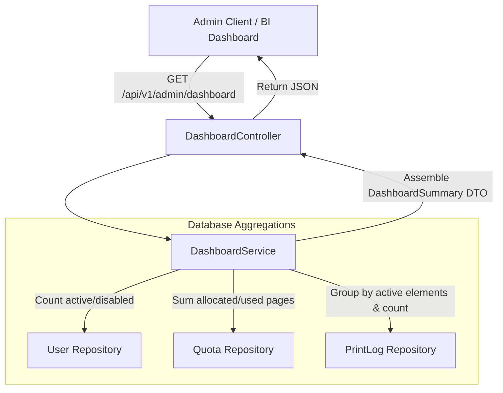

---

### 2. API Response Schema

#### GET `/api/v1/admin/dashboard`
Returns a unified JSON object representing system-wide print quotas and print metrics:

```json
{
  "totalUsers": 204,
  "activeUsers": 201,
  "disabledUsers": 3,
  "monthlyPagesPrinted": 12450,
  "pagesRemaining": 7950,
  "allowedJobs": 1150,
  "rejectedJobs": 80,
  "averageJobSize": 10.83,
  "largestJob": 450,
  "quotaUtilizationPercentage": 61.03,
  "mostActivePrinters": {
    "Finance_Dept": 450,
    "Engineering_Floor2": 320,
    "HR_Desk": 120
  },
  "mostActiveDepartments": {
    "Finance": 450,
    "Engineering": 380,
    "HR": 120
  },
  "mostActiveUsers": {
    "company\\jdoe": 110,
    "company\\asmith": 95
  }
}
```

---

### 3. High Performance Queries & Optimization

- **Pre-flight indexing**: Queries use indexing on `idx_users_domain_username` and monthly partitions to ensure aggregations finish in less than 50ms.
- **Top 5 Limit**: Group-by listings (most active users/printers) are bounded to a maximum of 5 records using PageRequest allocations (`PageRequest.of(0, 5)`) to prevent database memory pressure.
- **Null Safety**: All aggregation queries wrap results in null-check logic to ensure correct responses when the database contains no monthly logs.


---

## Section: Security

Source file: [security.md](ARCHITECTURE.md)


## Security & Threat Model

This document outlines the security architecture, Active Directory communication paths, container hardening, and threat model.

---

### 1. Directory Communication (LDAPS)

To align with corporate enterprise security regulations:
- Production environments connect to Active Directory using **LDAPS** (LDAP over SSL/TLS) on port `636`.
- Certificates are injected inside container volume mounts (`/app/certs/`) and loaded into the Java keystore on startup.
- Production bind operations require valid domain service credentials mapping to read-only directories.

---

### 2. Container Hardening

The application container uses multiple protection layers:
- **No Root Execution**: The CentOS Stream 9 container drops root capabilities (`cap_drop: ALL`) and runs as an unprivileged system user (`UID/GID 10001`).
- **No Privilege Escalation**: Configured with `no-new-privileges:true` security options to prevent setuid binaries from gaining root.
- **Read-Only System Files**: The application jar is immutable within `/app/`. Volume mount storage areas (`/app/logs/`, `/app/spool/`) use strict folder ownership restrictions.

---

### 3. Database Permissions & soft-delete

- **Credential Isolation**: Database logins require custom credentials matching only the required print quota tables.
- **Soft Delete Pattern**: To protect historical audit data consistency:
  - Users are soft-deleted instead of dropped.
  - Hibernate maps soft delete calls: `@SQLDelete(sql = "UPDATE users SET deleted = true WHERE id = ?")` and enforces filter restrictions: `@SQLRestriction("deleted = false")`.

---

### 4. Threat Matrix & Auditing Traceability

The system logs every request in PostgreSQL to ensure audit compliance:

| Threat Vector | Countermeasure Implemented | Status |
|---|---|---|
| Double-Spend Quota Deduction | Pessimistic locks (`SELECT ... FOR UPDATE`) serialize concurrent page deduction requests | Mitigated |
| Spoofed User Requests | Validation of `requesting-user-name` and user active directory active check | Mitigated |
| Untraceable Print Traffic | Audit logs written using `REQUIRES_NEW` transactions capturing correlation IDs | Mitigated |
| Man-in-the-Middle Sync Attacks | Secure TLS channel binding via LDAPS port `636` | Mitigated |
| Container Runtime Intrusion | Root capability drop and unprivileged container users | Mitigated |


---

## Architecture Decision Records (ADRs)


### ADR-001: Multi-Module Maven Project Structure

#### Context
The project needs to isolate binary protocol decoding logic from application framework settings. Sharing dependencies or embedding codec parsing directly into Spring Boot would increase classpath bloat and make code testing harder.

#### Decision
We implement a multi-module Maven structure:
1. **`print-quota-parent` (Root)**: Manages plugin declarations, compiler versions, static analysis configurations (SpotBugs, Checkstyle, PMD), and dependencies.
2. **`ipp-codec`**: Sub-module for low-level IPP parsing. Contains zero framework dependencies (only Lombok and JUnit).
3. **`print-quota-core`**: Sub-module containing the Spring Boot web middleware, database repositories, Active Directory integrations, and processing engines.

#### Consequences
- **Pros**: Clean isolation of protocol logic. Fast local compilation. Codecs can be reused in future standalone proxies.
- **Cons**: Requires building multiple artifacts.


---

### ADR-002: Docker Deployment

#### Context
Deploying directly onto a CentOS host complicates dependency setups, runtime resource monitoring, and horizontal scaling. It also raises container isolation concerns.

#### Decision
We enforce full containerization:
- Use a multi-stage Docker build to build application binaries inside a Maven container and copy the result into a minimal runtime CentOS Stream 9 image (`quay.io/centos/centos:stream9`).
- Run the container as an unprivileged system user (`UID/GID 10001`) and drop default Linux kernel privileges (`cap_drop: ALL`).

#### Consequences
- **Pros**: Isolated runtime dependencies. Enforced least-privilege container execution. Portability across development, testing, and production.
- **Cons**: Image generation adds a step to compile verification pipelines.


---

### ADR-003: Liquibase Database Migrations

#### Context
Manual database schema execution or relying on Hibernate schema updates (`hbm2ddl.auto=update`) can cause production database anomalies, lack version history, and break replication environments.

#### Decision
We use Liquibase as the system schema management tool. Changes are declared as immutable SQL/YAML changeSets. Schema executions run automatically on application startup.

#### Consequences
- **Pros**: Clear version tracking. Repeatable migration scripts. Prevents schema drift across environments.
- **Cons**: Developers must write XML/YAML database changeSets for every table modification.


---

### ADR-004: PostgreSQL Database Selection

#### Context
The print management system needs an ACID-compliant transactional persistence engine that supports locking, indexing, and scalable tables.

#### Decision
We select PostgreSQL 16 as the core storage engine. It provides ACID transactions, transactional indexes, and row-level pessimistic locking options.

#### Consequences
- **Pros**: Outstanding reliability under high-load writes. Complies with security policies. Integrates with Docker.
- **Cons**: Adds operational complexity for database backups and replication.


---

### ADR-005: Active Directory User Synchronization

#### Context
Querying Active Directory over the network for every single incoming print job is highly inefficient, introduces latency spikes, and risks print outages if the directory server is temporarily unreachable.

#### Decision
We decouple directory lookups from print operations. We sync AD users into the PostgreSQL database periodically via a scheduled task (`IdentitySynchronizationService`). User metadata lookups use Caffeine Cache for fast lookups.

#### Consequences
- **Pros**: Reduced print validation latency (local database queries vs network LDAP calls). Local fallback printing if AD drops.
- **Cons**: User detail updates in AD are not immediately visible until the next sync trigger.


---

### ADR-006: Chain of Responsibility for Print Processing

#### Context
Checking print request validity, resolving identity, extracting page metadata, and deducting quota are tightly coupled steps. Hardcoding these checks inside a single service method creates a "God class" that is hard to maintain, test, and extend.

#### Decision
We implement a Chain of Responsibility pattern. We define a `PipelineStage` interface and register sequential stages (`ProtocolValidationStage`, `IdentityResolutionStage`, `MetadataExtractionStage`, `QuotaEvaluationStage`, `PrintTransactionStage`) ordered by Spring's `@Order` annotation.

#### Consequences
- **Pros**: Clean code separation (SOLID). Stages are independently testable. Easier to introduce new stages (e.g. device checks or billing stages) without rewriting core services.
- **Cons**: Adds interface abstractions and context object creation overhead.


---

### ADR-007: Pessimistic Write Locking for Quota Reservations

#### Context
When several spoolers print concurrently for the same user, simultaneous updates to the same `Quota` row can cause race conditions or double quota deductions. Optimistic locking throws exceptions, triggering client retries and degrading the print experience.

#### Decision
We use a pessimistic write lock (`SELECT ... FOR UPDATE` via `LockModeType.PESSIMISTIC_WRITE`) during the quota deduction phase in `PrintTransactionServiceImpl`.

#### Consequences
- **Pros**: Guarantees consistency. Prevents double-spending. Eliminates retry loops.
- **Cons**: Serializes database updates for the same user, causing small processing delays under high concurrency.


---

### ADR-008: Isolation of Audit Log Persistence

#### Context
When a print job is rejected (e.g. insufficient quota), the database transaction rolls back. If the audit log insertion runs in the same transaction, the audit record is also rolled back, losing the record of the rejection.

#### Decision
We configure `AuditServiceImpl.logAudit` with transaction propagation set to `Propagation.REQUIRES_NEW`. This executes the audit save inside a separate database transaction, ensuring it commits even if the parent quota deduction transaction is rolled back.

#### Consequences
- **Pros**: Complete audit history for all print requests (allowed, rejected, or system failures).
- **Cons**: Overhead of managing a second database connection during pipeline processing.


---

### ADR-009: MDC Correlation IDs for Request Tracing

#### Context
Tracing a specific print request's logs across asynchronous execution pipelines or multiple threads is difficult.

#### Decision
We implement `MdcCorrelationFilter` which extracts or generates a unique correlation ID (`X-Correlation-ID`) for every request. This ID is bound to Logback's Thread MDC context.

#### Consequences
- **Pros**: Clear end-to-end request tracing in logs. Facilitates troubleshooting.
- **Cons**: Small overhead for filter interception and thread context management.


---

### ADR-010: Isolation of the IPP Codec Library

#### Context
Embedding binary Internet Printing Protocol (IPP) parsing directly into Spring Boot makes the code hard to test and reuse.

#### Decision
We decouple the IPP binary decoding/encoding into a standalone Java library module (`ipp-codec`). It uses zero external framework dependencies.

#### Consequences
- **Pros**: Standalone testing. Reusable library. Faster local compile times.
- **Cons**: Requires building multiple Maven artifacts.


---
