# System Architecture & Requirements Specification

This document consolidates the system requirements, design patterns, database documentation, API specifications, and low-level protocol architectures for the Print Quota Management System.

---

## Section: Srs

Source file: [SRS.md](ARCHITECTURE.md)


## Software Requirements Specification

### PrintKeep — Enterprise Print Quota Management System

---

| Field              | Value                                                  |
| :----------------- | :----------------------------------------------------- |
| **Project Name**   | PrintKeep — Enterprise Print Quota Management System   |
| **Version**        | 1.0                                                    |
| **Author**         | Daksh Saini — Principal Solution Architect             |
| **Date**           | 10 July 2026                                           |
| **Document Status**| Draft — Pending Stakeholder Review                     |
| **Classification** | Internal — Confidential                                |

#### Revision History

| Version | Date           | Author      | Description                              |
| :------ | :------------- | :---------- | :--------------------------------------- |
| 0.1     | 10 July 2026   | D. Saini    | Initial draft — all sections             |
| 1.0     | 10 July 2026   | D. Saini    | Baseline release for stakeholder review  |

---

### Table of Contents

1. [Introduction](#1-introduction)
2. [Overall Description](#2-overall-description)
3. [Functional Requirements](#3-functional-requirements)
4. [Non-Functional Requirements](#4-non-functional-requirements)
5. [Business Rules](#5-business-rules)
6. [System Architecture](#6-system-architecture)
7. [Use Cases](#7-use-cases)
8. [Data Model](#8-data-model)
9. [External Interfaces](#9-external-interfaces)
10. [Security Requirements](#10-security-requirements)
11. [Error Handling](#11-error-handling)
12. [Acceptance Criteria](#12-acceptance-criteria)
13. [Future Enhancements](#13-future-enhancements)

---

### 1 Introduction

#### 1.1 Purpose

This Software Requirements Specification (SRS) defines the functional, non-functional, security, and architectural requirements for **PrintKeep**, an enterprise print quota management system. The document serves as the authoritative requirements baseline for development, quality assurance, and stakeholder acceptance.

#### 1.2 Scope

PrintKeep is a middleware application that intercepts Internet Printing Protocol (IPP) requests from all Active Directory users within a corporate network, validates monthly print quotas, forwards approved jobs to physical printers, rejects unauthorized jobs, records every print transaction in a relational database, and generates monthly Excel usage reports distributed via email.

The system is deployed on a single CentOS virtual machine serving approximately 200 Active Directory users across a flat enterprise network.

#### 1.3 Objectives

- Enforce monthly page quotas for all domain-authenticated users.
- Provide transparent print interception requiring zero client-side software installation.
- Automate user provisioning from Active Directory.
- Generate actionable monthly usage reports for IT administration.
- Maintain a complete, auditable transaction log for every print operation.

#### 1.4 Business Goals

| ID    | Goal                                                                 |
| :---- | :------------------------------------------------------------------- |
| BG-01 | Reduce uncontrolled printing costs by enforcing per-user page limits |
| BG-02 | Provide department-level visibility into printing consumption        |
| BG-03 | Eliminate manual user registration through LDAP auto-provisioning    |
| BG-04 | Deliver automated monthly reports to IT management                   |
| BG-05 | Maintain full audit trail compliance for print transactions          |

#### 1.5 Definitions, Acronyms, and Abbreviations

| Term           | Definition                                                            |
| :------------- | :-------------------------------------------------------------------- |
| **IPP**        | Internet Printing Protocol (RFC 8010 / RFC 8011)                      |
| **IPPS**       | IPP over TLS (secure printing transport)                              |
| **LDAPS**      | Lightweight Directory Access Protocol over SSL/TLS                    |
| **AD**         | Active Directory                                                      |
| **mTLS**       | Mutual Transport Layer Security                                       |
| **Quota**      | Monthly page allocation assigned to each user                         |
| **Spool**      | Temporary disk storage for print data streams                         |
| **Duplex**     | Two-sided printing                                                    |
| **Simplex**    | Single-sided printing                                                 |
| **POI**        | Apache POI — Java API for Microsoft document formats                  |
| **MDC**        | Mapped Diagnostic Context — thread-local logging context              |
| **HikariCP**   | High-performance JDBC connection pool                                 |
| **SXSSFWorkbook** | Apache POI streaming workbook for memory-efficient Excel generation |
| **systemd**    | Linux system and service manager                                      |

#### 1.6 References

| Ref | Document                                              |
| :-- | :---------------------------------------------------- |
| R1  | RFC 8010 — IPP/1.1: Encoding and Transport            |
| R2  | RFC 8011 — IPP/1.1: Model and Semantics               |
| R3  | IEEE 29148:2018 — Systems and Software Engineering — Life Cycle Processes — Requirements Engineering |
| R4  | IEEE 830-1998 — Recommended Practice for SRS           |
| R5  | PrintKeep Implementation Roadmap & Production Blueprint |

#### 1.7 Document Conventions

- Requirement identifiers follow the pattern `FR-NNN` (functional) and `NFR-NNN` (non-functional).
- Priority levels: **Critical**, **High**, **Medium**, **Low**.
- Diagrams use Mermaid syntax.
- All time references use 24-hour UTC format unless stated otherwise.

---

### 2 Overall Description

#### 2.1 Product Perspective

PrintKeep operates as a transparent IPP proxy positioned between network print clients and physical printers. Clients submit print jobs to PrintKeep's IPPS endpoint as though it were the physical printer. PrintKeep intercepts each request, validates the submitting user's monthly quota, and either forwards the job downstream or rejects it.

The system does not require any client-side software installation. Users configure their workstations to print to the PrintKeep IPPS endpoint via standard operating system printer drivers.

#### 2.2 Business Context

Carzonrent's enterprise environment supports approximately 200 employees across multiple departments. The organization requires visibility into per-user and per-department printing consumption to control operational costs. The current environment lacks any print quota enforcement or usage tracking mechanism.

#### 2.3 High-Level Architecture

The system comprises five primary subsystems: IPP Interception, User Authentication, Quota Engine, Print Forwarding, and Reporting.

#### 2.4 Target Users

| User Role             | Description                                                   |
| :-------------------- | :------------------------------------------------------------ |
| **Domain User**       | Any Active Directory user who submits print jobs               |
| **IT Administrator**  | Manages quotas, receives monthly reports, monitors system health |
| **System Operator**   | Manages deployment, certificates, and service lifecycle        |

#### 2.5 User Roles

| Role                  | Capabilities                                                        |
| :-------------------- | :------------------------------------------------------------------ |
| **Printing User**     | Submit print jobs; receive acceptance or rejection responses         |
| **Report Recipient**  | Receive monthly Excel usage reports via email                        |
| **System Administrator** | Configure quotas, manage certificates, restart services, review logs |

#### 2.6 Operating Environment

| Component        | Specification                                    |
| :--------------- | :----------------------------------------------- |
| **Server OS**    | CentOS Linux                                     |
| **Runtime**      | Java 21 (LTS)                                    |
| **Framework**    | Spring Boot 3.x with embedded Jetty              |
| **Database**     | PostgreSQL                                       |
| **Directory**    | Microsoft Active Directory (LDAPS on port 636)   |
| **Network**      | Flat enterprise LAN; all clients reach port 443  |
| **Deployment**   | Single VM; systemd-managed background service    |
| **CI/CD**        | Jenkins declarative pipeline                     |

#### 2.7 Assumptions

1. All printing users are registered in a single Active Directory domain.
2. Physical printers support IPP or RAW TCP (port 9100) connectivity.
3. The CentOS VM has sufficient disk space for spool files and log rotation.
4. An SMTP relay server is available on the enterprise network.
5. Active Directory service accounts with read-only access are provisioned.
6. Default monthly quota values are defined by organizational policy.

#### 2.8 Dependencies

| Dependency              | Type     | Description                                  |
| :---------------------- | :------- | :------------------------------------------- |
| Active Directory        | External | User identity and department resolution       |
| PostgreSQL              | External | Persistent storage for quotas and logs         |
| Physical Printers       | External | Downstream print job targets                   |
| SMTP Server             | External | Monthly report email delivery                  |
| Certificate Authority   | External | TLS certificates for IPPS and LDAPS            |
| Jenkins                 | External | Continuous integration and deployment pipeline  |

#### 2.9 Constraints

1. The system shall run on a single virtual machine; distributed deployment is out of scope.
2. The system shall not require any client-side software installation or agent.
3. Color and black-and-white print costs are equal (1× multiplier).
4. File size attributes shall not affect quota calculations.
5. The application shall not run as the root user in production.
6. Maximum log disk consumption shall not exceed 5 GB.

---

### 3 Functional Requirements

#### FR-001 — Print Interception

| Field               | Value |
| :------------------ | :---- |
| **Requirement ID**  | FR-001 |
| **Title**           | IPP Print Job Interception |
| **Description**     | The system shall accept incoming IPP print requests on an IPPS endpoint and intercept the print job payload before it reaches the physical printer. |
| **Priority**        | Critical |
| **Preconditions**   | Jetty server is running and listening on port 443 with a valid TLS certificate. |
| **Trigger**         | A client submits an IPP Print-Job operation to the system's IPPS endpoint. |
| **Main Flow**       | 1. Client establishes TLS connection. 2. System receives IPP request stream. 3. System delegates to IPP parser for metadata extraction. 4. System proceeds to user authentication. |
| **Alternative Flow**| If the IPP operation is not Print-Job (e.g., Get-Printer-Attributes), the system returns a standard IPP response without quota processing. |
| **Exception Flow**  | If TLS handshake fails, the connection is dropped and the event is logged. |
| **Postconditions**  | IPP metadata is extracted and available for downstream processing. |
| **Acceptance Criteria** | IPP Print-Job requests from standard Windows and CUPS drivers are intercepted and parsed without error. |

---

#### FR-002 — IPP Packet Parsing

| Field               | Value |
| :------------------ | :---- |
| **Requirement ID**  | FR-002 |
| **Title**           | IPP Binary Packet Parsing |
| **Description**     | The system shall parse IPP binary request streams per RFC 8010 and extract metadata attributes including `requesting-user-name`, `job-impressions`, `sides`, and `document-name`. |
| **Priority**        | Critical |
| **Preconditions**   | An IPP request stream has been received by the interception layer. |
| **Trigger**         | The interception handler passes the raw byte stream to the parser module. |
| **Main Flow**       | 1. Read IPP version and operation-id. 2. Parse operation attributes until end-of-attributes tag (`0x03`). 3. Extract `requesting-user-name`, `job-impressions`, `sides`, and `document-name`. 4. Return a structured packet model. |
| **Alternative Flow**| If `job-impressions` is absent, default to 1 page. If `sides` is absent, default to simplex. |
| **Exception Flow**  | If the packet is malformed or exceeds size limits, return IPP status `client-error-not-possible` (`0x040B`). |
| **Postconditions**  | A validated, structured packet model is available for the quota engine. |
| **Acceptance Criteria** | Parser correctly extracts all required attributes from compliant IPP streams. Malformed packets are rejected with the correct IPP error code. String attributes exceeding 255 characters are rejected. |

---

#### FR-003 — User Authentication

| Field               | Value |
| :------------------ | :---- |
| **Requirement ID**  | FR-003 |
| **Title**           | User Identity Resolution |
| **Description**     | The system shall resolve the identity of the submitting user by matching the `requesting-user-name` IPP attribute against the local user database. |
| **Priority**        | Critical |
| **Preconditions**   | IPP packet has been parsed and `requesting-user-name` is available. |
| **Trigger**         | The quota processing pipeline queries the user database. |
| **Main Flow**       | 1. Query the `users` table by `domain_username`. 2. If found and active, proceed to quota validation. 3. If found but inactive, reject the request. |
| **Alternative Flow**| If the user is not found in the database, trigger auto-provisioning (FR-004). |
| **Exception Flow**  | If the database is unavailable, log the error and return an IPP server-error response. |
| **Postconditions**  | The user's identity and active status are confirmed. |
| **Acceptance Criteria** | Known active users are resolved within 50ms. Unknown users trigger the auto-provisioning flow. Inactive users are rejected. |

---

#### FR-004 — LDAP Auto-Provisioning

| Field               | Value |
| :------------------ | :---- |
| **Requirement ID**  | FR-004 |
| **Title**           | Automatic User Provisioning from Active Directory |
| **Description**     | When a user submits a print job but does not exist in the local database, the system shall query Active Directory via LDAPS to retrieve the user's department and automatically create a local user record with a default monthly quota. |
| **Priority**        | High |
| **Preconditions**   | User not found in local database. AD connectivity available. |
| **Trigger**         | User lookup in FR-003 returns no matching record. |
| **Main Flow**       | 1. Query AD using `sAMAccountName` filter over LDAPS (port 636). 2. Retrieve the `department` attribute. 3. Create a new `User` record with `is_active = true`. 4. Create a `Quota` record for the current month with default allocation. 5. Proceed to quota validation. |
| **Alternative Flow**| If AD is unavailable, create the user with department set to `"Default"` and log a warning. |
| **Exception Flow**  | If LDAPS connection times out (>2 seconds), fall back to default department. |
| **Postconditions**  | A new user record and initial quota allocation exist in the database. |
| **Acceptance Criteria** | New users print successfully on first attempt. Department is correctly populated from AD. Fallback to "Default" functions when AD is unreachable. LDAP queries execute outside database transaction boundaries. |

---

#### FR-005 — Quota Validation

| Field               | Value |
| :------------------ | :---- |
| **Requirement ID**  | FR-005 |
| **Title**           | Monthly Print Quota Validation |
| **Description**     | The system shall verify that the submitting user's remaining monthly page allocation is sufficient to cover the requested print job before forwarding. |
| **Priority**        | Critical |
| **Preconditions**   | User identity resolved. Quota record exists for the current month. |
| **Trigger**         | The quota engine receives the user record and page count from the parsed IPP packet. |
| **Main Flow**       | 1. Acquire a pessimistic write lock on the user's current-month quota row. 2. Calculate page cost using duplex rules. 3. Verify `used_pages + page_cost ≤ allocated_pages`. 4. Increment `used_pages` by `page_cost`. 5. Commit the transaction. |
| **Alternative Flow**| If quota record does not exist for the current month, create one with default allocation before validating. |
| **Exception Flow**  | If `used_pages + page_cost > allocated_pages`, roll back the transaction, log `REJECTED_QUOTA`, and return an IPP rejection response. |
| **Postconditions**  | Quota balance is updated atomically. A print log entry is created. |
| **Acceptance Criteria** | Concurrent print jobs from the same user are serialized via database locks without race conditions. Quota deductions are accurate for both simplex and duplex jobs. Rejected jobs do not decrement quotas. |

---

#### FR-006 — Print Transaction Logging

| Field               | Value |
| :------------------ | :---- |
| **Requirement ID**  | FR-006 |
| **Title**           | Print Transaction Audit Logging |
| **Description**     | The system shall create a persistent log entry for every print job processed, regardless of whether the job was approved or rejected. |
| **Priority**        | Critical |
| **Preconditions**   | IPP packet parsed. User identity resolved. |
| **Trigger**         | Quota validation completes (either success or rejection). |
| **Main Flow**       | 1. Create a `PrintLog` record with: employee reference, timestamp, document name, calculated page count, and status. 2. Persist to database within the active transaction. |
| **Alternative Flow**| None. |
| **Exception Flow**  | If the database write fails, log the error to the application log file as a fallback. |
| **Postconditions**  | An immutable audit record exists for the transaction. |
| **Acceptance Criteria** | Every processed print job — successful, rejected, or errored — has a corresponding database log entry. |

---

#### FR-007 — Print Forwarding

| Field               | Value |
| :------------------ | :---- |
| **Requirement ID**  | FR-007 |
| **Title**           | Downstream Print Job Forwarding |
| **Description**     | The system shall forward approved print jobs to the target physical printer using IPPS or RAW TCP, spooling data to disk to prevent memory exhaustion. |
| **Priority**        | Critical |
| **Preconditions**   | Quota validation passed. Print data stream available. |
| **Trigger**         | Quota engine returns approval status. |
| **Main Flow**       | 1. Spool the print data stream to a temporary disk file. 2. Open a connection to the downstream printer. 3. Stream the spooled data to the printer. 4. Delete the spool file upon successful transmission. |
| **Alternative Flow**| If the printer supports RAW TCP (port 9100) instead of IPPS, use the appropriate protocol. |
| **Exception Flow**  | If forwarding fails (printer offline, timeout, connection reset): 1. Execute a compensating transaction to refund the deducted pages. 2. Update the print log status to `ERROR`. 3. Delete the spool file. 4. Return an IPP server-error response. |
| **Postconditions**  | Print data delivered to printer OR quota refunded and error recorded. |
| **Acceptance Criteria** | Large print jobs (>50 MB) do not cause JVM OutOfMemoryError. Failed transmissions result in full quota refunds. Spool files are cleaned up in all code paths. |

---

#### FR-008 — Monthly Report Generation

| Field               | Value |
| :------------------ | :---- |
| **Requirement ID**  | FR-008 |
| **Title**           | Automated Monthly Usage Report |
| **Description**     | The system shall generate an Excel workbook containing two sheets — Employee Summary and Detailed Print History — for the preceding calendar month. |
| **Priority**        | High |
| **Preconditions**   | Print log data exists for the preceding month. |
| **Trigger**         | Scheduled cron execution at midnight on the first day of each month. |
| **Main Flow**       | 1. Query all print log entries for the preceding month. 2. Aggregate data by employee and department. 3. Generate Sheet 1: Employee Summary (name, department, pages used, pages allocated, percentage). 4. Generate Sheet 2: Detailed Print History (timestamp, document, pages, status). 5. Write to `.xlsx` file using streaming workbook API. |
| **Alternative Flow**| If no print data exists for the month, generate an empty report with headers only. |
| **Exception Flow**  | If report generation fails, log the error and save a partial report to the backup directory. |
| **Postconditions**  | An Excel report file is generated and available for email dispatch. |
| **Acceptance Criteria** | Reports generate without JVM memory issues for up to 200 users and 50,000 monthly log entries. Report data matches database records exactly. |

---

#### FR-009 — Email Report Distribution

| Field               | Value |
| :------------------ | :---- |
| **Requirement ID**  | FR-009 |
| **Title**           | Automated Report Email Dispatch |
| **Description**     | The system shall email the monthly usage report to configured IT administrator recipients as an attachment. |
| **Priority**        | High |
| **Preconditions**   | Monthly report file has been generated (FR-008). SMTP server is reachable. |
| **Trigger**         | Successful completion of report generation. |
| **Main Flow**       | 1. Compose email with subject line containing the report month and year. 2. Attach the generated Excel file. 3. Send via SMTP using configured credentials. |
| **Alternative Flow**| None. |
| **Exception Flow**  | If SMTP is unavailable, save the report to the local backup directory (`/var/lib/print-quota/reports`) and log a warning. The quota rollover (FR-010) shall proceed independently. |
| **Postconditions**  | Report delivered to recipients OR saved locally for manual retrieval. |
| **Acceptance Criteria** | Emails contain the correct attachment. SMTP failures do not block quota reset operations. |

---

#### FR-010 — Monthly Quota Reset

| Field               | Value |
| :------------------ | :---- |
| **Requirement ID**  | FR-010 |
| **Title**           | Monthly Quota Rollover |
| **Description**     | The system shall create new quota records for all active users for the new calendar month, resetting `used_pages` to zero. |
| **Priority**        | Critical |
| **Preconditions**   | The first day of a new month has arrived. |
| **Trigger**         | Scheduled cron execution at midnight on the first day of each month, after report generation. |
| **Main Flow**       | 1. Query all active users. 2. Create a new `Quota` record for the current month with default `allocated_pages` and `used_pages = 0`. 3. Execute as a single bulk database transaction. |
| **Alternative Flow**| If a quota record already exists for the current month (idempotency guard), skip that user. |
| **Exception Flow**  | If the database transaction fails, retry once. If retry fails, log a critical error and alert administrators. |
| **Postconditions**  | All active users have quota records for the new month. |
| **Acceptance Criteria** | Quota reset completes within 30 seconds for 200 users. The operation is idempotent. |

---

#### FR-011 — Health Monitoring

| Field               | Value |
| :------------------ | :---- |
| **Requirement ID**  | FR-011 |
| **Title**           | System Health Endpoints |
| **Description**     | The system shall expose health check endpoints for monitoring database connectivity, LDAP availability, disk space, and overall application status. |
| **Priority**        | Medium |
| **Preconditions**   | Application is running. |
| **Trigger**         | External monitoring tool queries health endpoints. |
| **Main Flow**       | 1. Respond to `/actuator/health/liveness` with application alive status. 2. Respond to `/actuator/health` with aggregate health including database and disk indicators. |
| **Alternative Flow**| None. |
| **Exception Flow**  | If a health indicator detects failure (e.g., database down), report status as `DOWN`. |
| **Postconditions**  | Monitoring tools receive accurate health status. |
| **Acceptance Criteria** | Health endpoints respond within 200ms. Health status accurately reflects component availability. Endpoints are accessible only from localhost. |

---

#### FR-012 — Configuration Management

| Field               | Value |
| :------------------ | :---- |
| **Requirement ID**  | FR-012 |
| **Title**           | Externalized Application Configuration |
| **Description**     | The system shall support externalized configuration for database credentials, LDAP settings, SMTP parameters, quota defaults, printer endpoints, and TLS keystore paths via Spring profile-based YAML files. |
| **Priority**        | High |
| **Preconditions**   | Configuration files deployed to the server. |
| **Trigger**         | Application startup. |
| **Main Flow**       | 1. Load base `application.yml`. 2. Override with profile-specific file (`application-prod.yml`). 3. Decrypt encrypted property values. |
| **Alternative Flow**| Environment variables override YAML properties. |
| **Exception Flow**  | If required properties are missing, fail fast with a descriptive error message. |
| **Postconditions**  | Application operates with the correct environment-specific settings. |
| **Acceptance Criteria** | No secrets are stored in plain text in configuration files. Profile switching between `dev` and `prod` functions correctly. |

---

#### FR-013 — Administration

| Field               | Value |
| :------------------ | :---- |
| **Requirement ID**  | FR-013 |
| **Title**           | Administrative Database Operations |
| **Description**     | Administrators shall be able to modify user quotas, activate/deactivate users, and query print logs via direct database access. A future REST management API is out of scope for version 1.0. |
| **Priority**        | Medium |
| **Preconditions**   | Administrator has database access credentials. |
| **Trigger**         | Administrative action required. |
| **Main Flow**       | 1. Connect to PostgreSQL using authorized credentials. 2. Execute SQL queries to update quotas or user statuses. |
| **Alternative Flow**| None for v1.0. |
| **Exception Flow**  | Database access controls prevent unauthorized modifications. |
| **Postconditions**  | Administrative changes take effect immediately for subsequent print requests. |
| **Acceptance Criteria** | Schema supports direct SQL-based administration. All tables have appropriate constraints to prevent invalid data entry. |

---

### 4 Non-Functional Requirements

#### 4.1 Performance

| ID       | Requirement                                                               |
| :------- | :------------------------------------------------------------------------ |
| NFR-001  | Print quota validation shall complete within 100ms under normal load.      |
| NFR-002  | IPP packet parsing shall complete within 50ms for standard-size packets.   |
| NFR-003  | LDAP user lookups shall complete within 2 seconds.                         |
| NFR-004  | Database pessimistic lock hold time shall not exceed 100ms.                |
| NFR-005  | Monthly report generation shall complete within 5 minutes for 200 users.   |

#### 4.2 Scalability

| ID       | Requirement                                                               |
| :------- | :------------------------------------------------------------------------ |
| NFR-006  | The system shall support up to 200 concurrent authenticated users.         |
| NFR-007  | The database connection pool shall handle up to 20 concurrent connections. |

#### 4.3 Availability

| ID       | Requirement                                                               |
| :------- | :------------------------------------------------------------------------ |
| NFR-008  | The system shall achieve 99% uptime during business hours (08:00–20:00).   |
| NFR-009  | Service restarts via systemd shall complete within 10 seconds.             |

#### 4.4 Reliability

| ID       | Requirement                                                               |
| :------- | :------------------------------------------------------------------------ |
| NFR-010  | All quota transactions shall maintain ACID compliance.                     |
| NFR-011  | Failed print forwarding shall trigger compensating quota refund transactions. |
| NFR-012  | Orphaned spool files shall be cleaned up automatically on service restart.  |

#### 4.5 Security

| ID       | Requirement                                                               |
| :------- | :------------------------------------------------------------------------ |
| NFR-013  | All client connections shall use TLS 1.3.                                  |
| NFR-014  | All configuration secrets shall be encrypted at rest.                      |
| NFR-015  | The application shall run as an unprivileged system user.                   |
| NFR-016  | Actuator endpoints shall be restricted to localhost access.                 |

#### 4.6 Maintainability

| ID       | Requirement                                                               |
| :------- | :------------------------------------------------------------------------ |
| NFR-017  | Database schema changes shall be managed via version-controlled migrations. |
| NFR-018  | The codebase shall maintain minimum 80% unit test coverage.                |

#### 4.7 Extensibility

| ID       | Requirement                                                               |
| :------- | :------------------------------------------------------------------------ |
| NFR-019  | The IPP parser shall be isolated in a separate module to support future protocol extensions. |
| NFR-020  | Service interfaces shall be defined to allow alternative implementations.   |

#### 4.8 Portability

| ID       | Requirement                                                               |
| :------- | :------------------------------------------------------------------------ |
| NFR-021  | The application shall run on any Linux distribution supporting Java 21 and systemd. |

#### 4.9 Usability

| ID       | Requirement                                                               |
| :------- | :------------------------------------------------------------------------ |
| NFR-022  | Users shall require zero software installation; standard OS printer drivers suffice. |
| NFR-023  | Users shall receive clear IPP error messages when print jobs are rejected.  |

#### 4.10 Observability

| ID       | Requirement                                                               |
| :------- | :------------------------------------------------------------------------ |
| NFR-024  | All log entries shall include a correlation ID for request tracing.         |
| NFR-025  | The system shall expose Prometheus-compatible metrics for JVM, database, and request statistics. |

#### 4.11 Logging

| ID       | Requirement                                                               |
| :------- | :------------------------------------------------------------------------ |
| NFR-026  | Application logs shall use size-based and time-based rolling policies.      |
| NFR-027  | Total log disk consumption shall not exceed 5 GB.                          |
| NFR-028  | Log patterns shall sanitize CRLF characters to prevent log injection.      |

#### 4.12 Backup and Recovery

| ID       | Requirement                                                               |
| :------- | :------------------------------------------------------------------------ |
| NFR-029  | Database backups shall be scripted and executable from the deployment directory. |
| NFR-030  | Disaster recovery procedures shall enable full restoration within 1 hour.   |

#### 4.13 Compliance

| ID       | Requirement                                                               |
| :------- | :------------------------------------------------------------------------ |
| NFR-031  | Every print transaction shall be recorded with an immutable audit trail.    |
| NFR-032  | The system shall log all authentication events for security auditing.       |

#### 4.14 Monitoring

| ID       | Requirement                                                               |
| :------- | :------------------------------------------------------------------------ |
| NFR-033  | Health endpoints shall indicate `DOWN` status when critical dependencies fail. |
| NFR-034  | External monitoring tools shall be able to scrape metrics from a dedicated internal port. |

#### 4.15 Configuration Management

| ID       | Requirement                                                               |
| :------- | :------------------------------------------------------------------------ |
| NFR-035  | Configuration shall be separated into profiles for development and production. |
| NFR-036  | All configuration changes shall be deployable without code recompilation.   |

---

### 5 Business Rules

#### 5.1 Monthly Quota Rules

| Rule ID | Rule                                                                    |
| :------ | :---------------------------------------------------------------------- |
| BR-01   | Each active user shall be allocated a configurable default number of pages per calendar month. |
| BR-02   | Unused pages from a previous month shall NOT carry forward to the next month. |
| BR-03   | Quota records shall be created for the new month on the first day at midnight. |

#### 5.2 Duplex Rules

| Rule ID | Rule                                                                    |
| :------ | :---------------------------------------------------------------------- |
| BR-04   | If `sides` = `two-sided-long-edge` or `two-sided-short-edge`, the page cost equals `job-impressions × 2`. |
| BR-05   | If `sides` is absent or equals `one-sided`, the page cost equals `job-impressions × 1`. |

#### 5.3 Print Approval Rules

| Rule ID | Rule                                                                    |
| :------ | :---------------------------------------------------------------------- |
| BR-06   | A print job shall be approved if and only if `used_pages + page_cost ≤ allocated_pages`. |
| BR-07   | Upon approval, `used_pages` shall be atomically incremented by `page_cost`. |

#### 5.4 Rejection Rules

| Rule ID | Rule                                                                    |
| :------ | :---------------------------------------------------------------------- |
| BR-08   | If a user's quota is insufficient, the print job shall be rejected with IPP status `client-error-not-possible`. |
| BR-09   | If a user's `is_active` flag is `false`, the print job shall be rejected. |
| BR-10   | Rejected jobs shall not decrement the user's quota balance.              |

#### 5.5 Department Rules

| Rule ID | Rule                                                                    |
| :------ | :---------------------------------------------------------------------- |
| BR-11   | A user's department shall be sourced from the Active Directory `department` attribute during auto-provisioning. |
| BR-12   | If AD is unavailable during provisioning, the department shall default to `"Default"`. |

#### 5.6 Auto-Provisioning Rules

| Rule ID | Rule                                                                    |
| :------ | :---------------------------------------------------------------------- |
| BR-13   | Any domain user who submits a print job shall be automatically provisioned if not already in the database. |
| BR-14   | Auto-provisioned users shall receive the default monthly page allocation immediately. |

#### 5.7 Logging Rules

| Rule ID | Rule                                                                    |
| :------ | :---------------------------------------------------------------------- |
| BR-15   | Every print job — approved, rejected, or errored — shall produce a `PrintLog` record. |
| BR-16   | Log entries are immutable; they shall not be modified or deleted by the application. |

#### 5.8 Reporting Rules

| Rule ID | Rule                                                                    |
| :------ | :---------------------------------------------------------------------- |
| BR-17   | Monthly reports shall cover the full preceding calendar month (day 1 to last day). |
| BR-18   | Reports shall contain per-employee summaries and detailed transaction histories. |
| BR-19   | SMTP failures shall not block or delay the monthly quota reset.          |

#### 5.9 Error Handling Rules

| Rule ID | Rule                                                                    |
| :------ | :---------------------------------------------------------------------- |
| BR-20   | If print forwarding fails after quota deduction, the deducted pages shall be refunded. |
| BR-21   | Compensating refund transactions shall execute in an independent database transaction. |
| BR-22   | All system errors shall be logged with sufficient detail for root cause analysis. |

---

### 6 System Architecture

#### 6.1 High-Level Architecture Diagram

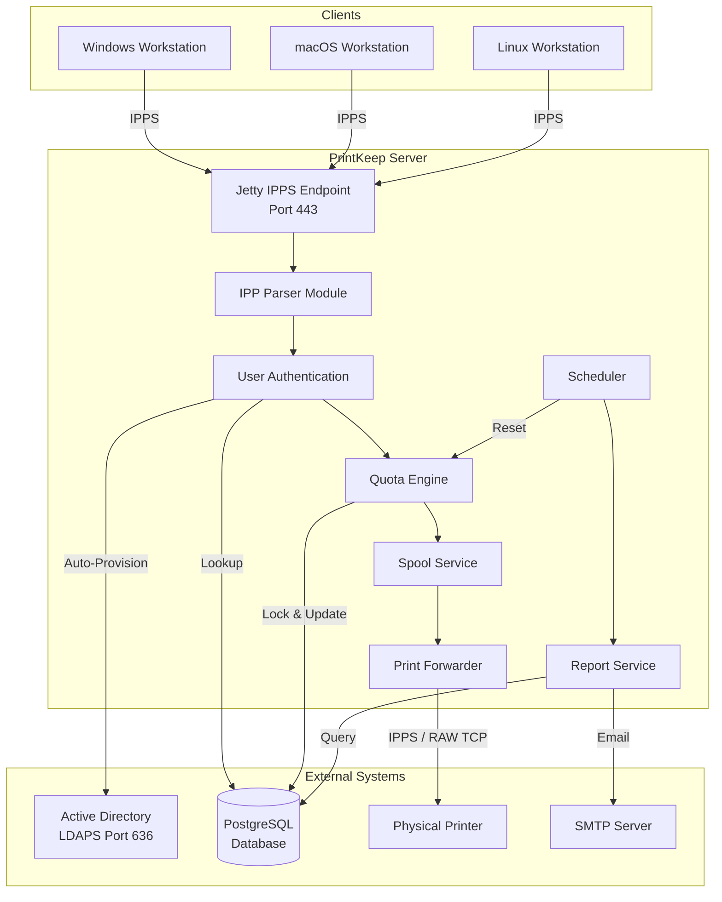
```mermaid
graph TB
    subgraph Clients
        C1[Windows Workstation]
        C2[macOS Workstation]
        C3[Linux Workstation]
    end

    subgraph PrintKeep Server
        JT[Jetty IPPS Endpoint<br/>Port 443]
        IPP[IPP Parser Module]
        AUTH[User Authentication]
        QE[Quota Engine]
        SPL[Spool Service]
        FWD[Print Forwarder]
        RPT[Report Service]
        SCH[Scheduler]
    end

    subgraph External Systems
        AD[Active Directory<br/>LDAPS Port 636]
        DB[(PostgreSQL<br/>Database)]
        PR[Physical Printer]
        SMTP[SMTP Server]
    end

    C1 & C2 & C3 -->|IPPS| JT
    JT --> IPP
    IPP --> AUTH
    AUTH -->|Lookup| DB
    AUTH -->|Auto-Provision| AD
    AUTH --> QE
    QE -->|Lock & Update| DB
    QE --> SPL
    SPL --> FWD
    FWD -->|IPPS / RAW TCP| PR
    SCH --> RPT
    RPT -->|Query| DB
    RPT -->|Email| SMTP
    SCH -->|Reset| QE
```

#### 6.2 Component Diagram

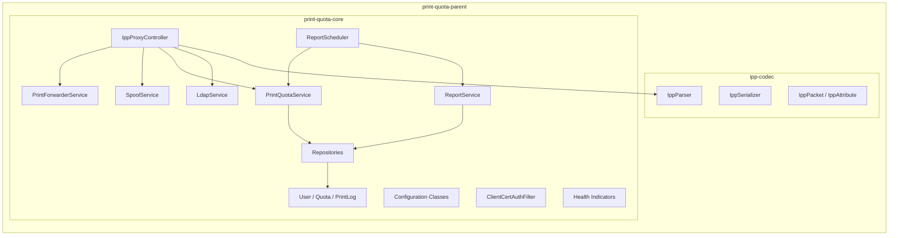
```mermaid
graph LR
    subgraph print-quota-parent
        subgraph ipp-codec
            Parser[IppParser]
            Serializer[IppSerializer]
            Model[IppPacket / IppAttribute]
        end
        subgraph print-quota-core
            Controller[IppProxyController]
            LdapSvc[LdapService]
            QuotaSvc[PrintQuotaService]
            SpoolSvc[SpoolService]
            FwdSvc[PrintForwarderService]
            ReportSvc[ReportService]
            Scheduler[ReportScheduler]
            Entities[User / Quota / PrintLog]
            Repos[Repositories]
            Config[Configuration Classes]
            Security[ClientCertAuthFilter]
            Monitoring[Health Indicators]
        end
    end

    Controller --> Parser
    Controller --> LdapSvc
    Controller --> QuotaSvc
    Controller --> SpoolSvc
    Controller --> FwdSvc
    Scheduler --> ReportSvc
    Scheduler --> QuotaSvc
    QuotaSvc --> Repos
    ReportSvc --> Repos
    Repos --> Entities
```

#### 6.3 Deployment Diagram

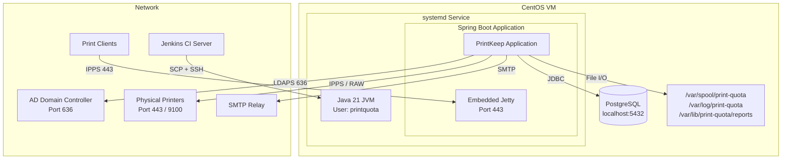
```mermaid
graph TB
    subgraph CentOS VM
        subgraph systemd Service
            JVM[Java 21 JVM<br/>User: printquota]
            subgraph Spring Boot Application
                Jetty[Embedded Jetty<br/>Port 443]
                App[PrintKeep Application]
            end
        end
        FS["/var/spool/print-quota<br/>/var/log/print-quota<br/>/var/lib/print-quota/reports"]
        PG[(PostgreSQL<br/>localhost:5432)]
    end

    subgraph Network
        Clients[Print Clients]
        ADServer[AD Domain Controller<br/>Port 636]
        Printer[Physical Printers<br/>Port 443 / 9100]
        Mail[SMTP Relay]
        Jenkins[Jenkins CI Server]
    end

    Clients -->|IPPS 443| Jetty
    App -->|LDAPS 636| ADServer
    App -->|IPPS / RAW| Printer
    App -->|SMTP| Mail
    App -->|JDBC| PG
    App -->|File I/O| FS
    Jenkins -->|SCP + SSH| JVM
```

#### 6.4 Request Flow Diagram

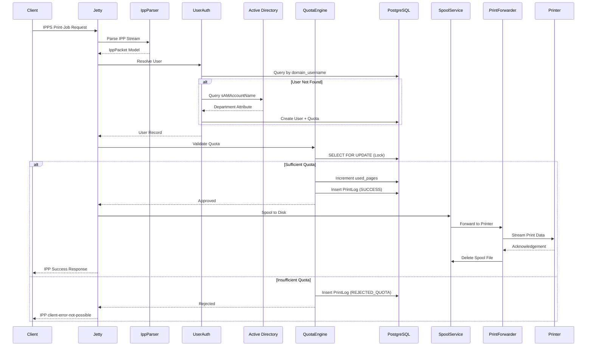
```mermaid
sequenceDiagram
    participant Client
    participant Jetty
    participant IppParser
    participant Auth as UserAuth
    participant LDAP as Active Directory
    participant Quota as QuotaEngine
    participant DB as PostgreSQL
    participant Spool as SpoolService
    participant Fwd as PrintForwarder
    participant Printer

    Client->>Jetty: IPPS Print-Job Request
    Jetty->>IppParser: Parse IPP Stream
    IppParser-->>Jetty: IppPacket Model
    Jetty->>Auth: Resolve User
    Auth->>DB: Query by domain_username

    alt User Not Found
        Auth->>LDAP: Query sAMAccountName
        LDAP-->>Auth: Department Attribute
        Auth->>DB: Create User + Quota
    end

    Auth-->>Jetty: User Record
    Jetty->>Quota: Validate Quota
    Quota->>DB: SELECT FOR UPDATE (Lock)

    alt Sufficient Quota
        Quota->>DB: Increment used_pages
        Quota->>DB: Insert PrintLog (SUCCESS)
        Quota-->>Jetty: Approved
        Jetty->>Spool: Spool to Disk
        Spool->>Fwd: Forward to Printer
        Fwd->>Printer: Stream Print Data
        Printer-->>Fwd: Acknowledgement
        Fwd->>Spool: Delete Spool File
        Jetty-->>Client: IPP Success Response
    else Insufficient Quota
        Quota->>DB: Insert PrintLog (REJECTED_QUOTA)
        Quota-->>Jetty: Rejected
        Jetty-->>Client: IPP client-error-not-possible
    end
```

#### 6.5 Print Processing Flow

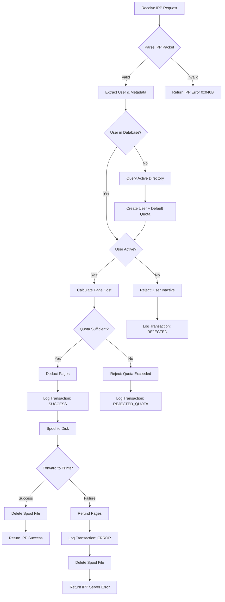
```mermaid
flowchart TD
    A[Receive IPP Request] --> B{Parse IPP Packet}
    B -->|Valid| C[Extract User & Metadata]
    B -->|Invalid| Z1[Return IPP Error 0x040B]

    C --> D{User in Database?}
    D -->|Yes| E{User Active?}
    D -->|No| F[Query Active Directory]
    F --> G[Create User + Default Quota]
    G --> E

    E -->|Yes| H[Calculate Page Cost]
    E -->|No| Z2[Reject: User Inactive]

    H --> I{Quota Sufficient?}
    I -->|Yes| J[Deduct Pages]
    I -->|No| Z3[Reject: Quota Exceeded]

    J --> K[Log Transaction: SUCCESS]
    K --> L[Spool to Disk]
    L --> M{Forward to Printer}

    M -->|Success| N[Delete Spool File]
    N --> O[Return IPP Success]

    M -->|Failure| P[Refund Pages]
    P --> Q[Log Transaction: ERROR]
    Q --> R[Delete Spool File]
    R --> Z4[Return IPP Server Error]

    Z2 --> S[Log Transaction: REJECTED]
    Z3 --> T[Log Transaction: REJECTED_QUOTA]
```

---

### 7 Use Cases

#### UC-01 — Submit Print Job

| Field              | Value                                                         |
| :----------------- | :------------------------------------------------------------ |
| **Actors**         | Domain User, PrintKeep System                                 |
| **Preconditions**  | User has a printer configured pointing to the PrintKeep IPPS endpoint. |
| **Main Flow**      | 1. User prints a document from any application. 2. The OS print driver sends an IPP Print-Job request to PrintKeep. 3. PrintKeep processes the request through parsing, authentication, quota validation, and forwarding. 4. The document is printed on the physical printer. |
| **Alternative Flow** | If the user has never printed before, auto-provisioning creates their account. |
| **Exceptions**     | Quota exceeded → job rejected. Printer offline → job fails with refund. |
| **Postconditions** | Document printed; quota decremented; transaction logged.       |

#### UC-02 — Validate User

| Field              | Value                                                         |
| :----------------- | :------------------------------------------------------------ |
| **Actors**         | PrintKeep System                                              |
| **Preconditions**  | IPP packet parsed with `requesting-user-name` extracted.       |
| **Main Flow**      | 1. Query local database for user. 2. Verify `is_active` flag. 3. Return user record to caller. |
| **Alternative Flow** | User not found → delegate to UC-03 (Auto-Provision).         |
| **Exceptions**     | Database unavailable → return IPP server error.                |
| **Postconditions** | User identity confirmed or provisioning triggered.             |

#### UC-03 — Auto-Provision User

| Field              | Value                                                         |
| :----------------- | :------------------------------------------------------------ |
| **Actors**         | PrintKeep System, Active Directory                             |
| **Preconditions**  | User does not exist in local database.                         |
| **Main Flow**      | 1. Query AD via LDAPS for `sAMAccountName`. 2. Retrieve `department`. 3. Insert new `User` record. 4. Insert default `Quota` record for current month. |
| **Alternative Flow** | AD unavailable → use department `"Default"`.                  |
| **Exceptions**     | LDAPS timeout exceeds 2 seconds → fallback to default.         |
| **Postconditions** | User exists in database with active status and default quota.   |

#### UC-04 — Validate Quota

| Field              | Value                                                         |
| :----------------- | :------------------------------------------------------------ |
| **Actors**         | PrintKeep System                                              |
| **Preconditions**  | User authenticated. Quota record exists for current month.     |
| **Main Flow**      | 1. Lock quota row (`PESSIMISTIC_WRITE`). 2. Calculate page cost (apply duplex multiplier). 3. Compare against remaining allocation. 4. Deduct if sufficient. 5. Commit transaction. |
| **Alternative Flow** | No quota for current month → create default before validating. |
| **Exceptions**     | Insufficient quota → reject with `REJECTED_QUOTA` log.         |
| **Postconditions** | Quota updated or rejection recorded.                           |

#### UC-05 — Forward Print Job

| Field              | Value                                                         |
| :----------------- | :------------------------------------------------------------ |
| **Actors**         | PrintKeep System, Physical Printer                             |
| **Preconditions**  | Quota validation passed. Print data spooled to disk.           |
| **Main Flow**      | 1. Open connection to downstream printer. 2. Stream spooled data. 3. Receive acknowledgement. 4. Delete spool file. |
| **Alternative Flow** | Use RAW TCP if printer does not support IPPS.                 |
| **Exceptions**     | Printer offline → compensating refund + error log.             |
| **Postconditions** | Print data delivered to printer; spool file removed.           |

#### UC-06 — Reject Print Job

| Field              | Value                                                         |
| :----------------- | :------------------------------------------------------------ |
| **Actors**         | PrintKeep System                                              |
| **Preconditions**  | Quota validation determined insufficient balance or user inactive. |
| **Main Flow**      | 1. Log rejection with reason. 2. Serialize IPP error response (`0x040B`). 3. Return response to client. |
| **Alternative Flow** | None.                                                         |
| **Exceptions**     | None.                                                         |
| **Postconditions** | User receives rejection; quota unchanged; event logged.        |

#### UC-07 — Generate Monthly Report

| Field              | Value                                                         |
| :----------------- | :------------------------------------------------------------ |
| **Actors**         | Scheduler, Report Service, SMTP Server                         |
| **Preconditions**  | First day of the month. Print data exists for prior month.     |
| **Main Flow**      | 1. Scheduler triggers report generation. 2. Query prior month's data. 3. Generate two-sheet Excel workbook. 4. Email to IT administrators. |
| **Alternative Flow** | SMTP failure → save report to backup directory.               |
| **Exceptions**     | Report generation OOM → log error, continue to quota reset.    |
| **Postconditions** | Report delivered or saved locally. Quota reset proceeds.       |

#### UC-08 — Reset Monthly Quotas

| Field              | Value                                                         |
| :----------------- | :------------------------------------------------------------ |
| **Actors**         | Scheduler, Quota Engine                                        |
| **Preconditions**  | First day of the month. Report generation completed or failed.  |
| **Main Flow**      | 1. Query all active users. 2. Create new quota records for current month with default allocation and `used_pages = 0`. 3. Commit in a single transaction. |
| **Alternative Flow** | If quota already exists for the month (idempotency), skip.    |
| **Exceptions**     | Database failure → retry once, then log critical alert.        |
| **Postconditions** | All active users have fresh quota records for the new month.   |

---

### 8 Data Model

#### 8.1 User Entity

| Attribute          | Type        | Constraints                            | Description                         |
| :----------------- | :---------- | :------------------------------------- | :---------------------------------- |
| `employee_id`      | UUID / Long | Primary Key, Auto-generated            | Unique user identifier               |
| `domain_username`  | String      | Unique, Not Null, Indexed              | Active Directory `sAMAccountName`    |
| `department`       | String      | Not Null, Default `"Default"`          | Department from AD or default        |
| `is_active`        | Boolean     | Not Null, Default `true`               | User eligibility flag                |

**Purpose:** Represents an authenticated domain user eligible for print quota management.
**Relationships:** One-to-Many with Quota; One-to-Many with PrintLog.
**Constraints:** `domain_username` must be unique. Index `idx_users_domain_username`.

#### 8.2 Quota Entity

| Attribute          | Type        | Constraints                            | Description                         |
| :----------------- | :---------- | :------------------------------------- | :---------------------------------- |
| `quota_id`         | Long        | Primary Key, Auto-generated            | Unique quota record identifier       |
| `employee_id`      | FK → User   | Not Null                               | Reference to owning user             |
| `month_year`       | String      | Not Null, Format `YYYY-MM`             | Calendar month for this allocation   |
| `allocated_pages`  | Integer     | Not Null, Default from config          | Total pages allowed for the month    |
| `used_pages`       | Integer     | Not Null, Default `0`                  | Pages consumed so far                |

**Purpose:** Tracks per-user monthly page allocation and consumption.
**Relationships:** Many-to-One with User.
**Constraints:** Unique composite constraint `uk_user_month_year` on `(employee_id, month_year)`.

#### 8.3 PrintLog Entity

| Attribute          | Type        | Constraints                            | Description                         |
| :----------------- | :---------- | :------------------------------------- | :---------------------------------- |
| `log_id`           | Long        | Primary Key, Auto-generated            | Unique log entry identifier          |
| `employee_id`      | FK → User   | Not Null                               | Reference to submitting user         |
| `timestamp`        | Timestamp   | Not Null, Indexed                      | Time of print job submission         |
| `document_name`    | String      | Nullable                               | Name of the printed document         |
| `page_count`       | Integer     | Not Null                               | Calculated page cost after duplex rules |
| `status`           | Enum        | Not Null                               | `SUCCESS`, `REJECTED_QUOTA`, `ERROR` |

**Purpose:** Immutable audit record for every print transaction.
**Relationships:** Many-to-One with User.
**Constraints:** Index `idx_logs_timestamp` on `timestamp`. Records are append-only.

#### 8.4 Printer (Configuration)

| Attribute          | Type        | Description                                     |
| :----------------- | :---------- | :---------------------------------------------- |
| `printer_name`     | String      | Logical name for the downstream printer          |
| `printer_uri`      | String      | Connection URI (IPPS or RAW TCP address)         |
| `protocol`         | Enum        | `IPPS` or `RAW_TCP`                              |

**Purpose:** Configuration-driven printer targets. Defined in YAML, not as a database entity in v1.0.

#### 8.5 Report (Generated Artifact)

| Attribute          | Type        | Description                                     |
| :----------------- | :---------- | :---------------------------------------------- |
| `filename`         | String      | Generated Excel filename with month/year         |
| `generated_at`     | Timestamp   | Report generation timestamp                      |
| `sheet_1`          | Sheet       | Employee Summary (name, dept, used, allocated, %) |
| `sheet_2`          | Sheet       | Detailed Print History (timestamp, doc, pages, status) |

**Purpose:** Monthly usage report distributed to IT administrators. Generated as `.xlsx` file, not persisted in database.

#### 8.6 Entity-Relationship Diagram

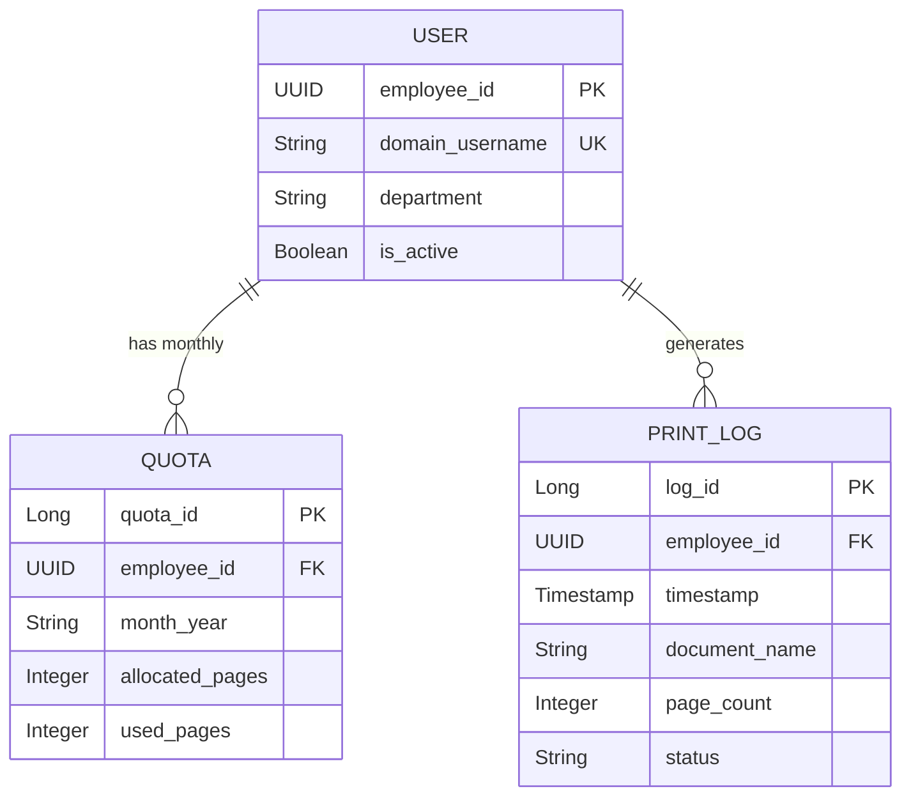
```mermaid
erDiagram
    USER {
        UUID employee_id PK
        String domain_username UK
        String department
        Boolean is_active
    }

    QUOTA {
        Long quota_id PK
        UUID employee_id FK
        String month_year
        Integer allocated_pages
        Integer used_pages
    }

    PRINT_LOG {
        Long log_id PK
        UUID employee_id FK
        Timestamp timestamp
        String document_name
        Integer page_count
        String status
    }

    USER ||--o{ QUOTA : "has monthly"
    USER ||--o{ PRINT_LOG : "generates"
```

---

### 9 External Interfaces

#### 9.1 IPP Interface

| Property          | Value                                                         |
| :---------------- | :------------------------------------------------------------ |
| **Protocol**      | IPP/1.1 over TLS (IPPS)                                       |
| **Port**          | 443                                                            |
| **Direction**     | Inbound from print clients                                     |
| **Operations**    | Print-Job (primary), Get-Printer-Attributes (informational)    |
| **Data Format**   | Binary IPP encoding per RFC 8010                                |
| **Authentication**| Client TLS certificate (mTLS) + IPP `requesting-user-name`     |
| **Error Codes**   | `successful-ok` (0x0000), `client-error-not-possible` (0x040B), `server-error-internal-error` (0x0500) |

#### 9.2 LDAP Interface

| Property          | Value                                                         |
| :---------------- | :------------------------------------------------------------ |
| **Protocol**      | LDAP over SSL (LDAPS)                                          |
| **Port**          | 636                                                            |
| **Direction**     | Outbound to Active Directory domain controller                  |
| **Operations**    | Search (user lookup by `sAMAccountName`)                        |
| **Attributes**    | `department` (read)                                             |
| **Authentication**| Service account bind credentials                                |
| **Timeout**       | 2 seconds connection timeout                                    |

#### 9.3 SMTP Interface

| Property          | Value                                                         |
| :---------------- | :------------------------------------------------------------ |
| **Protocol**      | SMTP with STARTTLS                                              |
| **Port**          | 587 (configurable)                                              |
| **Direction**     | Outbound to mail relay                                          |
| **Operations**    | Send email with Excel attachment                                |
| **Authentication**| SMTP credentials (encrypted in application configuration)       |
| **Frequency**     | Monthly (1st of each month)                                     |

#### 9.4 Database Interface

| Property          | Value                                                         |
| :---------------- | :------------------------------------------------------------ |
| **Protocol**      | JDBC over TCP                                                   |
| **Port**          | 5432                                                            |
| **Direction**     | Bidirectional (application ↔ PostgreSQL)                        |
| **Connection Pool**| HikariCP with configurable maximum connections                  |
| **Isolation**     | `READ_COMMITTED` default                                        |
| **Locking**       | `PESSIMISTIC_WRITE` for quota row updates                       |

#### 9.5 Administrator Interface (v1.0)

| Property          | Value                                                         |
| :---------------- | :------------------------------------------------------------ |
| **Method**        | Direct SQL access via PostgreSQL client tools                   |
| **Operations**    | Query logs, update quotas, activate/deactivate users            |
| **Authentication**| PostgreSQL role-based credentials                               |

#### 9.6 REST Management Interface (Future)

| Property          | Value                                                         |
| :---------------- | :------------------------------------------------------------ |
| **Status**        | Out of scope for v1.0                                           |
| **Planned Endpoints** | User management, quota overrides, report downloads          |
| **Authentication**| To be determined (likely token-based)                           |

---

### 10 Security Requirements

#### 10.1 Authentication

The system shall authenticate users via two mechanisms: the IPP `requesting-user-name` attribute and, when mTLS is enabled, the Common Name (CN) extracted from the client TLS certificate. Certificate CN must match the IPP username.

#### 10.2 Authorization

Only active users (`is_active = true`) shall be authorized to submit print jobs. Administrative database operations require separate PostgreSQL role credentials with restricted permissions.

#### 10.3 LDAPS

All directory queries shall use LDAPS (port 636). The AD root CA certificate shall be imported into the Java truststore. Hostname verification shall be enforced.

#### 10.4 TLS

All client-facing connections shall use TLS 1.3. The Jetty server shall be configured with a valid keystore. Weak cipher suites shall be explicitly disabled.

#### 10.5 Certificate Management

| Requirement                                                              |
| :----------------------------------------------------------------------- |
| TLS certificates shall be rotated quarterly.                              |
| Keystores and truststores shall be stored outside the application archive. |
| Certificate expiry monitoring shall be included in health checks.         |

#### 10.6 Secrets Management

All sensitive configuration values (database passwords, LDAP bind credentials, SMTP passwords, keystore passwords) shall be encrypted at rest using JASYPT or equivalent AES-based property encryption. Decryption keys shall be provided via systemd environment variables, not stored in files.

#### 10.7 Audit Logging

All authentication events (successful lookups, failed lookups, auto-provisions), quota decisions (approvals, rejections), and administrative actions shall be logged with timestamps, correlation IDs, and actor identities.

#### 10.8 Input Validation

- IPP attribute strings exceeding 255 characters shall be rejected.
- IPP packet byte lengths shall be validated against declared sizes.
- SQL queries shall use parameterized statements exclusively.
- Log output shall sanitize user-supplied strings to prevent CRLF injection.

#### 10.9 Rate Limiting

The system shall enforce connection limits at the Jetty thread pool level to prevent resource exhaustion from excessive concurrent requests.

#### 10.10 Least Privilege

- The application shall run as the unprivileged `printquota` system user.
- The database runtime account shall have no DDL permissions.
- The LDAP service account shall have read-only directory permissions.
- The application user shall not have write access to its own executable.

---

### 11 Error Handling

| Scenario                | Expected Behaviour                                                                                    |
| :---------------------- | :---------------------------------------------------------------------------------------------------- |
| **LDAP unavailable**    | Log warning. Auto-provision user with department `"Default"`. Continue print processing.               |
| **Database unavailable**| Log critical error. Return IPP `server-error-internal-error`. No quota modification attempted.         |
| **Printer offline**     | Execute compensating transaction to refund quota. Log as `ERROR`. Delete spool file. Return IPP error. |
| **SMTP unavailable**    | Save report to local backup directory. Log warning. Proceed with quota reset independently.            |
| **Disk full**           | Reject new spool operations. Log critical alert. Return IPP server error.                              |
| **SSL/TLS failure**     | Drop connection immediately. Log certificate details and error at `WARN` level.                        |
| **Network timeout**     | Apply configured timeout thresholds. Retry once for printer connections. Log and fail gracefully.       |
| **Quota exceeded**      | Reject print job. Log `REJECTED_QUOTA`. Return IPP `client-error-not-possible`.                        |
| **Invalid IPP packet**  | Reject with IPP status `0x040B`. Log malformed packet details at `WARN` level.                         |
| **Malformed request**   | Return HTTP 400 or IPP error. Do not process further. Log event with correlation ID.                   |

---

### 12 Acceptance Criteria

The following measurable criteria shall be satisfied before production deployment is authorized.

| ID    | Criterion                                                                                     |
| :---- | :-------------------------------------------------------------------------------------------- |
| AC-01 | The application compiles and packages on JDK 21 without warnings or errors.                    |
| AC-02 | Database migrations execute successfully against a clean PostgreSQL instance.                   |
| AC-03 | IPP Print-Job requests from Windows and CUPS drivers are parsed correctly.                      |
| AC-04 | Unknown users are auto-provisioned from Active Directory on first print.                        |
| AC-05 | Quota validation correctly approves jobs within allocation limits.                               |
| AC-06 | Quota validation correctly rejects jobs exceeding allocation limits.                             |
| AC-07 | Duplex page cost calculations produce correct results (`impressions × 2`).                      |
| AC-08 | Concurrent print jobs from the same user are serialized without race conditions.                 |
| AC-09 | Failed print forwarding triggers a compensating quota refund.                                    |
| AC-10 | Spool files are cleaned up in all code paths (success, failure, exception).                      |
| AC-11 | Monthly Excel reports generate without OutOfMemoryError for 200 users.                           |
| AC-12 | Monthly reports are emailed successfully with correct attachments.                                |
| AC-13 | Monthly quota reset creates new records for all active users idempotently.                        |
| AC-14 | Health endpoints accurately report system component status.                                      |
| AC-15 | All configuration secrets are encrypted at rest.                                                  |
| AC-16 | The application binds to port 443 as the unprivileged `printquota` user.                         |
| AC-17 | Service restarts via systemd complete within 10 seconds.                                          |
| AC-18 | Log rotation enforces the 5 GB maximum disk consumption cap.                                     |
| AC-19 | Unit test coverage meets or exceeds 80%.                                                          |
| AC-20 | The Jenkins pipeline builds, tests, and deploys without manual intervention.                      |

---

### 13 Future Enhancements

The following capabilities are identified for future versions and are explicitly out of scope for v1.0.

| Enhancement              | Description                                                                  |
| :----------------------- | :--------------------------------------------------------------------------- |
| **Department Quotas**    | Shared page pools allocated at the department level, allowing flexible distribution among department members. |
| **Web Dashboard**        | Browser-based interface for users to view remaining quota and print history.  |
| **Analytics Engine**     | Trend analysis for printing patterns, cost projections, and departmental comparisons over time. |
| **Printer Groups**       | Logical grouping of physical printers with routing rules based on department, floor, or document type. |
| **Retry Queue**          | Automatic retry mechanism for temporarily failed print forwarding operations with configurable backoff. |
| **User Notifications**   | Email or push notifications sent to users when quota drops below configurable thresholds (e.g., 10% remaining). |
| **Role-Based Administration** | REST API with role-based access control for quota management, user administration, and report generation. |

---

**END OF SOFTWARE REQUIREMENTS SPECIFICATION.**


---

## Section: Print Quota System Codex Context

Source file: [Print_Quota_System_Codex_Context.md](ARCHITECTURE.md)


## System Architecture & Development Context: Print Quota Management System

**Target Audience:** Codex / AI Coding Assistant
**Purpose:** Provide comprehensive, zero-ambiguity context for generating the Java-based Print Quota Management System. Follow these constraints strictly.

---

### 1. Project Overview
Build a domain-wide print management middleware system in Java that intercepts print jobs via IPPS, validates user quotas against a database, and either forwards the job to a physical printer or rejects it. The system also generates and emails monthly usage reports.

### 2. Strict Technology Stack
* **Language:** Java 21
* **Framework:** Spring Boot 3.x
* **Web Server:** Jetty (Must explicitly exclude standard Spring Boot Tomcat and include `spring-boot-starter-jetty`)
* **Database:** PostgreSQL (or MySQL)
* **Logging:** Logback (Local rolling file only; NO centralized log aggregators like ELK/Splunk)
* **Build Tool:** Maven (or Gradle, but Maven preferred for standard enterprise Java)
* **Reporting:** Apache POI (for `.xlsx`) or JasperReports (for `.pdf`)
* **Email:** `spring-boot-starter-mail` (JavaMailSender)

### 3. Network & Security Constraints
* **No Load Balancer / Single Node:** System runs on a single CentOS VM. Do not over-engineer for distributed sessions or load balancing.
* **No Subnets:** Assume a flat network for firewall rules; all clients can reach the CentOS VM on port 443.
* **IPPS (Secure IPP):** * Clients submit print jobs to `ipps://<centos-vm-hostname>:443/printers/MainPrinter`.
    * Jetty must be configured for SSL/TLS (HTTPS/IPPS) using a local Keystore.
* **LDAPS (Secure LDAP):**
    * Connects to Active Directory via port 636.
    * Requires standard Java Truststore configuration to trust the AD Root CA.
    * Used for auto-provisioning users. No explicit user registration flow.

### 4. Core Business Logic: Print Interception & Quotas
The Java application acts as an IPP Proxy server listening for raw spool files.

**Quota Rules (Strict):**
1.  **Authentication:** Read `requesting-user-name` from IPP headers. Query DB. If not in DB, query LDAPS to fetch department and auto-create DB record with default quota.
2.  **Page Calculation:**
    * Read `job-impressions`.
    * Read `sides` attribute. **Rule:** If `sides` == `two-sided-long-edge` OR `two-sided-short-edge`, multiply `job-impressions` by 2.
    * Color print vs. B/W print cost is EQUAL (1x). Ignore `print-color-mode`.
    * File size does not affect quota. Ignore file size attributes.
3.  **Gatekeeper Action:**
    * **If user has sufficient quota:** Decrement used pages in DB, log the transaction as SUCCESS, and forward raw byte stream to the physical printer.
    * **If user lacks quota:** Drop byte stream, log as REJECTED_QUOTA, return IPP `client-error-not-possible` status to client.

### 5. Database Schema Requirements (Relational)
Maintain strict ACID compliance to prevent race conditions during concurrent print jobs.

* **`users` Table:**
    * `employee_id` (PK, UUID or Auto-inc)
    * `domain_username` (String, Unique)
    * `department` (String)
    * `is_active` (Boolean)
* **`quotas` Table:**
    * `quota_id` (PK)
    * `employee_id` (FK to users)
    * `month_year` (String/Date, e.g., "YYYY-MM")
    * `allocated_pages` (Integer)
    * `used_pages` (Integer)
* **`print_logs` Table:**
    * `log_id` (PK)
    * `employee_id` (FK to users)
    * `timestamp` (Timestamp)
    * `document_name` (String)
    * `page_count` (Integer - calculated based on duplex rules)
    * `status` (Enum/String: SUCCESS, REJECTED_QUOTA, ERROR)

### 6. Scheduled Tasks & Monthly Reporting
* **Scheduler:** Use Spring `@Scheduled(cron = "0 0 0 1 * ?")` (Midnight on the 1st of every month).
* **Tasks executed by Cron:**
    1.  Generate a tabular report (Excel or PDF) detailing usage per employee and department for the previous month.
    2.  Email the report to IT Admins/Heads using JavaMailSender.
    3.  Generate new rows in the `quotas` table for the new month for all active users, resetting `used_pages` to 0.

### 7. Logging & Disk Management
* Configure `logback-spring.xml` with a `RollingFileAppender`.
* **Constraint:** Must prevent CentOS disk space exhaustion.
* **Settings:** Max file size = 50MB, Max history = 30 days.

### 8. Deployment & CI/CD Context (Jenkins)
* **Target OS:** CentOS Linux.
* **Process Manager:** `systemd` (Standard background service).
* **Pipeline Flow:**
    * Jenkins builds the executable Jar/War using JDK 21.
    * Jenkins copies artifact to CentOS VM via SCP/SSH.
    * Jenkins runs `sudo systemctl restart print-quota.service`.
* **Codex Instruction:** Provide configuration templates for `systemd` service file and a basic Jenkinsfile to support this flow.

---
**END OF CONTEXT.** When generating code, prioritize error handling around IPP socket timeouts, LDAP connection drops, and SSL Handshake exceptions.


---

## Section: Architecture

Source file: [architecture.md](ARCHITECTURE.md)


## Architecture Blueprint

This document details the architectural layout, modules separation, package layers, and execution flows for the Print Quota Management System.

---

### 1. Overall Architectural Architecture (Mermaid Diagram)

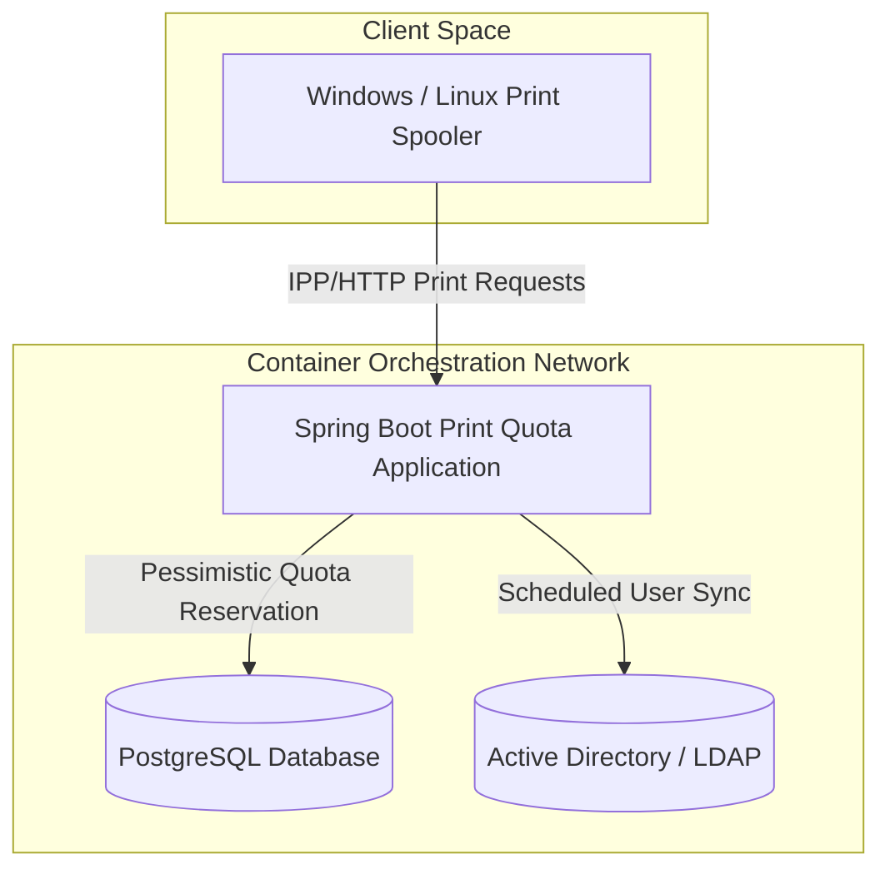
```mermaid
graph TB
    subgraph Client Space
        Spooler[Windows / Linux Print Spooler]
    end

    subgraph Container Orchestration Network
        App[Spring Boot Print Quota Application]
        DB[(PostgreSQL Database)]
        LDAP[(Active Directory / LDAP)]
    end

    Spooler -->|IPP/HTTP Print Requests| App
    App -->|Pessimistic Quota Reservation| DB
    App -->|Scheduled User Sync| LDAP
```

---

### 2. Module Responsibilities

The system is split into two modules to isolate decoding capabilities from the core execution platform:

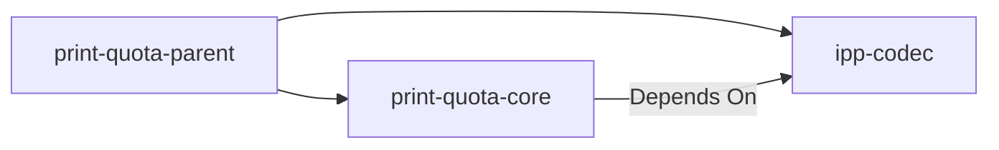
```mermaid
graph LR
    Parent[print-quota-parent]
    Codec[ipp-codec]
    Core[print-quota-core]

    Parent --> Codec
    Parent --> Core
    Core -->|Depends On| Codec
```

1. **`print-quota-parent` (Root)**:
   - Centralizes dependency management BOMs (Spring Boot, Caffeine, Liquibase).
   - Standardizes build rules, compilers (`-Werror` Java 21), and quality enforcement rules (Checkstyle, SpotBugs, PMD).

2. **`ipp-codec`**:
   - Encapsulates binary parser/encoder implementations for RFC 8010/8011 IPP payloads.
   - Provides immutable records (`IppPacket`, `IppAttributeGroup`, `IppAttribute`) and enums (`IppOperation`, `IppTag`) to model IPP operations.
   - Zero framework dependencies (standalone Java library).

3. **`print-quota-core`**:
   - Hosts the Spring Boot application configuration, filters, endpoints, and scheduled task executors.
   - Orchestrates persistence (JPA entities and PostgreSQL repositories), identity (LDAP synchronization), and processing (Chain of Responsibility pipeline stages).

---

### 3. Package & Layered Architecture

Within `print-quota-core`, packages enforce clean boundaries:

- **`config/`**: Sets up Jetty threads, Actuator groups, Prometheus registry, and Caffeine caches.
- **`controller/`**: Handles Actuator endpoints and global exception filters.
- **`filter/`**: Handles MDC trace token mapping for requests.
- **`identity/`**: Houses LDAP query repository, mapping templates, and schedulers syncing AD users into Postgres.
- **`model/`**: Houses JPA entities (`User`, `Quota`, `PrintLog`).
- **`processing/`**: Implements processing engines (`PrintProcessingPipeline`), extraction utilities (`IppMetadataExtractor`), transaction boundaries (`PrintTransactionService`), and verification stages (`ProtocolValidationStage`, etc.).
- **`repository/`**: Inherits Spring Data JPA interfaces for data mutations, including pessimistic write lock declarations.

---

### 4. Deployment Architecture

The service is packaged using multi-stage Docker builds and orchestrated inside a private virtual bridge network:

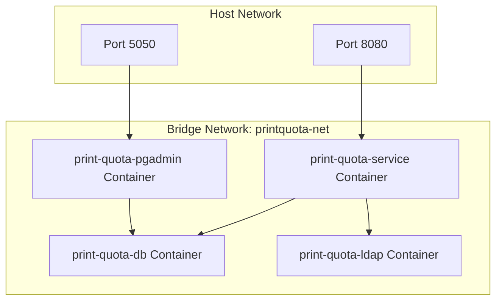
```mermaid
graph TD
    subgraph Host Network
        Port8080[Port 8080]
        Port5050[Port 5050]
    end

    subgraph Bridge Network: printquota-net
        AppContainer[print-quota-service Container]
        DbContainer[print-quota-db Container]
        PgAdminContainer[print-quota-pgadmin Container]
        LdapContainer[print-quota-ldap Container]
    end

    Port8080 --> AppContainer
    Port5050 --> PgAdminContainer
    AppContainer --> DbContainer
    AppContainer --> LdapContainer
    PgAdminContainer --> DbContainer
```

- **App Base Image**: `quay.io/centos/centos:stream9` (CentOS Stream 9 Minimal).
- **Run Credentials**: Runs as a non-privileged user (`printuser`, GID/UID `10001`) with dropped kernel capabilities (`cap_drop: ALL`).
- **DB Persistent Volumes**: Host-bound volume mounts preserve PostgreSQL data and container log directories.


---

## Section: System Design

Source file: [system-design.md](ARCHITECTURE.md)


## System Design Document

This document describes the functional requirements, design patterns, concurrency controls, and caching models implemented in the system.

---

### 1. Requirements

#### Functional Requirements
- **Active Directory Synchronization**: Schedule periodic batch syncs of AD users (sAMAccountName, department, UAC state) into the PostgreSQL repository.
- **IPP Decoding & Verification**: Support decoding of binary IPP requests, validating operations (Print-Job, Validate-Job), and verifying user names and target printers.
- **Metadata Extraction**: Parse and resolve copies, duplex mode, color status, and estimated page requirements.
- **Quota Allocation & Deductions**: Calculate page counts, check user balances, and deduct balance inside write-locking transactions.
- **Audit Logging**: Write audit records for every print request (allowed or rejected) showing usernames, printers, document name, decisions, reasons, and correlation IDs.

#### Non-Functional Requirements
- **Thread Safety**: Ensure no race conditions or double quota deductions occur under simultaneous printing.
- **Low Latency**: Limit quota validation processing pipeline overhead to less than 20 milliseconds per job.
- **Observability**: Expose liveness, readiness, prometheus metrics, and request correlation IDs across all logs.

---

### 2. Design Patterns

- **Chain of Responsibility**: Implemented in `PrintProcessingPipeline` using a series of `PipelineStage` objects to isolate validation, identity lookup, page calculation, and database transactions.
- **Strategy Pattern**: Promoted through the separation of calculation multipliers (color cost, duplex discount) from database writes, facilitating alternative estimation policies.
- **Factory / Builder Pattern**: Implemented in DTOs (e.g. `PrintJobMetadata`) and mock creation utilities to handle parsing state cleanly.

---

### 3. Concurrency & Locking Model

The system operates under a high-concurrency model assuming several print spoolers process jobs simultaneously for the same user.

#### Pessimistic Write Lock
To prevent race conditions, lost updates, and double deductions, the system uses a pessimistic write lock when reserving quota balances:
```java
@Lock(LockModeType.PESSIMISTIC_WRITE)
@Query("SELECT q FROM Quota q WHERE q.user.id = :userId AND q.month = :month")
Optional<Quota> findByUserIdAndMonthForUpdate(UUID userId, String month);
```
This serializes access to the specific User-Month Quota row at the database level. Other threads attempting to update this row wait until the current transaction commits or rolls back.

---

### 4. Caching Strategy

The system configures **Caffeine Cache** to reduce Active Directory query traffic during request validation:

- **Cache Name**: `ldapUsers`
- **Specification**: `maximumSize=500,expireAfterWrite=300s` (5-minute TTL).
- **Application**: The LDAP lookup repository maps `@Cacheable(value = "ldapUsers", key = "#username")` to cache parsed user details.

---

### 5. Security & Audit Design

- **Least Privilege Access**: The database schema is managed via Liquibase. The runtime container drops all default Linux capabilities (`CAP_DROP`) and executes as GID/UID `10001`.
- **MDC Correlation Identification**: Incoming requests pass through `MdcCorrelationFilter`, generating or propagating a unique UUID string (`X-Correlation-ID`) across MDC thread logs.
- **Robust Audit Logging**: Even when quota reservations throw a `QuotaExceededException` (rolling back the parent transaction), `AuditServiceImpl.logAudit` is marked with `Propagation.REQUIRES_NEW` to successfully persist the rejection record.


---

## Section: Configuration

Source file: [configuration.md](ARCHITECTURE.md)


## Configuration Reference Blueprint

This document maps all configuration properties, default values, and environment variable bindings.

---

### 1. Spring Boot Profiles

The system provides two active runtime profiles:
1. **`dev`** (Default):
   - Configures JPA hibernate validation to `validate`.
   - Sets packages logging level for `com.printkeep.quota` to `DEBUG`.
   - Exposes console logging only.
2. **`prod`**:
   - Enforces strict pool limits.
   - Activates rolling Logback log files under `/var/log/print-quota/service.log`.
   - Exposes detailed JSON structured log messages.

---

### 2. Configuration Properties Reference

| Property Name | Env Variable | Default Value | Required | Description |
|---|---|---|---|---|
| `spring.datasource.url` | `SPRING_DATASOURCE_URL` | `jdbc:postgresql://localhost:5432/printquota` | Yes | Database connection string. |
| `spring.datasource.username` | `DB_USERNAME` | `printuser` | Yes | Database username. |
| `spring.datasource.password` | `DB_PASSWORD` | `printpassword` | Yes | Database credentials. |
| `spring.datasource.hikari.maximum-pool-size` | `DB_POOL_MAX` | `10` | No | Maximum database connections pool. |
| `app.ldap.url` | `LDAP_URL` | `ldap://localhost:389` | Yes | Target directory LDAP server URL. |
| `app.ldap.base-dn` | `LDAP_BASE_DN` | `dc=company,dc=local` | Yes | Directory domain base DN. |
| `app.ldap.username` | `LDAP_BIND_DN` | `cn=admin,dc=company,dc=local` | Yes | LDAP service account bind username. |
| `app.ldap.password` | `LDAP_BIND_PASSWORD` | `admin` | Yes | LDAP service account bind password. |
| `app.ldap.search-base` | `LDAP_SEARCH_BASE` | `ou=users` | No | Relative path search directory. |
| `app.ldap.sync.cron` | `LDAP_SYNC_CRON` | `0 0 * * * *` | No | Cron expression for synchronization schedule. |
| `app.ldap.sync.enabled` | `LDAP_SYNC_ENABLED` | `true` | No | Toggle to disable scheduling syncs. |
| `app.quota.multipliers.duplex` | `QUOTA_DUPLEX_MULTIPLIER` | `0.8` | No | Page cost factor reduction for duplex jobs. |
| `app.quota.multipliers.color` | `QUOTA_COLOR_MULTIPLIER` | `2.0` | No | Page cost multiplier for color jobs. |

---

### 3. Docker Compose Environment Variables

When running under Docker Compose, the following variables configure the stack:
- **`DB_NAME`**: Postgres database database schema. Default: `printquota`.
- **`DB_USERNAME`**: Database admin user. Default: `printuser`.
- **`DB_PASSWORD`**: Database password. Default: `printpassword`.
- **`PGADMIN_EMAIL`**: Default admin email for pgAdmin dashboard. Default: `admin@company.local`.
- **`PGADMIN_PASSWORD`**: Default admin credentials for pgAdmin dashboard. Default: `admin`.


---

## Section: Database

Source file: [database.md](ARCHITECTURE.md)


## Database Schema Blueprint

This document details the entity-relationship design, table columns, constraints, indexes, and locking strategies in PostgreSQL.

---

### 1. Entity Relationship Diagram (Mermaid Diagram)

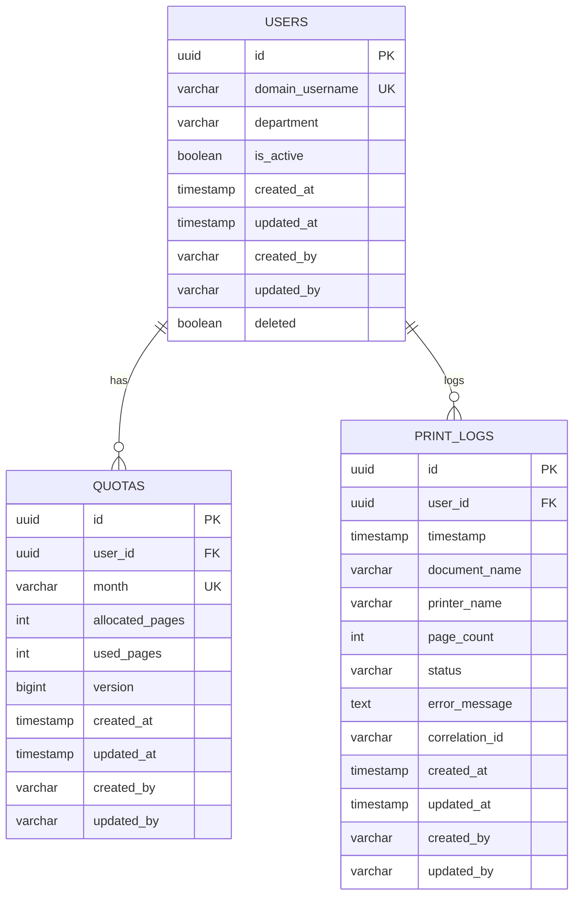
```mermaid
erDiagram
    USERS {
        uuid id PK
        varchar domain_username UK
        varchar department
        boolean is_active
        timestamp created_at
        timestamp updated_at
        varchar created_by
        varchar updated_by
        boolean deleted
    }

    QUOTAS {
        uuid id PK
        uuid user_id FK
        varchar month UK
        int allocated_pages
        int used_pages
        bigint version
        timestamp created_at
        timestamp updated_at
        varchar created_by
        varchar updated_by
    }

    PRINT_LOGS {
        uuid id PK
        uuid user_id FK
        timestamp timestamp
        varchar document_name
        varchar printer_name
        int page_count
        varchar status
        text error_message
        varchar correlation_id
        timestamp created_at
        timestamp updated_at
        varchar created_by
        varchar updated_by
    }

    USERS ||--o{ QUOTAS : "has"
    USERS ||--o{ PRINT_LOGS : "logs"
```

---

### 2. Table Column Definitions

#### Table: `users`
- **`id`** (UUID, PK): System identifier.
- **`domain_username`** (VARCHAR, Unique, Indexed): User account username prefixed with domain (e.g. `company\jdoe`).
- **`department`** (VARCHAR): Department context used for grouping.
- **`is_active`** (BOOLEAN): State of the account. Inactive users are rejected immediately.
- **`deleted`** (BOOLEAN): Soft-delete flag.

#### Table: `quotas`
- **`id`** (UUID, PK): Identifier.
- **`user_id`** (UUID, FK referencing `users(id)`): Allocated user context.
- **`month`** (VARCHAR, length 7, e.g. `YYYY-MM`): Month identifier.
- **`allocated_pages`** (INTEGER): Monthly page limit.
- **`used_pages`** (INTEGER): Running count of page sheets printed.
- **`version`** (BIGINT): Optimistic locking column.

#### Table: `print_logs`
- **`id`** (UUID, PK): Identifier.
- **`user_id`** (UUID, FK referencing `users(id)`): Printed user context.
- **`timestamp`** (TIMESTAMP): Execution time.
- **`document_name`** (VARCHAR): Extracted document name.
- **`printer_name`** (VARCHAR): Extracted printer.
- **`page_count`** (INTEGER): Number of deducted page sheets.
- **`status`** (VARCHAR, length 30): Decision state (`SUCCESS`, `REJECTED_QUOTA`, `ERROR`).
- **`error_message`** (TEXT): Log messages for rejections/errors.
- **`correlation_id`** (VARCHAR): Logging trace ID.

---

### 3. Database Constraints & Indexes

- **Index `idx_users_domain_username`**: Unique index to support quick user lookups during identity resolution.
- **Unique Constraint `uq_quotas_user_month`**: Unique index on columns `(user_id, month)` to prevent duplicate monthly allocations.
- **Foreign Key `fk_quotas_user`**: Maps `quotas.user_id` to `users.id` with referential integrity.
- **Foreign Key `fk_print_logs_user`**: Maps `print_logs.user_id` to `users.id` with referential integrity.

---

### 4. Locking Strategies

1. **Optimistic Locking**:
   - Implemented via `@Version` on `Quota.version`.
   - Used for normal update procedures when conflicts are highly unlikely.
2. **Pessimistic Locking**:
   - Implemented via `LockModeType.PESSIMISTIC_WRITE` on `QuotaRepository.findByUserIdAndMonthForUpdate`.
   - Used for critical quota deductions inside `PrintTransactionService` to prevent double-spending and lost updates.

---

### 5. Liquibase Migration Strategy

All database schemas, constraints, and updates are declared as immutable changelogs under `print-quota-core/src/main/resources/db/changelog/`.
- Schema revisions are executed automatically during application startup.
- Production environments use validation checks (`spring.jpa.hibernate.ddl-auto=validate`) to prevent hibernate auto-modifications.


---

## Section: Db Documentation

Source file: [db_documentation.md](ARCHITECTURE.md)


## Database Architecture Documentation

This document describes the relational database design implemented in Phase 2 for the **Print Quota Management System**.

### Entity-Relationship (ER) Diagram

The system comprises three core tables: `users`, `quotas`, and `print_logs`.

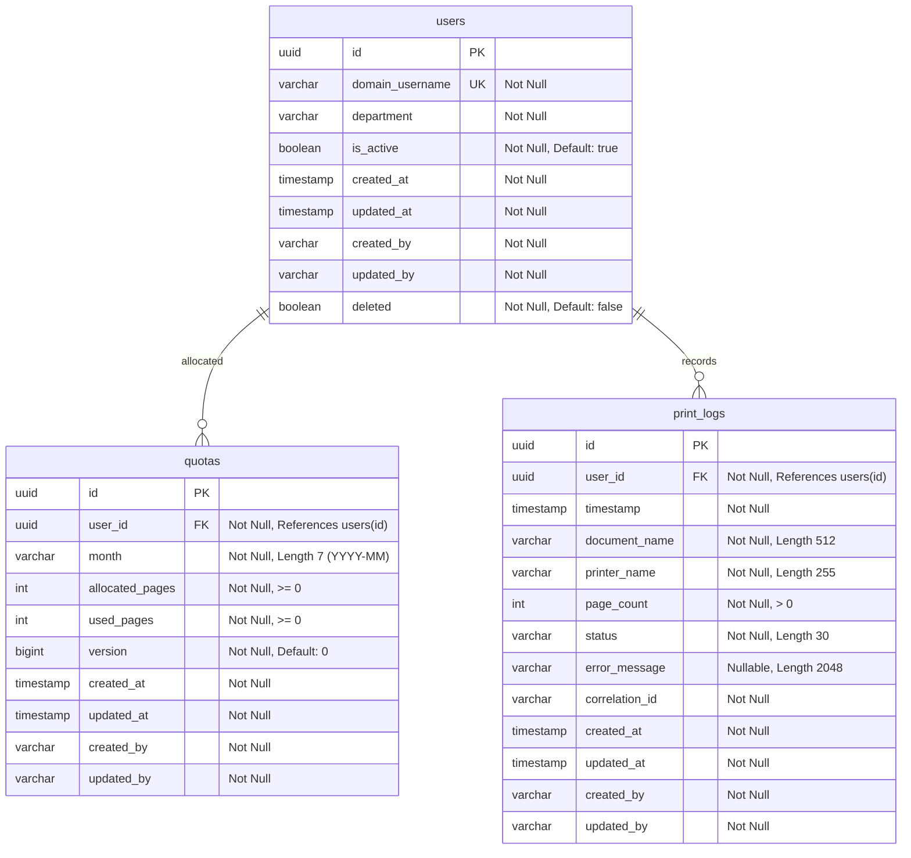
```mermaid
erDiagram
    users {
        uuid id PK
        varchar domain_username UK "Not Null"
        varchar department "Not Null"
        boolean is_active "Not Null, Default: true"
        timestamp created_at "Not Null"
        timestamp updated_at "Not Null"
        varchar created_by "Not Null"
        varchar updated_by "Not Null"
        boolean deleted "Not Null, Default: false"
    }
    quotas {
        uuid id PK
        uuid user_id FK "Not Null, References users(id)"
        varchar month "Not Null, Length 7 (YYYY-MM)"
        int allocated_pages "Not Null, >= 0"
        int used_pages "Not Null, >= 0"
        bigint version "Not Null, Default: 0"
        timestamp created_at "Not Null"
        timestamp updated_at "Not Null"
        varchar created_by "Not Null"
        varchar updated_by "Not Null"
    }
    print_logs {
        uuid id PK
        uuid user_id FK "Not Null, References users(id)"
        timestamp timestamp "Not Null"
        varchar document_name "Not Null, Length 512"
        varchar printer_name "Not Null, Length 255"
        int page_count "Not Null, > 0"
        varchar status "Not Null, Length 30"
        varchar error_message "Nullable, Length 2048"
        varchar correlation_id "Not Null"
        timestamp created_at "Not Null"
        timestamp updated_at "Not Null"
        varchar created_by "Not Null"
        varchar updated_by "Not Null"
    }
    users ||--o{ quotas : "allocated"
    users ||--o{ print_logs : "records"
```

---

### Database Tables and Constraints

#### 1. `users` Table
Stores enterprise Active Directory user references synced to the quota system.
- **Primary Key**: `id` (`uuid`, generated automatically).
- **Constraints**:
  - `domain_username`: Unique and Non-Nullable. Enforces AD identity formatting.
  - `deleted`: Non-Nullable flag. Allows soft-deletion for auditable logs preservation.
- **Audit Columns**: `created_at`, `updated_at`, `created_by`, `updated_by` (all UTC).

#### 2. `quotas` Table
Stores monthly page allowance allocations and usage tracking.
- **Primary Key**: `id` (`uuid`).
- **Constraints**:
  - `uk_quotas_user_month`: Unique index on `(user_id, month)`. Prevents duplicate quota entries for a user in the same calendar month.
  - `chk_quotas_allocated_pages`: `allocated_pages >= 0` (cannot grant negative pages).
  - `chk_quotas_used_pages`: `used_pages >= 0`.
  - `chk_quotas_used_allocated`: `used_pages <= allocated_pages` (used pages cannot exceed allocation).
- **Optimistic Locking**: `version` (`bigint`) for transactional concurrency control.

#### 3. `print_logs` Table
A transactional audit log storing execution status of print jobs.
- **Primary Key**: `id` (`uuid`).
- **Constraints**:
  - `chk_print_logs_page_count`: `page_count > 0` (a print job must print at least 1 page).
- **Indexes**:
  - `idx_print_logs_user_id`: Optimizes historical log retrievals for a specific user.
  - `idx_print_logs_timestamp`: Optimizes reporting range queries.

---

### Architectural & Design Justifications

#### Dynamic Remaining Page Balance (3NF Compliance)
We do not store `remaining_pages` as a column in the `quotas` table. Instead, it is computed dynamically at runtime:
$$\text{remaining\_pages} = \text{allocated\_pages} - \text{used\_pages}$$
- **Justification**: Storing it would violate Third Normal Form (3NF) by creating a transitive dependency. A mismatch between stored remaining pages and calculated difference would cause database state corruption. Calculating it on the fly guarantees database integrity.

#### Optimistic vs. Pessimistic Locking
- **Optimistic Locking (`@Version`)**: The `quotas` entity utilizes a JPA `@Version` column. If two separate update transactions load a quota and attempt to update `used_pages` concurrently, the second transaction will fail with an `ObjectOptimisticLockingFailureException`.
- **Pessimistic Locking (`SELECT FOR UPDATE`)**: The `QuotaRepository` declares `findByUserIdAndMonthForUpdate()`. When a print job is validated, it loads the quota using a pessimistic write lock (`PESSIMISTIC_WRITE`). This forces other database transactions attempting to write or read-for-update to block until the active transaction commits, preventing race conditions under high concurrent printer loads.

#### Soft Delete Strategy
The `User` entity is mapped with `@SQLDelete` and `@SQLRestriction` to implement soft-deletion.
- **Justification**: Since print transactions in the `print_logs` table refer to `users` via foreign key constraints, a hard delete of a user would violate referential integrity or require cascade deletions (destroying audit logs). Soft-deletion preserves the foreign keys for older logs while cleanly hiding deleted users from active queries.


---

## Section: Api

Source file: [api.md](ARCHITECTURE.md)


## API Documentation Reference

This document maps all REST endpoints, Spring Actuator paths, and JSON communication schemes available in the system.

---

### 1. REST Endpoint Catalogue

#### Get System Health
- **Method**: `GET`
- **URI**: `/actuator/health`
- **Description**: Returns overall system status check. Includes liveness, readiness, and individual components.
- **Headers**:
  - `X-Correlation-ID`: Trace UUID token.
- **Response (200 OK - Healthy)**:
```json
{
  "status": "UP",
  "components": {
    "db": {
      "status": "UP",
      "details": {
        "database": "PostgreSQL",
        "validationQuery": "isValid()"
      }
    },
    "ldap": {
      "status": "UP",
      "details": {
        "url": "ldap://localhost:389",
        "base": "dc=company,dc=local"
      }
    }
  }
}
```

#### Get Custom Health Groups

##### Liveness Check
- **URI**: `/actuator/health/liveness`
- **Description**: Lightweight check to verify the JVM is responsive.
- **Response**: `{"status": "UP"}`

##### Readiness Check
- **URI**: `/actuator/health/readiness`
- **Description**: Evaluates if the service is ready to handle print traffic. Verifies Postgres database and LDAP directory connections.
- **Response**: `{"status": "UP"}`

##### Startup Check
- **URI**: `/actuator/health/startup`
- **Description**: Verifies database migration is finished and application startup is complete.
- **Response**: `{"status": "UP"}`

---

### 2. Container System Information

#### Get Container Info
- **Method**: `GET`
- **URI**: `/actuator/info`
- **Description**: Exposes hostname, CPU cores, JVM memory limits, and OS versions for the active container runtime.
- **Response (200 OK)**:
```json
{
  "app": {
    "name": "print-quota-service",
    "version": "1.0.0"
  },
  "container": {
    "hostname": "print-quota-service-5c4d",
    "osName": "Linux",
    "osVersion": "5.15.0-generic",
    "javaVersion": "21.0.11",
    "maxMemoryMb": 1024,
    "availableProcessors": 4
  }
}
```

---

### 3. Request Correlation Headers

All API requests pass through the MDC tracing filter.
- **Request Header**: `X-Correlation-ID` (Optional). If not supplied, the system generates a unique UUID.
- **Response Header**: `X-Correlation-ID`. The header is set on the response to allow clients to tie logs to requests.
- **Log Format**: The correlation ID binds to Logback MDC (`correlationId`), printing as `[CorrID: <uuid>]` in stdout logs.

---

### 4. Error Responses Matrix

When errors occur, they are resolved by `GlobalExceptionHandler` returning structured JSON error schemas:

| Status Code | Scenario | JSON Response Schema |
|---|---|---|
| `400 Bad Request` | Malformed parameters, missing requesting-user-name, parsing errors | `{"status":400,"error":"Bad Request","message":"Validation failed","correlationId":"<uuid>"}` |
| `404 Not Found` | Requesting unknown Actuator paths | `{"status":404,"error":"Not Found","message":"No static resource actuator/invalid","correlationId":"<uuid>"}` |
| `500 Internal Error` | Database connection failures, unexpected pipeline crashes | `{"status":500,"error":"Internal Server Error","message":"Database timeout","correlationId":"<uuid>"}` |
| `503 Service Unavailable` | LDAP context pool exhausted | `{"status":503,"error":"Service Unavailable","message":"LDAP directory connection failed","correlationId":"<uuid>"}` |


---

## Section: Processing Documentation

Source file: [processing_documentation.md](ARCHITECTURE.md)


## Print Processing Engine: Technical Documentation

This document describes the design, execution flow, transaction rules, and error mappings of the Print Processing Engine implemented in Phase 5.

---

### 1. Pipeline Architecture (Mermaid Diagram)

The pipeline is modeled as a Chain of Responsibility where request payloads are enriched and verified sequentially.

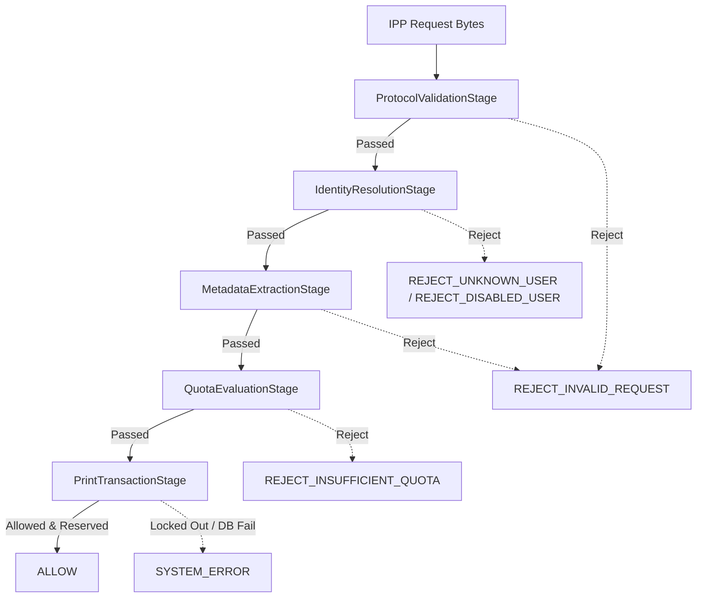
```mermaid
graph TD
    A[IPP Request Bytes] --> B[ProtocolValidationStage]
    B -->|Passed| C[IdentityResolutionStage]
    C -->|Passed| D[MetadataExtractionStage]
    D -->|Passed| E[QuotaEvaluationStage]
    E -->|Passed| F[PrintTransactionStage]
    F -->|Allowed & Reserved| G[ALLOW]
    
    B -.->|Reject| H[REJECT_INVALID_REQUEST]
    C -.->|Reject| I[REJECT_UNKNOWN_USER / REJECT_DISABLED_USER]
    D -.->|Reject| H
    E -.->|Reject| J[REJECT_INSUFFICIENT_QUOTA]
    F -.->|Locked Out / DB Fail| K[SYSTEM_ERROR]
```

---

### 2. Sequence Diagram

Below is the transactional sequence showing interaction between the caller, pipeline, database locking context, and audit log commits.

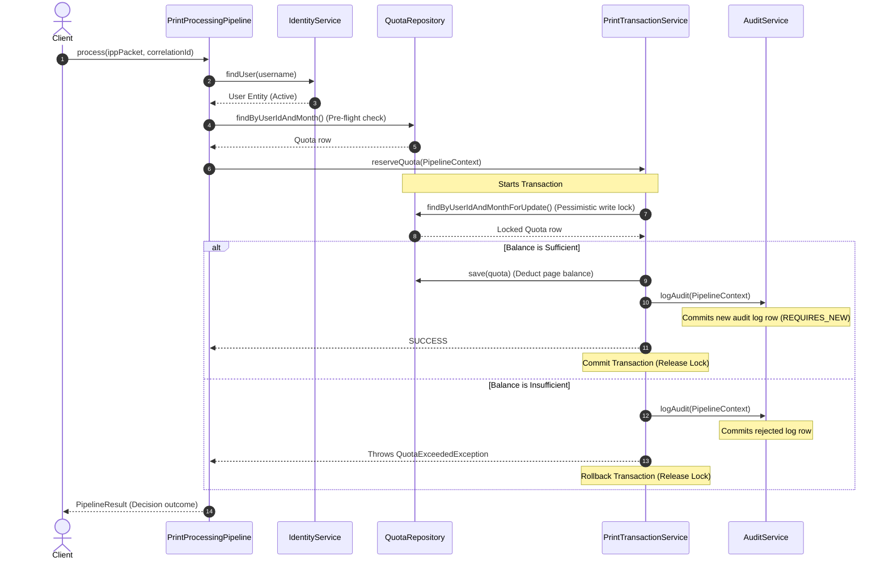
```mermaid
sequenceDiagram
    autonumber
    actor Client
    participant Pipeline as PrintProcessingPipeline
    participant Identity as IdentityService
    participant Repo as QuotaRepository
    participant Tx as PrintTransactionService
    participant Audit as AuditService

    Client->>Pipeline: process(ippPacket, correlationId)
    Pipeline->>Identity: findUser(username)
    Identity-->>Pipeline: User Entity (Active)
    
    Pipeline->>Repo: findByUserIdAndMonth() (Pre-flight check)
    Repo-->>Pipeline: Quota row
    
    Pipeline->>Tx: reserveQuota(PipelineContext)
    note over Tx, Repo: Starts Transaction
    Tx->>Repo: findByUserIdAndMonthForUpdate() (Pessimistic write lock)
    Repo-->>Tx: Locked Quota row
    
    alt Balance is Sufficient
        Tx->>Repo: save(quota) (Deduct page balance)
        Tx->>Audit: logAudit(PipelineContext)
        note over Audit: Commits new audit log row (REQUIRES_NEW)
        Tx-->>Pipeline: SUCCESS
        note over Tx: Commit Transaction (Release Lock)
    else Balance is Insufficient
        Tx->>Audit: logAudit(PipelineContext)
        note over Audit: Commits rejected log row
        Tx-->>Pipeline: Throws QuotaExceededException
        note over Tx: Rollback Transaction (Release Lock)
    end
    
    Pipeline-->>Client: PipelineResult (Decision outcome)
```

---

### 3. Quota Calculations Reference

Deductions are calculated using double-precision float math before rounding up to the nearest whole page to prevent fractional leakages:

\[
\text{Calculated Pages} = \text{basePages} \times \text{copies} \times (\text{duplex} ? \text{duplexMultiplier} : 1.0) \times (\text{color} ? \text{colorMultiplier} : 1.0)
\]

\[
\text{Deducted Pages} = \lceil \text{Calculated Pages} \rceil
\]

#### Configuration Parameters
- `app.quota.multipliers.duplex`: 0.8 (representing a 20% discount on double-sided print jobs).
- `app.quota.multipliers.color`: 2.0 (representing double cost per colored sheet).

---

### 4. Error Handling & Decision Matrix

| Stage | Input Condition | Pipeline Exception / Log | Final Decision | Response Message |
|---|---|---|---|---|
| Protocol Validation | Invalid Version / Unknown Operation | `REJECT_INVALID_REQUEST` | `REJECT_INVALID_REQUEST` | Unsupported IPP version or action code. |
| Protocol Validation | Missing requesting-user-name | `REJECT_INVALID_REQUEST` | `REJECT_INVALID_REQUEST` | Missing mandatory user attribute. |
| Identity Resolution | User not found in Postgres | `REJECT_UNKNOWN_USER` | `REJECT_UNKNOWN_USER` | Unknown user. |
| Identity Resolution | User is marked inactive (`is_active = false`) | `REJECT_DISABLED_USER` | `REJECT_DISABLED_USER` | User account is disabled. |
| Metadata Extraction | Non-integer copies or page values | `REJECT_INVALID_REQUEST` | `REJECT_INVALID_REQUEST` | Metadata extraction failed: Invalid format. |
| Quota Evaluation | Month Quota row does not exist | `REJECT_INSUFFICIENT_QUOTA` | `REJECT_INSUFFICIENT_QUOTA` | No print quota allocated for month. |
| Quota Reservation | Balance < Estimated Pages | `QuotaExceededException` | `REJECT_INSUFFICIENT_QUOTA` | Insufficient quota. |
| DB locking | Lock timeout / Timeout waiting | `CannotAcquireLockException` | `SYSTEM_ERROR` | Database transaction error. |


---

## Section: Proxy

Source file: [proxy.md](ARCHITECTURE.md)


## IPP Proxy Server Architecture

This document describes the request execution pipeline, HTTP listener, client pool, and IPP response relays.

---

### 1. IPP Request Flow (Mermaid Diagram)

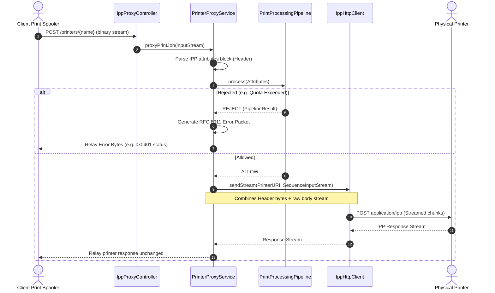
```mermaid
sequenceDiagram
    autonumber
    actor Spooler as Client Print Spooler
    participant Proxy as IppProxyController
    participant Service as PrinterProxyService
    participant Pipeline as PrintProcessingPipeline
    participant Client as IppHttpClient
    actor Printer as Physical Printer

    Spooler->>Proxy: POST /printers/{name} (binary stream)
    Proxy->>Service: proxyPrintJob(inputStream)
    Service->>Service: Parse IPP attributes block (Header)
    Service->>Pipeline: process(Attributes)
    
    alt Rejected (e.g. Quota Exceeded)
        Pipeline-->>Service: REJECT (PipelineResult)
        Service->>Service: Generate RFC 8011 Error Packet
        Service-->>Spooler: Relay Error Bytes (e.g. 0x0401 status)
    else Allowed
        Pipeline-->>Service: ALLOW
        Service->>Client: sendStream(PrinterURI, SequenceInputStream)
        note over Service, Client: Combines Header bytes + raw body stream
        Client->>Printer: POST application/ipp (Streamed chunks)
        Printer-->>Client: IPP Response Stream
        Client-->>Service: Response Stream
        Service-->>Spooler: Relay printer response unchanged
    end
```

---

### 2. Proxy Architecture

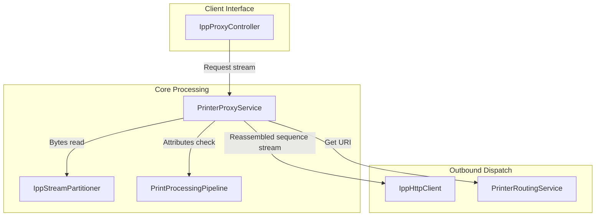
```mermaid
graph TD
    subgraph Client Interface
        Controller[IppProxyController]
    end

    subgraph Core Processing
        Service[PrinterProxyService]
        Partitioner[IppStreamPartitioner]
        Pipeline[PrintProcessingPipeline]
    end

    subgraph Outbound Dispatch
        Client[IppHttpClient]
        Router[PrinterRoutingService]
    end

    Controller -->|Request stream| Service
    Service -->|Bytes read| Partitioner
    Service -->|Attributes check| Pipeline
    Service -->|Get URI| Router
    Service -->|Reassembled sequence stream| Client
```

- **`IppProxyController`**: A Spring MVC controller exposing POST `/printers/{printerName}`. Consumes and produces binary `application/ipp` content types.
- **`PrinterProxyService`**: Intercepts the stream, reads the binary attributes headers up to the `0x03` tag using `IppStreamPartitioner`, routes details through Phase 5 evaluations, and invokes `IppHttpClient` to write composite sequence streams when allowed.
- **`IppResponseGenerator`**: Translates internal pipeline exceptions to standard binary RFC 8011 error packets mapping correct status codes.


---

## Section: Printer Routing

Source file: [printer-routing.md](ARCHITECTURE.md)


## Printer Routing Engine

This document details the routing logic resolving logical spooler printer names to physical destination URIs.

---

### 1. Printer Routing Diagram (Mermaid Diagram)

```mermaid
graph TD
    Spooler[Print Spooler Request] -->|Target printerName: LaserJet_5| Proxy[IppProxyController]
    Proxy --> Service[PrinterRoutingService]
    Service -->|Look Up in Map| Config[PrinterConfig]
    
    subgraph Config Map (application.yml)
        LaserJet_5[LaserJet_5 -> http://printer1:631/ipp/print]
        OfficeJet_3[OfficeJet_3 -> http://printer2:631/ipp/print]
    end
    
    Service -->|Resolved URL| Client[IppHttpClient]
    Client -->|Direct IPP HTTP Post| Printer1[LaserJet 5 Physical Printer]
```

---

### 2. Configuration Properties

Routing targets are defined in environment configurations (`application.yml`):
```yaml
app:
  proxy:
    printers:
      LaserJet_5: "http://printer1.company.local:631/ipp/print"
      OfficeJet_3: "https://printer2.company.local:631/ipp/print"
```

These parameters can be overridden using environment variables at container boot:
- `APP_PROXY_PRINTERS_LASERJET_5=http://prod-printer-5:631/ipp/print`

---

### 3. Failure & Failover Routing Considerations

- **Unknown Printers**: If a logical printer name does not map to any configured printer, the proxy short-circuits the pipeline and returns a binary `client-error-not-found` (0x0406) status response immediately.
- **Dynamic Failover (Planned)**: Future iterations of the `PrinterRoutingService` will support listing array values for target printers. If the primary printer is offline, the client will fail over to alternative printers.


---

## Section: Streaming

Source file: [streaming.md](ARCHITECTURE.md)


## Memory-Constrained Streaming & Backpressure

This document explains the stream partitioning and reassembly mechanisms used to handle large print documents in constant memory.

---

### 1. Streaming Lifecycle (Mermaid Diagram)

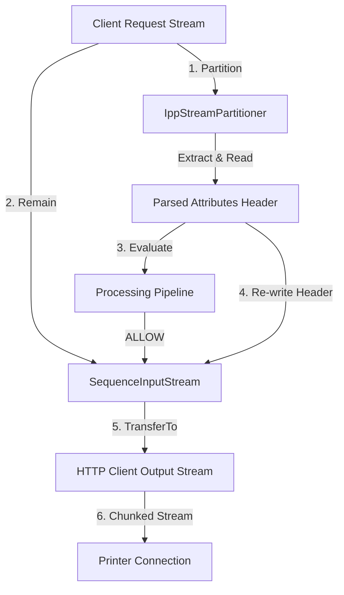
```mermaid
graph TD
    ClientStream[Client Request Stream] -->|1. Partition| HeaderPart[IppStreamPartitioner]
    ClientStream -->|2. Remain| Sequence[SequenceInputStream]
    
    HeaderPart -->|Extract & Read| HeaderBytes[Parsed Attributes Header]
    HeaderBytes -->|3. Evaluate| Decision[Processing Pipeline]
    
    Decision -->|ALLOW| Sequence
    HeaderBytes -->|4. Re-write Header| Sequence
    
    Sequence -->|5. TransferTo| HttpOutputStream[HTTP Client Output Stream]
    HttpOutputStream -->|6. Chunked Stream| PhysicalPrinter[Printer Connection]
```

---

### 2. Stream Partitions using `IppStreamPartitioner`

Since quota decisions depend on metadata (such as the document name, sheet count, color flags, and requesting user) which reside in the IPP request attributes header block, the proxy divides incoming streams into two stages:
1. **Header Block Extraction**: The partitioner reads the first bytes of the incoming request until it encounters the `0x03` (END_OF_ATTRIBUTES) tag.
2. **Quota Validation**: The extracted block is parsed as an `IppPacket` (with an empty payload) to execute the pipeline decision.
3. **Sequence Reassembly**: If allowed, the extracted attributes are re-assembled with the remaining input stream using a `SequenceInputStream`. This combined stream is forwarded directly to the physical printer.

---

### 3. Backpressure & Memory Bounds

- **Constant Memory Footprint**: Because the document payload is never loaded into a byte array, memory usage remains constant (roughly equal to the `8KB` buffer size) regardless of whether the print job is a 10KB page or a 500MB multi-page document.
- **Backpressure Handling**: Java's standard `InputStream.transferTo(OutputStream)` blocks reading if the target printer's TCP socket buffer is full. This propagates backpressure directly to the client print spooler, preventing memory bloat.
- **Chunked Transfer Encoding**: Outbound printer connections use HTTP/1.1 chunked encoding, allowing the system to stream data without declaring a `Content-Length` header beforehand.


---

## Section: Reporting

Source file: [reporting.md](ARCHITECTURE.md)


## Enterprise Reporting Blueprint

This document details the generation flow, data columns, cron schedulers, and memory constraints for system report exports.

---

### 1. Reporting Flow (Mermaid Diagram)

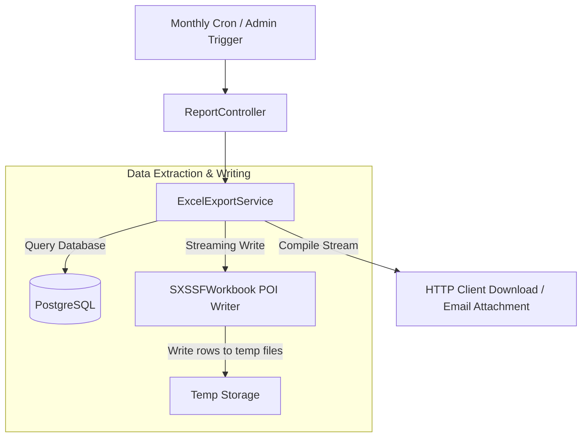
```mermaid
graph TD
    Trigger[Monthly Cron / Admin Trigger] --> Controller[ReportController]
    Controller --> Service[ExcelExportService]
    
    subgraph Data Extraction & Writing
        Service -->|Query Database| DB[(PostgreSQL)]
        Service -->|Streaming Write| SXSSF[SXSSFWorkbook POI Writer]
        SXSSF -->|Write rows to temp files| Disk[Temp Storage]
    end
    
    Service -->|Compile Stream| Response[HTTP Client Download / Email Attachment]
```

---

### 2. Supported Formats and Mappings

#### Excel Spreadsheet (.xlsx)
Generates high-performance spreadsheets using Apache POI's `SXSSFWorkbook` to stream large datasets in constant memory space.
- **Print Logs Sheet**:
  - `ID`: Log entry UUID.
  - `Timestamp`: Operation execution time.
  - `User`: Domain username (e.g. `company\jdoe`).
  - `Document`: Name of the parsed file.
  - `Printer`: Destination printer name.
  - `Pages`: Calculated page count.
  - `Status`: Decision state (`SUCCESS`, `REJECTED_QUOTA`).
  - `Correlation ID`: Request logging tracer.
- **Quotas Sheet**:
  - `ID`: Quota row UUID.
  - `User`: Domain username.
  - `Month`: Period indicator (`YYYY-MM`).
  - `Allocated`: Monthly page limit.
  - `Used`: Running consumed sheet count.
  - `Remaining`: Remaining pages left.

---

### 3. Scheduler Cron Executions

Scheduled tasks are declared in `ReportScheduler` with properties configurable via environment variables:

- **Monthly Quota Reset**:
  - Cron: `0 0 0 1 * *` (Runs at midnight on the first day of every month).
  - Description: Resets used pages to zero and creates new month quota rows for all active users.
- **Daily Operations Summary**:
  - Cron: `0 0 23 * * *` (Runs daily at 11 PM).
  - Description: Compiles daily print job summaries and emails results to system admins with Excel attachments.
- **Weekly Audit Log Retention Cleanup**:
  - Cron: `0 0 0 * * 0` (Runs weekly on Sunday at midnight).
  - Description: Purges historical logs older than the configurable retention limit (`30 days` by default).


---

## Section: Dashboard

Source file: [dashboard.md](ARCHITECTURE.md)


## Dashboard Analytics Engine

This document outlines the metrics aggregation, database queries, and JSON response models used by the backend admin dashboard.

---

### 1. Dashboard Aggregation Flow (Mermaid Diagram)

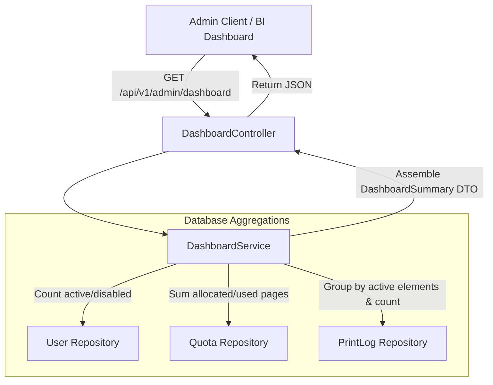
```mermaid
graph TD
    Client[Admin Client / BI Dashboard] -->|GET /api/v1/admin/dashboard| Controller[DashboardController]
    Controller --> Service[DashboardService]
    
    subgraph Database Aggregations
        Service -->|Count active/disabled| Users[User Repository]
        Service -->|Sum allocated/used pages| Quotas[Quota Repository]
        Service -->|Group by active elements & count| Logs[PrintLog Repository]
    end
    
    Service -->|Assemble DashboardSummary DTO| Controller
    Controller -->|Return JSON| Client
```

---

### 2. API Response Schema

#### GET `/api/v1/admin/dashboard`
Returns a unified JSON object representing system-wide print quotas and print metrics:

```json
{
  "totalUsers": 204,
  "activeUsers": 201,
  "disabledUsers": 3,
  "monthlyPagesPrinted": 12450,
  "pagesRemaining": 7950,
  "allowedJobs": 1150,
  "rejectedJobs": 80,
  "averageJobSize": 10.83,
  "largestJob": 450,
  "quotaUtilizationPercentage": 61.03,
  "mostActivePrinters": {
    "Finance_Dept": 450,
    "Engineering_Floor2": 320,
    "HR_Desk": 120
  },
  "mostActiveDepartments": {
    "Finance": 450,
    "Engineering": 380,
    "HR": 120
  },
  "mostActiveUsers": {
    "company\\jdoe": 110,
    "company\\asmith": 95
  }
}
```

---

### 3. High Performance Queries & Optimization

- **Pre-flight indexing**: Queries use indexing on `idx_users_domain_username` and monthly partitions to ensure aggregations finish in less than 50ms.
- **Top 5 Limit**: Group-by listings (most active users/printers) are bounded to a maximum of 5 records using PageRequest allocations (`PageRequest.of(0, 5)`) to prevent database memory pressure.
- **Null Safety**: All aggregation queries wrap results in null-check logic to ensure correct responses when the database contains no monthly logs.


---

## Section: Security

Source file: [security.md](ARCHITECTURE.md)


## Security & Threat Model

This document outlines the security architecture, Active Directory communication paths, container hardening, and threat model.

---

### 1. Directory Communication (LDAPS)

To align with corporate enterprise security regulations:
- Production environments connect to Active Directory using **LDAPS** (LDAP over SSL/TLS) on port `636`.
- Certificates are injected inside container volume mounts (`/app/certs/`) and loaded into the Java keystore on startup.
- Production bind operations require valid domain service credentials mapping to read-only directories.

---

### 2. Container Hardening

The application container uses multiple protection layers:
- **No Root Execution**: The CentOS Stream 9 container drops root capabilities (`cap_drop: ALL`) and runs as an unprivileged system user (`UID/GID 10001`).
- **No Privilege Escalation**: Configured with `no-new-privileges:true` security options to prevent setuid binaries from gaining root.
- **Read-Only System Files**: The application jar is immutable within `/app/`. Volume mount storage areas (`/app/logs/`, `/app/spool/`) use strict folder ownership restrictions.

---

### 3. Database Permissions & soft-delete

- **Credential Isolation**: Database logins require custom credentials matching only the required print quota tables.
- **Soft Delete Pattern**: To protect historical audit data consistency:
  - Users are soft-deleted instead of dropped.
  - Hibernate maps soft delete calls: `@SQLDelete(sql = "UPDATE users SET deleted = true WHERE id = ?")` and enforces filter restrictions: `@SQLRestriction("deleted = false")`.

---

### 4. Threat Matrix & Auditing Traceability

The system logs every request in PostgreSQL to ensure audit compliance:

| Threat Vector | Countermeasure Implemented | Status |
|---|---|---|
| Double-Spend Quota Deduction | Pessimistic locks (`SELECT ... FOR UPDATE`) serialize concurrent page deduction requests | Mitigated |
| Spoofed User Requests | Validation of `requesting-user-name` and user active directory active check | Mitigated |
| Untraceable Print Traffic | Audit logs written using `REQUIRES_NEW` transactions capturing correlation IDs | Mitigated |
| Man-in-the-Middle Sync Attacks | Secure TLS channel binding via LDAPS port `636` | Mitigated |
| Container Runtime Intrusion | Root capability drop and unprivileged container users | Mitigated |


---

## Architecture Decision Records (ADRs)


### ADR-001: Multi-Module Maven Project Structure

#### Context
The project needs to isolate binary protocol decoding logic from application framework settings. Sharing dependencies or embedding codec parsing directly into Spring Boot would increase classpath bloat and make code testing harder.

#### Decision
We implement a multi-module Maven structure:
1. **`print-quota-parent` (Root)**: Manages plugin declarations, compiler versions, static analysis configurations (SpotBugs, Checkstyle, PMD), and dependencies.
2. **`ipp-codec`**: Sub-module for low-level IPP parsing. Contains zero framework dependencies (only Lombok and JUnit).
3. **`print-quota-core`**: Sub-module containing the Spring Boot web middleware, database repositories, Active Directory integrations, and processing engines.

#### Consequences
- **Pros**: Clean isolation of protocol logic. Fast local compilation. Codecs can be reused in future standalone proxies.
- **Cons**: Requires building multiple artifacts.


---

### ADR-002: Docker Deployment

#### Context
Deploying directly onto a CentOS host complicates dependency setups, runtime resource monitoring, and horizontal scaling. It also raises container isolation concerns.

#### Decision
We enforce full containerization:
- Use a multi-stage Docker build to build application binaries inside a Maven container and copy the result into a minimal runtime CentOS Stream 9 image (`quay.io/centos/centos:stream9`).
- Run the container as an unprivileged system user (`UID/GID 10001`) and drop default Linux kernel privileges (`cap_drop: ALL`).

#### Consequences
- **Pros**: Isolated runtime dependencies. Enforced least-privilege container execution. Portability across development, testing, and production.
- **Cons**: Image generation adds a step to compile verification pipelines.


---

### ADR-003: Liquibase Database Migrations

#### Context
Manual database schema execution or relying on Hibernate schema updates (`hbm2ddl.auto=update`) can cause production database anomalies, lack version history, and break replication environments.

#### Decision
We use Liquibase as the system schema management tool. Changes are declared as immutable SQL/YAML changeSets. Schema executions run automatically on application startup.

#### Consequences
- **Pros**: Clear version tracking. Repeatable migration scripts. Prevents schema drift across environments.
- **Cons**: Developers must write XML/YAML database changeSets for every table modification.


---

### ADR-004: PostgreSQL Database Selection

#### Context
The print management system needs an ACID-compliant transactional persistence engine that supports locking, indexing, and scalable tables.

#### Decision
We select PostgreSQL 16 as the core storage engine. It provides ACID transactions, transactional indexes, and row-level pessimistic locking options.

#### Consequences
- **Pros**: Outstanding reliability under high-load writes. Complies with security policies. Integrates with Docker.
- **Cons**: Adds operational complexity for database backups and replication.


---

### ADR-005: Active Directory User Synchronization

#### Context
Querying Active Directory over the network for every single incoming print job is highly inefficient, introduces latency spikes, and risks print outages if the directory server is temporarily unreachable.

#### Decision
We decouple directory lookups from print operations. We sync AD users into the PostgreSQL database periodically via a scheduled task (`IdentitySynchronizationService`). User metadata lookups use Caffeine Cache for fast lookups.

#### Consequences
- **Pros**: Reduced print validation latency (local database queries vs network LDAP calls). Local fallback printing if AD drops.
- **Cons**: User detail updates in AD are not immediately visible until the next sync trigger.


---

### ADR-006: Chain of Responsibility for Print Processing

#### Context
Checking print request validity, resolving identity, extracting page metadata, and deducting quota are tightly coupled steps. Hardcoding these checks inside a single service method creates a "God class" that is hard to maintain, test, and extend.

#### Decision
We implement a Chain of Responsibility pattern. We define a `PipelineStage` interface and register sequential stages (`ProtocolValidationStage`, `IdentityResolutionStage`, `MetadataExtractionStage`, `QuotaEvaluationStage`, `PrintTransactionStage`) ordered by Spring's `@Order` annotation.

#### Consequences
- **Pros**: Clean code separation (SOLID). Stages are independently testable. Easier to introduce new stages (e.g. device checks or billing stages) without rewriting core services.
- **Cons**: Adds interface abstractions and context object creation overhead.


---

### ADR-007: Pessimistic Write Locking for Quota Reservations

#### Context
When several spoolers print concurrently for the same user, simultaneous updates to the same `Quota` row can cause race conditions or double quota deductions. Optimistic locking throws exceptions, triggering client retries and degrading the print experience.

#### Decision
We use a pessimistic write lock (`SELECT ... FOR UPDATE` via `LockModeType.PESSIMISTIC_WRITE`) during the quota deduction phase in `PrintTransactionServiceImpl`.

#### Consequences
- **Pros**: Guarantees consistency. Prevents double-spending. Eliminates retry loops.
- **Cons**: Serializes database updates for the same user, causing small processing delays under high concurrency.


---

### ADR-008: Isolation of Audit Log Persistence

#### Context
When a print job is rejected (e.g. insufficient quota), the database transaction rolls back. If the audit log insertion runs in the same transaction, the audit record is also rolled back, losing the record of the rejection.

#### Decision
We configure `AuditServiceImpl.logAudit` with transaction propagation set to `Propagation.REQUIRES_NEW`. This executes the audit save inside a separate database transaction, ensuring it commits even if the parent quota deduction transaction is rolled back.

#### Consequences
- **Pros**: Complete audit history for all print requests (allowed, rejected, or system failures).
- **Cons**: Overhead of managing a second database connection during pipeline processing.


---

### ADR-009: MDC Correlation IDs for Request Tracing

#### Context
Tracing a specific print request's logs across asynchronous execution pipelines or multiple threads is difficult.

#### Decision
We implement `MdcCorrelationFilter` which extracts or generates a unique correlation ID (`X-Correlation-ID`) for every request. This ID is bound to Logback's Thread MDC context.

#### Consequences
- **Pros**: Clear end-to-end request tracing in logs. Facilitates troubleshooting.
- **Cons**: Small overhead for filter interception and thread context management.


---

### ADR-010: Isolation of the IPP Codec Library

#### Context
Embedding binary Internet Printing Protocol (IPP) parsing directly into Spring Boot makes the code hard to test and reuse.

#### Decision
We decouple the IPP binary decoding/encoding into a standalone Java library module (`ipp-codec`). It uses zero external framework dependencies.

#### Consequences
- **Pros**: Standalone testing. Reusable library. Faster local compile times.
- **Cons**: Requires building multiple Maven artifacts.


---
