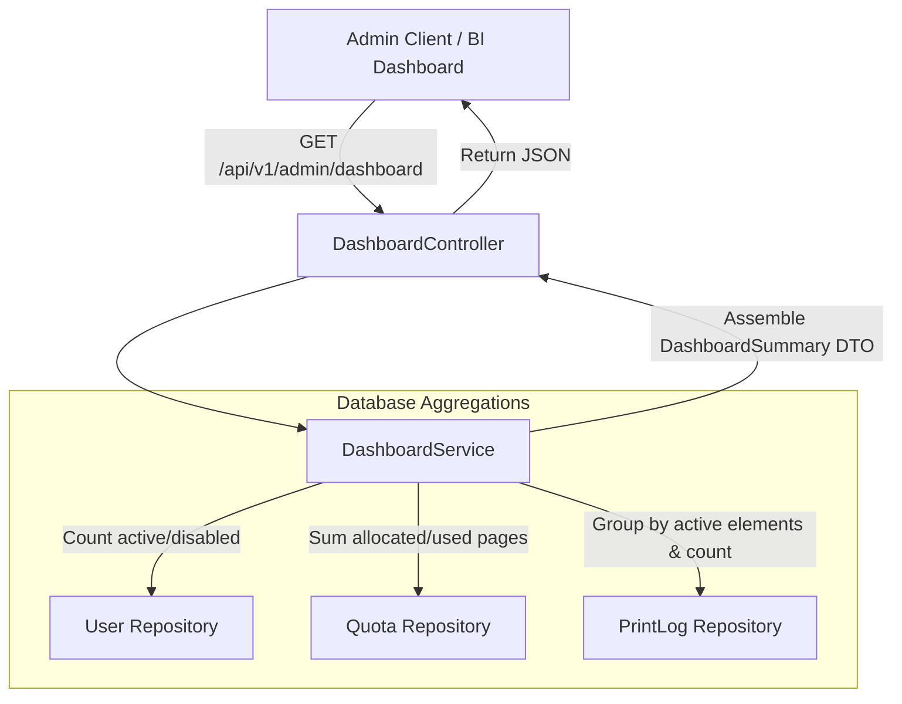

# Dashboard Analytics Engine

This document outlines the metrics aggregation, database queries, and JSON response models used by the backend admin dashboard.

---

## 1. Dashboard Aggregation Flow (Mermaid Diagram)



---

## 2. API Response Schema

### GET `/api/v1/admin/dashboard`
Returns a unified JSON object representing system-wide print quotas and print metrics:

```json
{
  "totalUsers": 204,
  "activeUsers": 201,
  "disabledUsers": 3,
  "monthlyPagesPrinted": 12450,
  "pagesRemaining": 7950,
  "allowedJobs": 1150,
  "rejectedJobs": 80,
  "averageJobSize": 10.83,
  "largestJob": 450,
  "quotaUtilizationPercentage": 61.03,
  "mostActivePrinters": {
    "Finance_Dept": 450,
    "Engineering_Floor2": 320,
    "HR_Desk": 120
  },
  "mostActiveDepartments": {
    "Finance": 450,
    "Engineering": 380,
    "HR": 120
  },
  "mostActiveUsers": {
    "company\\jdoe": 110,
    "company\\asmith": 95
  }
}
```

---

## 3. High Performance Queries & Optimization

- **Pre-flight indexing**: Queries use indexing on `idx_users_domain_username` and monthly partitions to ensure aggregations finish in less than 50ms.
- **Top 5 Limit**: Group-by listings (most active users/printers) are bounded to a maximum of 5 records using PageRequest allocations (`PageRequest.of(0, 5)`) to prevent database memory pressure.
- **Null Safety**: All aggregation queries wrap results in null-check logic to ensure correct responses when the database contains no monthly logs.
