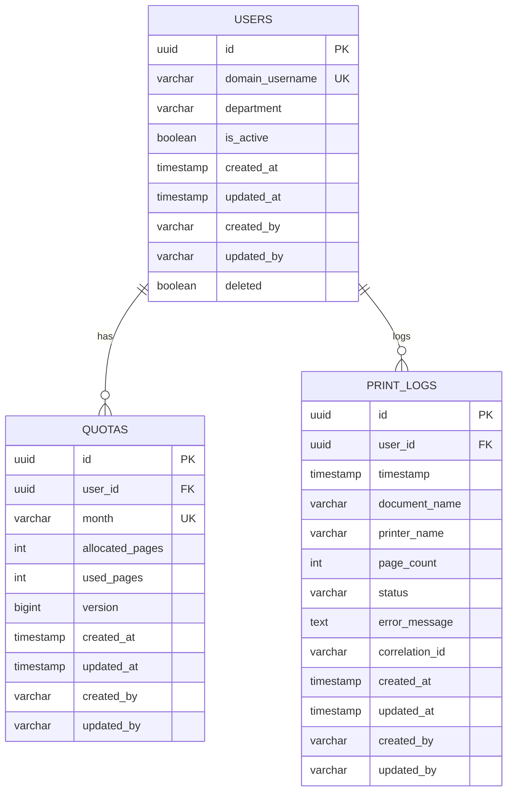

# Database Schema Blueprint

This document details the entity-relationship design, table columns, constraints, indexes, and locking strategies in PostgreSQL.

---

## 1. Entity Relationship Diagram (Mermaid Diagram)

---

## 2. Table Column Definitions

### Table: `users`
- **`id`** (UUID, PK): System identifier.
- **`domain_username`** (VARCHAR, Unique, Indexed): User account username prefixed with domain (e.g. `company\jdoe`).
- **`department`** (VARCHAR): Department context used for grouping.
- **`is_active`** (BOOLEAN): State of the account. Inactive users are rejected immediately.
- **`deleted`** (BOOLEAN): Soft-delete flag.

### Table: `quotas`
- **`id`** (UUID, PK): Identifier.
- **`user_id`** (UUID, FK referencing `users(id)`): Allocated user context.
- **`month`** (VARCHAR, length 7, e.g. `YYYY-MM`): Month identifier.
- **`allocated_pages`** (INTEGER): Monthly page limit.
- **`used_pages`** (INTEGER): Running count of page sheets printed.
- **`version`** (BIGINT): Optimistic locking column.

### Table: `print_logs`
- **`id`** (UUID, PK): Identifier.
- **`user_id`** (UUID, FK referencing `users(id)`): Printed user context.
- **`timestamp`** (TIMESTAMP): Execution time.
- **`document_name`** (VARCHAR): Extracted document name.
- **`printer_name`** (VARCHAR): Extracted printer.
- **`page_count`** (INTEGER): Number of deducted page sheets.
- **`status`** (VARCHAR, length 30): Decision state (`SUCCESS`, `REJECTED_QUOTA`, `ERROR`).
- **`error_message`** (TEXT): Log messages for rejections/errors.
- **`correlation_id`** (VARCHAR): Logging trace ID.

---

## 3. Database Constraints & Indexes

- **Index `idx_users_domain_username`**: Unique index to support quick user lookups during identity resolution.
- **Unique Constraint `uq_quotas_user_month`**: Unique index on columns `(user_id, month)` to prevent duplicate monthly allocations.
- **Foreign Key `fk_quotas_user`**: Maps `quotas.user_id` to `users.id` with referential integrity.
- **Foreign Key `fk_print_logs_user`**: Maps `print_logs.user_id` to `users.id` with referential integrity.

---

## 4. Locking Strategies

1. **Optimistic Locking**:
   - Implemented via `@Version` on `Quota.version`.
   - Used for normal update procedures when conflicts are highly unlikely.
2. **Pessimistic Locking**:
   - Implemented via `LockModeType.PESSIMISTIC_WRITE` on `QuotaRepository.findByUserIdAndMonthForUpdate`.
   - Used for critical quota deductions inside `PrintTransactionService` to prevent double-spending and lost updates.

---

## 5. Liquibase Migration Strategy

All database schemas, constraints, and updates are declared as immutable changelogs under `print-quota-core/src/main/resources/db/changelog/`.
- Schema revisions are executed automatically during application startup.
- Production environments use validation checks (`spring.jpa.hibernate.ddl-auto=validate`) to prevent hibernate auto-modifications.
