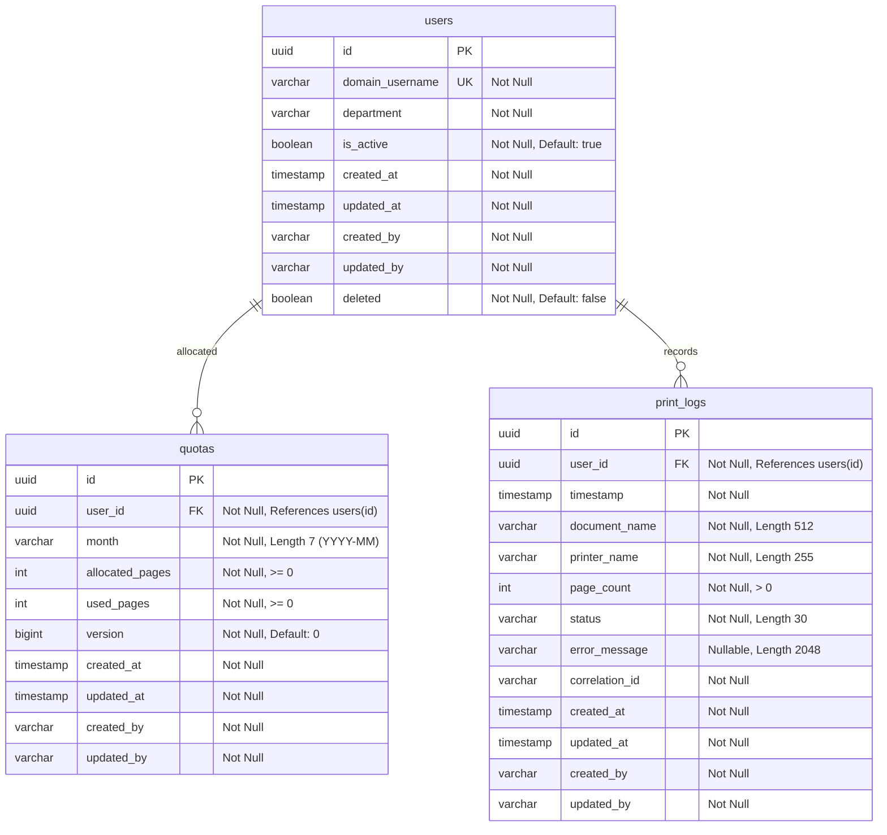

# Database Architecture Documentation

This document describes the relational database design implemented in Phase 2 for the **Print Quota Management System**.

## Entity-Relationship (ER) Diagram

The system comprises three core tables: `users`, `quotas`, and `print_logs`.

---

## Database Tables and Constraints

### 1. `users` Table
Stores enterprise Active Directory user references synced to the quota system.
- **Primary Key**: `id` (`uuid`, generated automatically).
- **Constraints**:
  - `domain_username`: Unique and Non-Nullable. Enforces AD identity formatting.
  - `deleted`: Non-Nullable flag. Allows soft-deletion for auditable logs preservation.
- **Audit Columns**: `created_at`, `updated_at`, `created_by`, `updated_by` (all UTC).

### 2. `quotas` Table
Stores monthly page allowance allocations and usage tracking.
- **Primary Key**: `id` (`uuid`).
- **Constraints**:
  - `uk_quotas_user_month`: Unique index on `(user_id, month)`. Prevents duplicate quota entries for a user in the same calendar month.
  - `chk_quotas_allocated_pages`: `allocated_pages >= 0` (cannot grant negative pages).
  - `chk_quotas_used_pages`: `used_pages >= 0`.
  - `chk_quotas_used_allocated`: `used_pages <= allocated_pages` (used pages cannot exceed allocation).
- **Optimistic Locking**: `version` (`bigint`) for transactional concurrency control.

### 3. `print_logs` Table
A transactional audit log storing execution status of print jobs.
- **Primary Key**: `id` (`uuid`).
- **Constraints**:
  - `chk_print_logs_page_count`: `page_count > 0` (a print job must print at least 1 page).
- **Indexes**:
  - `idx_print_logs_user_id`: Optimizes historical log retrievals for a specific user.
  - `idx_print_logs_timestamp`: Optimizes reporting range queries.

---

## Architectural & Design Justifications

### Dynamic Remaining Page Balance (3NF Compliance)
We do not store `remaining_pages` as a column in the `quotas` table. Instead, it is computed dynamically at runtime:
$$\text{remaining\_pages} = \text{allocated\_pages} - \text{used\_pages}$$
- **Justification**: Storing it would violate Third Normal Form (3NF) by creating a transitive dependency. A mismatch between stored remaining pages and calculated difference would cause database state corruption. Calculating it on the fly guarantees database integrity.

### Optimistic vs. Pessimistic Locking
- **Optimistic Locking (`@Version`)**: The `quotas` entity utilizes a JPA `@Version` column. If two separate update transactions load a quota and attempt to update `used_pages` concurrently, the second transaction will fail with an `ObjectOptimisticLockingFailureException`.
- **Pessimistic Locking (`SELECT FOR UPDATE`)**: The `QuotaRepository` declares `findByUserIdAndMonthForUpdate()`. When a print job is validated, it loads the quota using a pessimistic write lock (`PESSIMISTIC_WRITE`). This forces other database transactions attempting to write or read-for-update to block until the active transaction commits, preventing race conditions under high concurrent printer loads.

### Soft Delete Strategy
The `User` entity is mapped with `@SQLDelete` and `@SQLRestriction` to implement soft-deletion.
- **Justification**: Since print transactions in the `print_logs` table refer to `users` via foreign key constraints, a hard delete of a user would violate referential integrity or require cascade deletions (destroying audit logs). Soft-deletion preserves the foreign keys for older logs while cleanly hiding deleted users from active queries.
