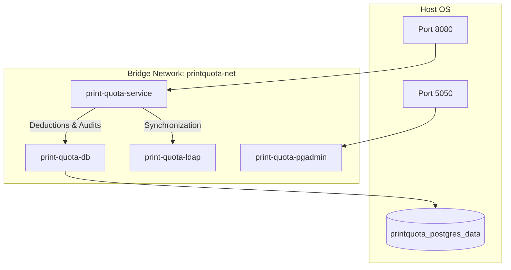

# Containerization & Docker Setup

This document describes the container layout, build configs, networks, and compose services defined in the system.

---

## 1. Container Architecture (Mermaid Diagram)



---

## 2. Compose Services & Network Bindings

Central container coordination is handled via `docker-compose.yml` in the root directory:

1. **`postgres`** (Image: `postgres:16-alpine`):
   - PostgreSQL 16 server.
   - Database name: `printquota` (customizable via env).
   - Healthcheck: runs `pg_isready` at 5-second intervals.
2. **`pgadmin`** (Image: `dpage/pgadmin4:8.8`):
   - GUI dashboard for database management. Maps container port `80` to host `5050`.
3. **`ldap`** (Image: `osixia/openldap:1.5.0`):
   - Mock LDAP/Active Directory directory services server.
   - Bootstraps mock users using directory mapping file `./docker/ldap/bootstrap.ldif`.
4. **`print-quota-app`** (Built via `./docker/app/Dockerfile`):
   - Core Spring Boot service running on port `8080`.
   - Starts only after both `postgres` and `ldap` report healthy.
5. **`printer-proxy`** (Image: `alpine:3.19`):
   - Future print forwarding routing placeholder (Phase 6).

---

## 3. Production Dockerfile Configuration

The production container uses a secure multi-stage CentOS Stream 9 assembly:

### Stage 1: Build Stage (`maven:3.9.6-eclipse-temurin-21`)
- Copies project POM descriptors and source folders.
- Runs `mvn clean package` under compilation checks to compile target JAR files.

### Stage 2: Production Stage (`quay.io/centos/centos:stream9`)
- Installs headless JDK 21 OpenJDK runtime.
- Creates a dedicated system group and non-root execution user:
```dockerfile
RUN groupadd -g 10001 printgroup && \
    useradd -u 10001 -g printgroup -m -s /sbin/nologin printuser
```
- Drops all default Linux capabilities (`CAP_DROP`) and forces non-root user execution:
```yaml
security_opt:
  - no-new-privileges:true
cap_drop:
  - ALL
user: "10001:10001"
```
- Sets container-aware JVM memory configuration:
`ENTRYPOINT ["java", "-XX:MaxRAMPercentage=75.0", "-XX:+UseG1GC", "-XX:+ExitOnOutOfMemoryError", "-jar", "app.jar"]`
