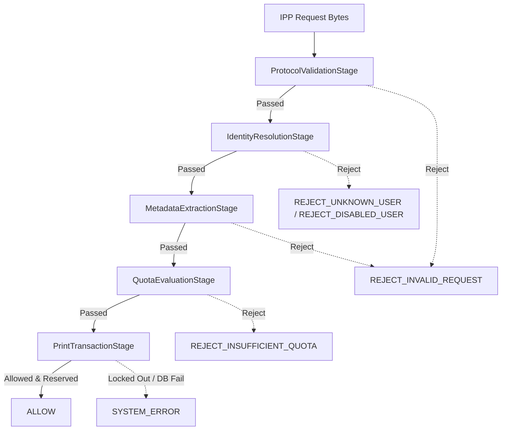
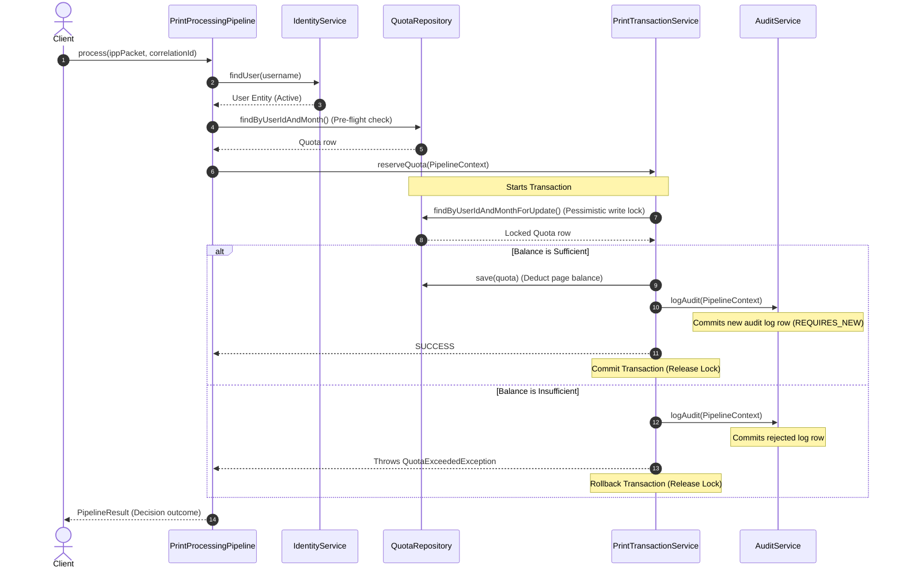

# Print Processing Engine: Technical Documentation

This document describes the design, execution flow, transaction rules, and error mappings of the Print Processing Engine implemented in Phase 5.

---

## 1. Pipeline Architecture (Mermaid Diagram)

The pipeline is modeled as a Chain of Responsibility where request payloads are enriched and verified sequentially.

---

## 2. Sequence Diagram

Below is the transactional sequence showing interaction between the caller, pipeline, database locking context, and audit log commits.

---

## 3. Quota Calculations Reference

Deductions are calculated using double-precision float math before rounding up to the nearest whole page to prevent fractional leakages:

\[
\text{Calculated Pages} = \text{basePages} \times \text{copies} \times (\text{duplex} ? \text{duplexMultiplier} : 1.0) \times (\text{color} ? \text{colorMultiplier} : 1.0)
\]

\[
\text{Deducted Pages} = \lceil \text{Calculated Pages} \rceil
\]

### Configuration Parameters
- `app.quota.multipliers.duplex`: 0.8 (representing a 20% discount on double-sided print jobs).
- `app.quota.multipliers.color`: 2.0 (representing double cost per colored sheet).

---

## 4. Error Handling & Decision Matrix

| Stage | Input Condition | Pipeline Exception / Log | Final Decision | Response Message |
|---|---|---|---|---|
| Protocol Validation | Invalid Version / Unknown Operation | `REJECT_INVALID_REQUEST` | `REJECT_INVALID_REQUEST` | Unsupported IPP version or action code. |
| Protocol Validation | Missing requesting-user-name | `REJECT_INVALID_REQUEST` | `REJECT_INVALID_REQUEST` | Missing mandatory user attribute. |
| Identity Resolution | User not found in Postgres | `REJECT_UNKNOWN_USER` | `REJECT_UNKNOWN_USER` | Unknown user. |
| Identity Resolution | User is marked inactive (`is_active = false`) | `REJECT_DISABLED_USER` | `REJECT_DISABLED_USER` | User account is disabled. |
| Metadata Extraction | Non-integer copies or page values | `REJECT_INVALID_REQUEST` | `REJECT_INVALID_REQUEST` | Metadata extraction failed: Invalid format. |
| Quota Evaluation | Month Quota row does not exist | `REJECT_INSUFFICIENT_QUOTA` | `REJECT_INSUFFICIENT_QUOTA` | No print quota allocated for month. |
| Quota Reservation | Balance < Estimated Pages | `QuotaExceededException` | `REJECT_INSUFFICIENT_QUOTA` | Insufficient quota. |
| DB locking | Lock timeout / Timeout waiting | `CannotAcquireLockException` | `SYSTEM_ERROR` | Database transaction error. |
