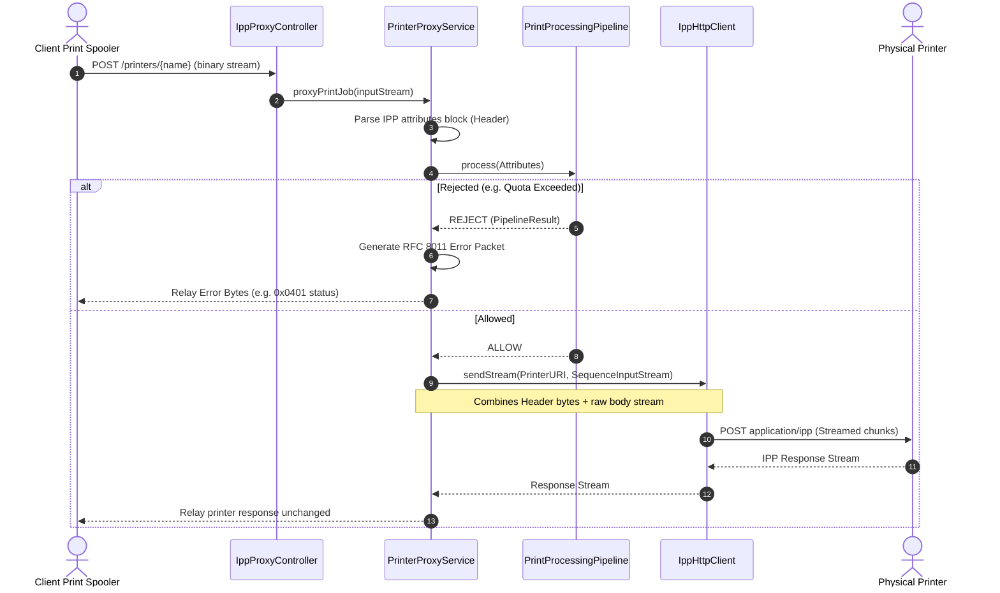
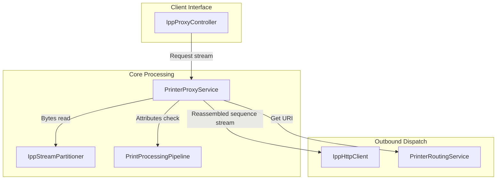

# IPP Proxy Server Architecture

This document describes the request execution pipeline, HTTP listener, client pool, and IPP response relays.

---

## 1. IPP Request Flow (Mermaid Diagram)

---

## 2. Proxy Architecture

- **`IppProxyController`**: A Spring MVC controller exposing POST `/printers/{printerName}`. Consumes and produces binary `application/ipp` content types.
- **`PrinterProxyService`**: Intercepts the stream, reads the binary attributes headers up to the `0x03` tag using `IppStreamPartitioner`, routes details through Phase 5 evaluations, and invokes `IppHttpClient` to write composite sequence streams when allowed.
- **`IppResponseGenerator`**: Translates internal pipeline exceptions to standard binary RFC 8011 error packets mapping correct status codes.
