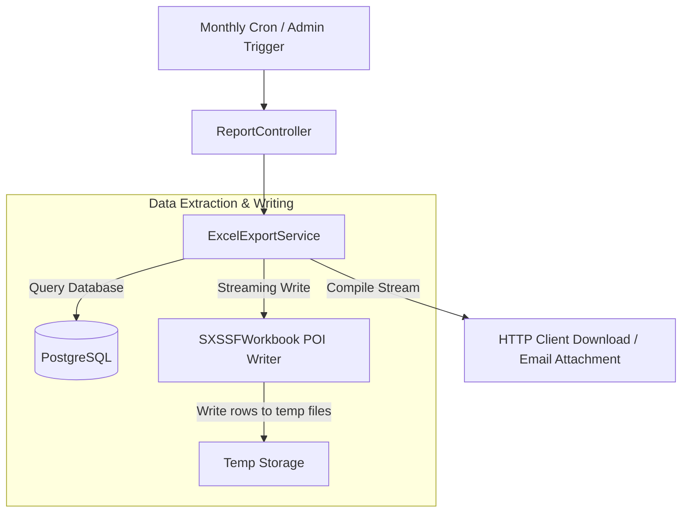

# Enterprise Reporting Blueprint

This document details the generation flow, data columns, cron schedulers, and memory constraints for system report exports.

---

## 1. Reporting Flow (Mermaid Diagram)

---

## 2. Supported Formats and Mappings

### Excel Spreadsheet (.xlsx)
Generates high-performance spreadsheets using Apache POI's `SXSSFWorkbook` to stream large datasets in constant memory space.
- **Print Logs Sheet**:
  - `ID`: Log entry UUID.
  - `Timestamp`: Operation execution time.
  - `User`: Domain username (e.g. `company\jdoe`).
  - `Document`: Name of the parsed file.
  - `Printer`: Destination printer name.
  - `Pages`: Calculated page count.
  - `Status`: Decision state (`SUCCESS`, `REJECTED_QUOTA`).
  - `Correlation ID`: Request logging tracer.
- **Quotas Sheet**:
  - `ID`: Quota row UUID.
  - `User`: Domain username.
  - `Month`: Period indicator (`YYYY-MM`).
  - `Allocated`: Monthly page limit.
  - `Used`: Running consumed sheet count.
  - `Remaining`: Remaining pages left.

---

## 3. Scheduler Cron Executions

Scheduled tasks are declared in `ReportScheduler` with properties configurable via environment variables:

- **Monthly Quota Reset**:
  - Cron: `0 0 0 1 * *` (Runs at midnight on the first day of every month).
  - Description: Resets used pages to zero and creates new month quota rows for all active users.
- **Daily Operations Summary**:
  - Cron: `0 0 23 * * *` (Runs daily at 11 PM).
  - Description: Compiles daily print job summaries and emails results to system admins with Excel attachments.
- **Weekly Audit Log Retention Cleanup**:
  - Cron: `0 0 0 * * 0` (Runs weekly on Sunday at midnight).
  - Description: Purges historical logs older than the configurable retention limit (`30 days` by default).
