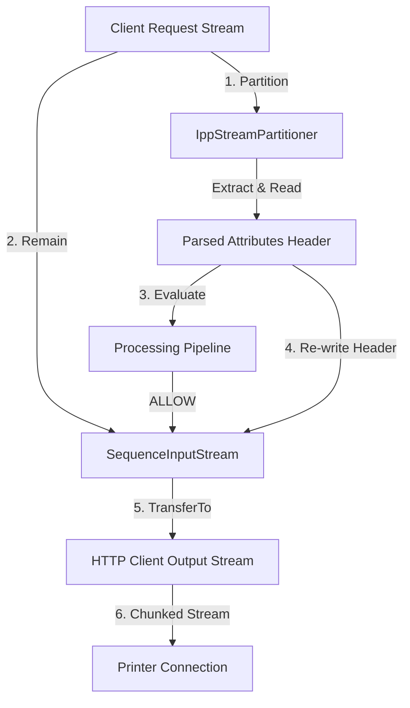

# Memory-Constrained Streaming & Backpressure

This document explains the stream partitioning and reassembly mechanisms used to handle large print documents in constant memory.

---

## 1. Streaming Lifecycle (Mermaid Diagram)

---

## 2. Stream Partitions using `IppStreamPartitioner`

Since quota decisions depend on metadata (such as the document name, sheet count, color flags, and requesting user) which reside in the IPP request attributes header block, the proxy divides incoming streams into two stages:
1. **Header Block Extraction**: The partitioner reads the first bytes of the incoming request until it encounters the `0x03` (END_OF_ATTRIBUTES) tag.
2. **Quota Validation**: The extracted block is parsed as an `IppPacket` (with an empty payload) to execute the pipeline decision.
3. **Sequence Reassembly**: If allowed, the extracted attributes are re-assembled with the remaining input stream using a `SequenceInputStream`. This combined stream is forwarded directly to the physical printer.

---

## 3. Backpressure & Memory Bounds

- **Constant Memory Footprint**: Because the document payload is never loaded into a byte array, memory usage remains constant (roughly equal to the `8KB` buffer size) regardless of whether the print job is a 10KB page or a 500MB multi-page document.
- **Backpressure Handling**: Java's standard `InputStream.transferTo(OutputStream)` blocks reading if the target printer's TCP socket buffer is full. This propagates backpressure directly to the client print spooler, preventing memory bloat.
- **Chunked Transfer Encoding**: Outbound printer connections use HTTP/1.1 chunked encoding, allowing the system to stream data without declaring a `Content-Length` header beforehand.
